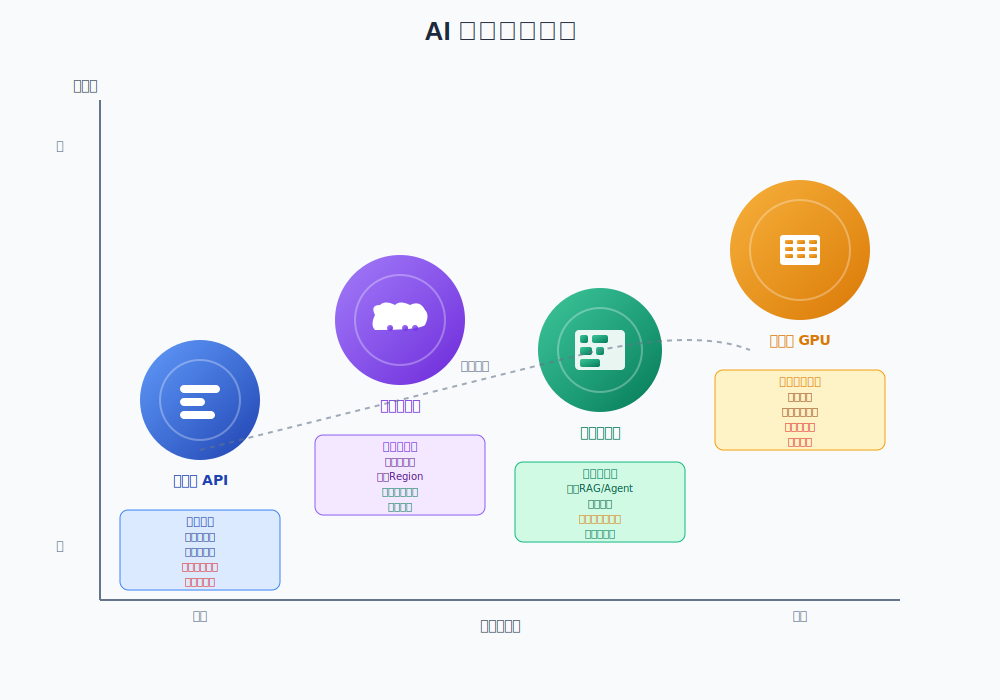

## LLM 部署方案调研报告 v2.0

## 目录

1. 执行摘要
2. 决策维度与评分模型
3. 部署模式概览
4. 初创扶持与免费额度概览
5. 详细方案对比
   - 5.1 国际 / 国内第三方 API
   - 5.2 云厂商托管推理
   - 5.3 低代码 / 调度平台与框架
   - 5.4 自托管开源模型
6. 三年 TCO 模拟
7. 风险与合规评估
8. 实施路线图
9. 关键结论与行动计划
10. 参考文献汇总

---

## 1. 执行摘要

本报告旨在为团队在 LLM 的部署选型上提供一个清晰、分阶段的战略路线图。
核心结论：通过 PoC → Beta → Scale 的渐进式演进，在不同阶段平衡上线速度、成本效率与合规安全，最终在大规模时通过自托管+API 混合架构实现最佳 TCO 和数据主权保障。

**PoC 阶段 (概念验证期)**

- 推荐方案：第三方 API + 低代码平台（如 Dify/Coze）。
- 理由：时间和资源有限，通过第三方 API 即插即用的能力结合低代码平台的可视化流程，可在数天到数周内产出可演示原型，用最少投入验证商业模型和用户需求。利用厂商免费额度或创业计划，早期成本几乎可忽略。

**Beta 阶段 (公测与迭代期)**

- 推荐方案：迁移至主流云厂商托管服务（如 Azure OpenAI / AWS Bedrock），并集成专业向量数据库（如 Pinecone、Milvus）构建 RAG 应用。
- 理由：用户量和功能需求增长，需要更高可用性、弹性扩展与合规保障。云托管服务能快速部署稳定端点，与云上监控、安全、存储等服务无缝整合，满足 SLA 和国内数据驻留要求，同时在可控成本范围内验证中等规模承载能力。

**Scale 阶段 (规模化与优化期)**

- 推荐方案：搭建 自托管 GPU 集群 + API 混合调度 架构。
- 理由：当调用量达到百万级/月或更高时，第三方 API 或云托管按量付费模式成本快速上涨。自托管 GPU 集群在高利用率时能显著降低单位成本；结合第三方 API 作为高峰或特殊高性能需求的备选，形成混合调度，实现成本与性能的平衡。此阶段需成熟的 MLOps 能力、完善监控与合规审计体系，以确保大规模服务的稳定与安全。

---

## 2. 决策维度与评分模型

为实现科学、透明的选型过程，建立了量化评估模型，包含以下六个关键维度，每个维度分配权重，反映初创公司的典型优先级。

### 部署方案评分表（PoC 阶段权重设置）

| 方案              | 上线速度 (1–5) | 长期成本 (1–5) | 运维复杂度 (1–5) | 弹性扩展 (1–5) | 生态完整度 (1–5) | 合规与安全 (1–5) | 加权总分 |
| ----------------- | -------------- | -------------- | ---------------- | -------------- | ---------------- | ---------------- | -------- |
| API 调用 + 低代码 | 5              | 4              | 5                | 4              | 4                | 3                | 4.3      |
| 云托管推理        | 4              | 3              | 4                | 4              | 5                | 4                | 3.9      |

> **说明：**
>
> - 加权总分按：上线速度 ×25% + 长期成本 ×20% + 运维复杂度 ×15% + 弹性扩展 ×15% + 生态完整度 ×15% + 合规与安全 ×10% 计算。
> - 示例评分仅供参考，实际评分应结合公司需求、已获扶持额度、团队能力、业务风险偏好等做细化调整。

---

### 维度权重表

| 维度         | 权重 | 说明与考量                                                                                                                                           |
| ------------ | :--: | ---------------------------------------------------------------------------------------------------------------------------------------------------- |
| 上线速度     | 25%  | 核心问题：我们多快能让用户用上产品？评估方案的集成难度和端到端交付周期。对于初创公司，快速上线 MVP 是抢占市场先机的关键。                            |
| 长期成本     | 20%  | 核心问题：规模化后，我们的利润是否会被成本吞噬？关注 3 年 TCO，包括 API 调用费、硬件折旧、运维人力、升级和迁移成本等，衡量长期可持续性和利润率影响。 |
| 运维复杂度   | 15%  | 核心问题：维护系统需要多少人、什么技能？评估日常维护、监控、故障排查和升级工作量。低运维方案让精简团队更专注业务创新。                               |
| 弹性扩展     | 15%  | 核心问题：当用户量突增时系统能否支撑？闲时成本能否下降？衡量方案自动扩容能力及自动缩容节约成本的灵活性，直接影响成本效率与用户体验。                 |
| 生态完整度   | 15%  | 核心问题：构建 RAG、Agent 等高级功能多容易？考察周边工具链、开发库和社区支持成熟度。完整生态可大幅降低复杂 AI 应用构建难度，加速开发和迭代。         |
| 合规与安全性 | 10%  | 核心问题：方案是否满足本地法规？用户数据是否安全？评估数据驻留、内容审查、隐私保护、加密与审计能力等，对面向特定行业或地区项目至关重要。             |

## 3. 部署模式概览

| 方案        | 典型厂商/工具                          | 成本模型                | 上线速度          | 运维复杂度           | 生态完整度            | 合规性                     | 推荐阶段 |
| ----------- | -------------------------------------- | ----------------------- | ----------------- | -------------------- | --------------------- | -------------------------- | -------- |
| 第三方 API  | OpenAI, Anthropic, 阿里 Qwen, DeepSeek | 按需 Token 计费         | ⭐⭐⭐⭐⭐ (最快) | ⭐⭐⭐⭐⭐ (零运维)  | ⭐⭐⭐⭐⭐ (开放生态) | 国际版 ❌ 国内版 ✅     | PoC      |
| 云托管推理  | Azure OpenAI, AWS Bedrock, 阿里百炼    | 按需 Token/预留实例     | ⭐⭐⭐⭐☆         | ⭐⭐⭐⭐☆            | ⭐⭐⭐⭐⭐ (闭环生态) | ✅ (可选国内节点)          | Beta     |
| 低代码/框架 | Dify, Coze, LangChain, CrewAI          | 订阅+用量 (成本穿透)    | ⭐⭐⭐⭐⭐ (最快) | ⭐⭐⭐⭐☆ (相对简单) | ⭐⭐⭐⭐☆ (集成生态)  | 自托管 ✅ SaaS 版需评估 | PoC➜Beta |
| 自托管 GPU  | RunPod, CoreWeave, BentoML Cloud       | 固定算力成本 (GPU 时租) | ⭐⭐☆☆☆           | ⭐☆☆☆☆ (最复杂)      | ⭐⭐⭐☆☆ (需自建)     | ✅ (责任自负)              | Scale    |

**说明：**

- 第三方 API：最快上线，无需基础设施运维；前期成本低，后期线性成本高；国际版存在数据出境和合规风险。
- 云托管推理：易部署、弹性伸缩、与云生态深度集成；可选国内 Region 满足数据驻留；对中等规模和合规需求场景适合。
- 低代码平台/框架：可视化流程或模块化组件、内置 RAG/Agent 功能，适合快速验证；SaaS 版需评估数据存储；自托管版或开源框架可完全掌控。
- 自托管 GPU：长期成本最低、可高度定制、数据主权最高，但技术门槛和运维复杂度最大，适合成熟阶段和高并发场景。

## 4. 创业扶持与免费额度概览

| 名称/厂商                | 计划/项目                    | 额度 (人民币 ¥ / 美元 \$ / 免费)                       | 申请要点（含申请难度）                            | 支持内容/使用建议                                                                                                                                                                             |
| ------------------------ | ---------------------------- | ------------------------------------------------------ | ------------------------------------------------- | --------------------------------------------------------------------------------------------------------------------------------------------------------------------------------------------- |
| AWS Activate             | 创业加速（含生成式 AI 专项） | ¥7.25 万–¥217.5 万 (\~\$1k–\$300k)                     | 申请难度：中；新创公司条件；可获 VC/孵化器推荐    | - 专项额度可用于测试 Trainium/Inferentia 等 AI 硬件 - 覆盖 AWS 所有云服务及 AI/ML 服务 (如 Amazon Bedrock, SageMaker) - 提供技术支持、培训与指导                                        |
| Azure Founders Hub       | 创业者中心                   | ¥3.6 万–¥108.75 万 (\~\$5k–\$150k)                     | 申请难度：低；无需 VC 推荐；根据使用活跃度续期    | - Credits 可用于 Azure 各类服务（Azure OpenAI、存储、计算、数据库等） - 含 GitHub Enterprise, Microsoft 365 开发者许可证 - 提供技术指导和创业生态连接                                   |
| Google for Startups      | Cloud Program                | ¥1.45 万–¥253.75 万 (\~\$2k–\$350k)                    | 申请难度：高；需 VC 推荐；分阶段提交商业/技术计划 | - Start Tier (\$2k) 适用于构思阶段 - Scale Tier (\$200k，两年期) 需融资与规模条件 - AI 优先型 (\$350k) 第一年度覆盖 \$250k 用量，第二年可折扣续费 - 覆盖 Vertex AI 等 GCP AI/ML 服务 |
| 阿里云 MARS 创业者计划   | 上云抵扣券                   | ¥3.5k–¥100 万                                          | 申请难度：低–中；个体工商户或初创企业可申请       | - AI 资源补贴：数万亿 tokens 级别调用补贴、数千小时技术支持 - 专家 1v1 对接服务、技术实训营、投融资资源对接 - 涵盖通义千问模型、DashVector 等 AI 服务                                   |
| 腾讯云 Lite 模型免费     | 混元 Lite / 智能体开发平台   | 免费 tokens 与字符容量、知识库等                       | 申请难度：低；完成实名认证并激活即可              | - 混元 Lite 模型永久免费、无额度限制 - 首次开通智能体开发平台赠送 50 万 tokens（2 个月）等 - 适合概念验证与早期开发测试                                                                 |
| 百度千帆创业者计划       | 创业者计划                   | 免费 / 企业专项 5000 万免费 Tokens                     | 申请难度：低–中；企业认证后可申请旗舰模型额度     | - ERNIE Speed/Lite 完全免费，无使用限制 - 企业用户可申请 ERNIE3.5 旗舰模型 5000 万 Tokens 免费调用 - 支持向量库集成、Agent Builder 低代码开发                                           |
| Anthropic for Startups   | Claude API 验证              | 免费 API credits、较高速率限制、社区支持、专属活动邀请 | 申请难度：高；通常需 VC/加速器背书                | - 覆盖 Claude 3 系列模型调用 - 适合验证 Claude 模型能力和进行早期原型开发                                                                                                                  |
| Mistralship (Mistral AI) | La Plateforme 访问           | 6 个月创业计划，提供约 \$30k credits                   | 申请难度：中；符合早期融资阶段                    | - PoC 阶段验证 Mistral 模型能力；Beta 阶段评估与其他模型对比后决定长期合作                                                                                                                    |
| Vercel AI Accelerator    | 前端+AI 应用加速             | \~\$4,000,000+ credits                                 | 申请难度：高；项目匹配条件                        | - 适合快速构建前端+AI 应用的团队 - 借助全方位 credits 进行端到端验证                                                                                                                       |
| Together AI Studio       | 综合云 credits               | 承诺 \$1,000,000 资金和 >\$600,000 云 credits          | 申请难度：高；关注项目申请时间                    | - 具备创新 AI 应用想法的团队可申请，获得综合支持                                                                                                                                              |

### 4.1.国际云平台福利详细解析

#### AWS Activate – 生成式 AI 专项重大提升

- **专项额度**：最高可达 $300,000（约 ¥217.5 万），专门用于测试 AWS Trainium / Inferentia 等 AI 加速硬件。
- **分级申请条件**：
    - **Activate Founders**：基础 $1,000（约 ¥7.25 万），适合自筹资金或早期团队。
    - **标准创业公司**：最高 $100,000（约 ¥72.5 万），需 VC/孵化器推荐或合作机构背书。
    - **生成式 AI 专项**：最高 $300,000（约 ¥217.5 万），需专注于生成式 AI 相关业务或技术验证场景。
- **基础要求**：
    - 新加入 AWS Activate，成立时间一般不超过 10 年。
    - 最近 12 个月有融资记录或具备可行商业计划。
    - 完整公司网站、工商注册信息、团队介绍等材料齐全。
- **申请网站：** https://aws.amazon.com/activate/

#### Azure Founders Hub – 门槛最低，参与度评分

- **初始额度**：起步级别 $5,000（约 ¥3.6 万）。
- **成长级别**：可申请至 $25,000（约 ¥18 万），需完成验证清单（如使用量、验证案例等）。
- **高级别**：最高 $150,000（约 ¥108.75 万），通过使用活跃度评分系统自动续期。
- **特点**：
    - 无需 VC 推荐，自助线上申请，审核速度快。
    - 参与度评分：在额度到期前约 45 天，根据 Azure 服务使用活跃度自动评估是否续期或提升额度。
    - Credits 可用于 Azure 各类服务，包括 Azure OpenAI、存储、计算、数据库等。
- **申请网站：** https://www.microsoft.com/en-us/startups

#### Google for Startups – 最高额度，AI 优先策略

- **三层支持体系**：
    1. **Start Tier（构思阶段）**：$2,000（约 ¥1.45 万）初始额度，针对尚未或少量融资的团队。
    2. **Scale Tier（标准初创）**：$200,000（约 ¥145 万）两年期支持，需符合融资与公司规模条件（如 Pre-seed/Seed/A 轮等）。
    3. **AI 优先型初创**：最高 $350,000（约 ¥253.75 万），专门针对核心 AI 技术初创，需提供 AI 相关商业或技术计划。
- **AI 优先计划额外福利**：
    - 第一年度覆盖高达 $250,000 使用额度，第二年可按 20% 折扣续费。
    - 额外专项支持：如 $10,000 用于合作伙伴 LLM 模型调用、$12,000 Google Cloud 增强支持额度等。
- **申请要点**：
    - 需提交公司信息、融资证明（如 VC 投资证明）、技术/商业计划书等。
    - 不同阶段额度分阶段发放，根据里程碑或使用情况评估后续支持。
- **申请网站：** https://cloud.google.com/startup

---

### 4.2 中国云平台扶持计划

#### 阿里云 MARS 创业者计划 – 2025 年重磅升级

- **发布背景**：2025 年 4 月全新升级“MARS 创业者计划”，目标一年内支持至少 1000 家初创企业，提供百万级 AI 资源补贴。
- **核心支持内容**：
    - **AI 资源补贴**：海量调用补贴（数万亿 tokens 级别）及数千小时技术支持。
    - **基础额度**：起步 ¥3,500，最高可达 ¥100 万上云抵扣券。
    - **专家服务**：免费 1v1 技术专家对接服务。
    - **生态支持**：技术实训营、投融资资源对接、合作伙伴网络等。
- **申请条件**：
    - 企业或个体工商户均可申请，需未在阿里云付费或首次申请专项计划。
    - 提交公司/团队信息、商业计划、AI 技术路线等；审核周期约 15-20 个工作日。
- **使用建议**：
    - PoC/Beta 阶段优先申请并消耗补贴资源进行模型调用和集成测试。
    - 根据使用情况提前规划后续付费或续期方案，结合 AWS/Azure/Google 对比评估多云方案。
    - 参与官方实训营和生态活动，获取更多技术与融资支持。
- **申请网站：** https://help.aliyun.com/document_detail/2698335.html

#### 腾讯云 Lite 模型免费

- **免费形式**：混元 Lite 模型永久免费，无使用额度限制，API 输入输出长度从 4k 升级至 256k。
- **免费额度**：
  - 首次开通混元大模型服务赠送 100 万 token（1 年）。首次开通智能体开发平台时，获得 50 万 tokens 免费调用额度（有效期 2 个月），适用于混元大模型系列及其他精调知识大模型。
  - 混元 Lite 模型不限额度，永久免费使用。
  - 赠送 300 万字符数的知识库容量（有效期 6 个月）和 5000 次联网搜索调用额度（有效期 2 个月）。
- **申请条件**：
    - 完成企业或个人实名认证。
    - 首次登录腾讯云智能体开发平台后，点击“产品体验”即可自动开通并获得免费额度。
- **使用建议**：
    - 优先使用免费额度，可在智能体开发平台的计费管理页面查看消耗情况。
    - 适合初创企业或个人进行概念验证与早期开发测试。
    - 逾期未用完的免费资源将失效，建议及时使用或根据需求购买续费。
- **申请网站：**https://cloud.tencent.com/document/product/1729/97731

#### 百度千帆创业者计划

- **完全免费策略**：ERNIE Speed/Lite 模型对所有用户完全免费使用，无使用限制。
- **企业专项额度**：企业认证后可申请 ERNIE3.5 旗舰模型 5000 万 Tokens 免费调用额度，用于生产或测试环境。
- **申请方式**：
    - 注册百度智能云账号并完成企业实名认证。
    - 在千帆平台免费开通页面领取基础免费额度；提交企业信息申请专项额度。
- **申请网站：** https://cloud.baidu.com/doc/WENXINWORKSHOP/s/xlxuhovgi

---

### 4.3 AI 专项服务提供商福利

#### Anthropic for Startups

- **支持内容**：与 VC 合作伙伴推出创业计划，提供免费 API credits、较高速率限制、社区支持、专属创始人活动邀请等。
- **申请条件**：通常需通过合作 VC 或加速器背书，提交项目计划和团队信息。
- **使用建议**：在验证 Claude 模型能力时申请额度；Beta 阶段对比其他模型性能和成本。
  - **申请网站：**https://www.anthropic.com/startups

#### Mistralship (Mistral AI)

- **支持内容**：6 个月期创业计划，为若干初创提供约 $30k credits，用于 La Plateforme；1:1 支持；早期访问新模型和产品。
- **申请条件**：团队需符合早期融资阶段，提交 AI 应用场景及技术方案。
- **使用建议**：PoC 阶段验证 Mistral 模型能力；Beta 阶段评估与其他模型对比后决定长期合作。
- **申请网站：** https://share-eu1.hsforms.com/12yGDfL7gQBCs-Jub4AonKw2dffx9

---

### 4.4 专业加速器创业者福利

#### Vercel AI Accelerator

- **项目周期**：约 6 周，为 \~40 个团队提供总计超 $4,000,000 的 credits 和资源支持。
- **主要福利**：
    - AWS 提供 $1,000,000 Activate credits
    - Anthropic 提供 $600,000 credits + 3 个月免费 Claude for Teams
    - OpenAI 提供 $430,000 credits
    - 其他 20+ 家 AI 平台 credits 和支持
- **使用建议**：有意向快速构建前端+AI 应用的团队可申请，借助全方位 credits 进行端到端验证。
- **申请网站：** https://vercel.com/ai-accelerator

#### Together AI Studio

- **支持内容**：承诺 $1,000,000 资金和 \>$600,000 云 credits，来自 OpenAI、AWS、Google Cloud、Azure 等。
- **使用建议**：具备创新 AI 应用想法的团队可关注该项目，并申请综合支持。
- **申请网站：**： https://together.fund/ai/

## 5. 详细方案对比

### 5.1 国际 / 国内第三方 API

#### 5.1.1 定价一览

| 平台 / 模型               | 上下文窗口 (Tokens) | 输入 ¥ / 1k Tokens             | 输出 ¥ / 1k Tokens                      | 特色与模型价值                                                    |
| ------------------------- | ------------------- | ------------------------------ | --------------------------------------- | ----------------------------------------------------------------- |
| **OpenAI**                |                     |                                |                                         |                                                                   |
| GPT-4.1 nano              | 128K                | 0.00073                        | 0.00290                                 | 最快、最低成本模型，适合低延迟任务，如快速响应 Agent 或边缘计算。 |
| GPT-4.1 mini              | 128K                | 0.00290                        | 0.01160                                 | 智能与速度的平衡，适合多数中等复杂度的业务应用。                  |
| GPT-4.1                   | 128K                | 0.01450                        | 0.05800                                 | 智能最强，适合复杂任务，如文档理解、法律分析、研究推理等。        |
| o3                        | 128K                | 0.01450                        | 0.05800                                 | 新一代旗舰推理模型，擅长代码、数学、科学和多模态推理任务。        |
| o4-mini                   | 128K                | 0.00798                        | 0.03190                                 | 推理性价比优选，适用于成本敏感但需强推理能力的数学与视觉场景。    |
| **Anthropic Claude**      |                     |                                |                                         |                                                                   |
| Claude Haiku 3.5          | 200K                | 0.00580                        | 0.02900                                 | 极致性价比与响应速度，适用于轻量级对话与实时内容生成场景。        |
| Claude Sonnet 4           | 200K                | 0.02180                        | 0.10875                                 | 智能与成本平衡最优，适合企业级搜索、RAG 应用、日常 AI 助理等。    |
| Claude Opus 4             | 200K                | 0.10875                        | 0.54375                                 | 最强智能模型，适合最复杂推理、跨模态应用与高价值任务场景。        |
| **Google (Gemini)**       |                     |                                |                                         |                                                                   |
| Gemini 2.5 Flash Preview  | 1M                  | 0.00109                        | 0.00435(Non-thinking) 0.02538(thinking) | 低价长上下文，多模态场景优选；高并发大规模部署常用。              |
|                           |
| Gemini 2.5 Pro            | 1M                  | 0.00906 (≤200K)                | 0.07250 (≤200K)                         | 深度文档理解与长文档摘要，复杂多模态高价值场景。                  |
|                           |                     | 0.01813 (>200K)                | 0.10875 (>200K)                         |                                                                   |
| **DeepSeek**              |                     |                                |                                         |                                                                   |
| DeepSeek-V3               | 64K                 | 0.00200 (未命中)               | 0.00800                                 | 通用 MoE，性价比高，中文理解与推理优；缓存命中可降至 0.00051。    |
| DeepSeek-R1               | 64K                 | 0.00400 (未命中)               | 0.01600                                 | 复杂推理优化版，适合技术问题解决与深度思考。                      |
| **阿里云 (Qwen)**         |                     |                                |                                         |                                                                   |
| 通义千问-Max              | 131,072             | 0.0024                         | 0.0096                                  | 旗舰模型，适合复杂任务，能力最强                                  |
| 通义千问-Plus             | 131,072             | 0.0008                         | 0.0020                                  | 效果、速度与成本均衡，适合大多数通用任务                          |
| 通义千问-Turbo            | 1,000,000           | 0.0003                         | 0.0006                                  | 极致性价比，速度快、成本低，适合简单任务                          |
| 通义千问-Long             | 10,000,000          | 0.0005                         | 0.0020                                  | 超长文本支持，适合大规模分析与长文档处理场景                      |
| **百度千帆**              |                     |                                |                                         |                                                                   |
| ERNIE Speed/Lite          | 8K/128K             | 0.00000 (免费)                 | 0.00000 (免费)                          | 轻量级零成本，适合大规模免费试验与 PoC。                          |
| ERNIE 4.5 Turbo           | TBC                 | 0.00080                        | 0.00320                                 | 高性价比通用模型，支持工具调用，企业常用。                        |
| ERNIE 4.5                 | TBC                 | 0.00400                        | 0.01600                                 | 深度多模态旗舰，中文理解与推理领先，核心业务场景优选。            |
| **腾讯云 (混元)**         |                     |                                |                                         |                                                                   |
| 混元-lite                 | 250K                | 0.00000 (免费)                 | 0.00000 (免费)                          | 免费长上下文，适合大规模基础服务与 PoC。                          |
| 混元-TurboS               | 28K                 | 0.00080(50-100 万 token 免费 ) | 0.00200                                 | 万亿参数旗舰，长上下文高性能场景。                                |
| 混元-T1                   | 28K                 | 0.00100                        | 0.00400                                 | 通用主力模型，能力全面，适合复杂问答、文档理解等核心应用          |
| **Mistral AI**            |                     |                                |                                         |                                                                   |
| Mistral Small 3.1         | 128K                | 0.00073                        | 0.00218                                 | 轻量高效，多语言场景。                                            |
| Mistral Medium 3          | 128K                | 0.00290                        | 0.01450                                 | 性价比中高复杂任务，编码/STEM 常用。                              |
| Mistral Large             | 128K                | 0.01450                        | 0.04350                                 | 旗舰级，适合对能力要求最高的场景。                                |
| **Cohere**                |                     |                                |                                         |                                                                   |
| Command R7B               | 128K                | 0.00027                        | 0.00109                                 | 小模型轻量测试与轻量 RAG，成本最低。                              |
| Command R                 | 128K                | 0.00109                        | 0.00435                                 | 通用 RAG 模型，企业轻量应用。                                     |
| Command A                 | 256K                | 0.01813                        | 0.07250                                 | Agentic AI 优化版，适合多语言 RAG 和复杂业务。                    |
| **火山方舟 (Volcengine)** |                     |                                |                                         |                                                                   |
| Doubao-pro-32k            | 32K                 | 0.00080                        | 0.00200                                 | 主力通用大模型，性能与精度较高。                                  |
| **OpenRouter (聚合平台)** |                     |                                |                                         |                                                                   |
| Llama 3.3 70B             | 131K                | 0.00051                        | 0.00181                                 | 最低单价，OpenAI 兼容 API，多供应商多模型选择。                   |

#### 5.1.2 详细说明

---

##### OpenAI 系列

##### GPT-4.1 nano

- **定位与任务**：超低延迟、超低成本，适合对响应速度要求极高的边缘计算、轻量 Agent、Webhook 回调场景。
- **性价比分析**：仅 ¥0.00073 /1k 输入、¥0.00290 /1k 输出，在毫秒级交互需求下无可取代。

##### GPT-4.1 mini

- **定位与任务**：智能与速度平衡之选，适合中等复杂度的客服对话、FAQ 机器人、内容审核流水线。
- **性价比分析**：¥0.00290 /1k 输入、¥0.01160 /1k 输出，较 nano 略高但推理质量显著提升。

##### GPT-4.1

- **定位与任务**：旗舰智能，面向长文本理解、法律/金融文书分析、深度研究报告撰写。
- **性价比分析**：¥0.01450 /1k 输入、¥0.05800 /1k 输出，适合预算充足且质量优先的核心业务。

##### o3

- **定位与任务**：顶级多模态推理模型，擅长代码生成、数学证明、科学实验设计与图像理解。
- **性价比分析**：与 GPT-4.1 同价 (¥0.01450/¥0.05800)，但在专业 benchmark（MATH、Codeforces、ImageNet）中优势明显。

##### o4-mini

- **定位与任务**：轻量化推理选手，兼顾较强的数学、编码与视觉理解能力，适合成本敏感型复杂任务。
- **性价比分析**：¥0.00798 /1k 输入、¥0.03190 /1k 输出，比 o3 降价 ≈45%，仍保有 80%+ 性能。

---

##### Anthropic Claude 系列

##### Claude Haiku 3.5

- **定位与任务**：极致高吞吐、低延迟对话模型，专为实时客服、内容审核、快速摘要设计。
- **性价比分析**：¥0.00580 /1k 输入、¥0.02900 /1k 输出，在高并发场景中持续稳定。

##### Claude Sonnet 4

- **定位与任务**：企业级平衡型旗舰，适合 RAG、搜索推荐、多轮混合文本+图表分析。
- **性价比分析**：¥0.02180 /1k 输入、¥0.10875 /1k 输出，为多模态和复杂应用提供优质体验。

##### Claude Opus 4

- **定位与任务**：顶级思想家，面向前沿研究、战略规划、跨领域综合问答与创造性写作。
- **性价比分析**：¥0.10875 /1k 输入、¥0.54375 /1k 输出，只为最苛刻的推理质量场景保留。

---

##### Google Gemini 系列

##### Gemini 2.5 Flash Preview

- **定位与任务**：低价长上下文 + 混合推理，支持文本/图像/视频/音频输入，适合大规模批量多模态流水线。
- **性价比分析**：¥0.00109 /1k 输入、¥0.00435 /1k 非推理输出、¥0.02538 /1k 推理输出，最优吞吐成本。

##### Gemini 2.5 Pro

- **定位与任务**：多模态深度推理旗舰，支持复杂文档理解、代码审计、跨媒体搜索与 RAG。
- **性价比分析**：¥0.00906–¥0.01813 /1k 输入、¥0.07250–¥0.10875 /1k 输出，唯一定价支持动态分段，兼顾短/长提示。

---

##### DeepSeek 系列

##### DeepSeek-V3

- **定位与任务**：高性价比中文通用 MoE，适合文章生成、摘要与通用知识问答。
- **性价比分析**：未命中 ¥0.00200 /1k 输入、¥0.00800 /1k 输出；缓存命中时降至 ¥0.00051，大幅节省重复查询成本。

##### DeepSeek-R1

- **定位与任务**：复杂推理增强版，专为技术文档解析、科研辅助、严谨逻辑推理场景优化。
- **性价比分析**：¥0.00400 /1k 输入、¥0.01600 /1k 输出，性能提升匹配专业需求。

---

##### 阿里云 Qwen 系列

##### 通义千问-Max

- **定位与任务**：旗舰复杂任务专家，面向财务审计、法律合规、科研文献深度分析。
- **性价比分析**：¥0.0024 /1k 输入、¥0.0096 /1k 输出，以极低成本实现顶级模型能力。

##### 通义千问-Plus

- **定位与任务**：平衡全能模型，适合大多数混合业务场景—对话、摘要、分类、RAG。
- **性价比分析**：¥0.0008 /1k 输入、¥0.0020 /1k 输出，是国内应用最广泛的“首选基座”。

##### 通义千问-Turbo

- **定位与任务**：极速低成本流水线选手，适合高并发日志拆解、指标抽取、结构化字段提取。
- **性价比分析**：¥0.0003 /1k 输入、¥0.0006 /1k 输出，是所有商业模型中单位成本最低者。

##### 通义千问-Long

- **定位与任务**：超长文本处理专家，支持 10M Tokens，专为大规模文档构建索引与全文检索。
- **性价比分析**：¥0.0005 /1k 输入、¥0.0020 /1k 输出，用最低成本解决超大上下文。

---

#### 百度千帆 ERNIE 系列

##### ERNIE Speed / Lite

- **定位与任务**：零成本入门，适合 PoC、开发者学习、轻量级批量文本处理。
- **性价比分析**：永久免费，无 Token 限制，是试错与学习的首选。

##### ERNIE 4.5 Turbo

- **定位与任务**：高性价比企业级通用工作马，支持工具调用、插件、RAG 流程。
- **性价比分析**：¥0.00080 /1k 输入、¥0.00320 /1k 输出，以接近免费价格提供专业级功能。

##### ERNIE 4.5

- **定位与任务**：中文多模态旗舰，擅长图片+文本、长文档理解、文化语境分析。
- **性价比分析**：¥0.00400 /1k 输入、¥0.01600 /1k 输出，为核心中文场景提供领先效果。

---

##### 腾讯云 混元 系列

##### 混元-lite

- **定位与任务**：永久免费长上下文，适合 PoC、教育和大规模基础服务。
- **性价比分析**：¥0.00000 /1k，极致性价比；但推理深度不及旗舰版。

##### 混元-TurboS

- **定位与任务**：万亿参数旗舰，高并发智能问答与文档解析。
- **性价比分析**：首月 100W Token 免费，¥0.00080 /1k 输入、¥0.00200 /1k 输出，兼顾成本和性能。

##### 混元-T1

- **定位与任务**：通用主力模型，面向复杂对话、全量文档理解、智能推荐。
- **性价比分析**：¥0.00100 /1k 输入、¥0.00400 /1k 输出，是混元系列的“经济旗舰”。

---

##### Mistral AI 系列

##### Mistral Small 3.1

- **定位与任务**：轻量多语言助手，适合翻译、摘要、分类等基础任务。
- **性价比分析**：¥0.00073 /1k 输入、¥0.00218 /1k 输出，启动成本极低。

##### Mistral Medium 3

- **定位与任务**：编码与 STEM 领域专家，常用于技术文档生成与分析。
- **性价比分析**：¥0.00290 /1k 输入、¥0.01450 /1k 输出，性能接近旗舰但价格更优。

##### Mistral Large 2

- **定位与任务**：开源旗舰竞争者，适合最苛刻的多模态与复杂推理任务。
- **性价比分析**：¥0.02900 /1k 输入、¥0.08700 /1k 输出，为需要顶尖能力的团队提供免费替代。

---

##### Cohere 系列

##### Command R7B

- **定位与任务**：轻量级 RAG 原型构建，成本最低的测试模型。
- **性价比分析**：¥0.00027 /1k 输入、¥0.00109 /1k 输出，是构建 RAG PoC 的理想选择。

##### Command R

- **定位与任务**：通用企业级 RAG，适合知识库问答、智能搜索。
- **性价比分析**：¥0.00109 /1k 输入、¥0.00435 /1k 输出，平衡性能与成本。

##### Command A

- **定位与任务**：Agentic AI 专用，支持多步工具调用和复杂业务流程。
- **性价比分析**：¥0.01813 /1k 输入、¥0.07250 /1k 输出，为复杂 Agent 流程提供专属优化。

---

##### 火山方舟 Volcengine

##### Doubao-pro-32k

- **定位与任务**：C 端大规模内容生成引擎，适合社交、推荐、创作平台。
- **性价比分析**：¥0.00080 /1k 输入、¥0.00200 /1k 输出，实现大流量下的极致低成本。

---

##### OpenRouter 第三方聚合平台

##### Llama 3.3 70B（OpenRouter）

- **定位与任务**：开源旗舰“一键试用”，无需自行部署。
- **性价比分析**：¥0.00051 /1k 输入、¥0.00181 /1k 输出，以便利性为核心价值，适合 PoC 与小规模实验。

#### 5.1.3 详细说明

- **成本模型**

  - 按输入/输出 Token 用量计费，无需前期基础设施投入。
  - 早期调用量低时成本可忽略（可利用免费额度）；随着调用量线性增长，成本快速上升。
  - 缓存输入定价与批量折扣：许多提供商为缓存输入和批量处理提供显著折扣，能有效降低重复性任务的成本。例如，阿里云 Qwen 系列的批量处理费用可减半，缓存令牌按输入成本的 40% 收费。DeepSeek 的缓存命中价格远低于缓存未命中价格。
  - 当月调用量达到数亿以上，需提前评估 API 成本与自托管成本拐点。

- **上线速度与部署复杂度**

  - 申请 Key 即可调用，集成简单；无需关注底层模型部署、运维、扩容等工作，服务商负责高可用。
  - 适合快速验证场景与迭代 Prompt，节省团队人力资源。

- **功能支持 (RAG/Agent/Embedding)**

  - 基础文本/对话生成与 Embedding 接口：所有主流 API 均提供。
  - 工具调用 (Function Calling)：支持多家模型服务，允许 LLM 与外部系统和数据进行交互。
  - 内置工具：部分服务商提供代码解释器、文件搜索、网页搜索等工具。
  - RAG 支持：开发者需自行或借助框架集成向量数据库，实现 RAG；部分平台对 RAG 进行了优化。
  - 多模态能力：多家旗舰模型支持图像、音频和视频处理。

- **免费额度**

  - 国际厂商：免费额度有限，多依赖创业或项目申请；有速率/使用限制。
  - 国内厂商：常有免费或低价策略，如部分免费模型和免费 Token 额度。

- **合规性**

  - 数据跨境与监管风险：国际 API 在国内生产环境存在风险，不宜直接用于面向国内用户的正式服务。
  - 国内合规：国内 API 已完成算法备案、内置审查机制，数据存储在境内，适合中国市场应用。若处理高度敏感数据，需评估是否需私有部署或额外安全措施。
  - 数据使用政策：多数提供商声明客户数据不会用于训练其基础模型。

- **模型价值与测评**

  - 通用智能：多家旗舰模型在通用基准测试中表现领先。DeepSeek-V3 在相关测试中表现出色。
  - 中文处理：部分中文模型在中文理解和推理方面表现优异，尤其在多项基准测试中表现突出。
  - 编码能力：多家模型在编码基准测试中表现优异。
  - 多模态能力：多家旗舰模型具备强大的图像、音频、视频处理能力。
  - 长上下文理解：多家模型支持百万级甚至千万级 Tokens 的上下文窗口，适合处理超长文档。
  - 性价比：部分低价或免费模型提供接近旗舰性能，是成本敏感型场景的理想选择。

- **典型场景**

  - 面向海外市场的创新产品、内部工具、研究项目；或早期快速演示与验证。
  - RAG 场景可结合自有向量库；若后期规模和合规要求提升，需要提前规划替代路径。

---

### 5.2. 云托管推理方案分析

#### 5.2 托管推理服务对比

##### 5.2.1 云平台对比总览

| 云平台            | 支持模型                                                                                            | RAG / Agent 生态                                                                                                    | 计费模式 (包含其他主要成本点)                                                                                                                                                                                                                                                                                                                        |
| :---------------- | :-------------------------------------------------------------------------------------------------- | :------------------------------------------------------------------------------------------------------------------ | :--------------------------------------------------------------------------------------------------------------------------------------------------------------------------------------------------------------------------------------------------------------------------------------------------------------------------------------------------- |
| **Azure OpenAI**  | GPT-4o，GPT-4.1 系列，o 系列（o3 / o4-mini）                                                        | 支持 MCP 协议集成；新增图像生成、Code Interpreter 工具；可调用 Azure AI Search、Functions 等服务构建复杂 Agent      | **Token 计费**：o3 输入 2 USD / 百万 Token，输出 8 USD / 百万 Token；缓存输入 0.5 USD / 百万 Token   **PTU 预留**：按实例类型预购计算资源   **其他费用**：可能涉及 **Azure AI Search (检索增强)**、**Azure Functions (Agent 工具)**、**存储**、**网络出站流量**等                                                                              |
| **AWS Bedrock**   | Claude 3，Llama 3，Titan，Mistral AI，Cohere，Stability AI；Claude Opus 4 / Sonnet 4                | Bedrock Agents 支持复杂多步骤任务；Claude 4 系列可处理 200K Token 上下文，支持“扩展思考”推理模式                    | **Serverless 按 Token**：Claude Opus 4 输入 15 USD / 百万 Token，输出 75 USD / 百万 Token；Sonnet 4 输入 3 USD / 百万 Token，输出 15 USD / 百万 Token   **预置吞吐**：按 API 调用量预购折扣套餐   **其他费用**：可能涉及 **Bedrock Agents (协调器)**、**Amazon OpenSearch (检索)**、**Lambda (Agent 工具)**、**S3 (存储)**、**网络出站流量**等 |
| **GCP Vertex AI** | Gemini 1.5 Pro（100 万 Token 上下文，2025 年晚些时候扩展至 200 万 Token），Mistral，Llama 3.1 / 3.2 | 新增多 Agent 开发套件（代理开发工具包、市场、引擎）并兼容 MCP 协议；Vertex AI RAG Engine 支持长文本分析和多模态交互 | **Token / GPU 小时混合**：Gemini 1.5 Pro 输入 1.25–2.5 USD / 百万 Token，输出 10–15 USD / 百万 Token；GPU 实例按小时计费（A100 约 0.6 USD / h）   **其他费用**：可能涉及 **Vertex AI RAG Engine (检索)**、**Cloud Functions (Agent 工具)**、**Cloud Storage (存储)**、**网络出站流量**等                                                          |
| **阿里云 百炼**   | 通义系列（Qwen-Long / Max / Plus / Turbo / VL），Llama 3                                            | 全生命周期 MCP 服务：5 分钟快速搭建 Agent；集成 DashVector 向量库、PAI-Lingjun 开发工具及可视化工作流               | **Token 计费**：Qwen-Long 输入 0.0005 元 / 千 Token，输出 0.002 元 / 千 Token；Qwen-Max 输入 0.04 元 / 千 Token   **GPU 实例小时**：V100 约 1.5 元 / h   **其他费用**：可能涉及 **DashVector (向量库)**、**函数计算 (Agent 工具)**、**OSS (存储)**、**网络出站流量**等                                                                         |
| **百度 千帆**     | 文心系列（ERNIE 4.5 / X1 / Speed / Lite），第三方模型（如 DeepSeek）                                | AppBuilder 低代码开发 Agent；向量库集成混合检索策略；AI Studio 提供模型训练与部署全流程工具                         | **Token 计费**：ERNIE X1 输入 0.002 元 / 千 Token，输出 0.008 元 / 千 Token；ERNIE 4.5 输入 0.004 元 / 千 Token，输出 0.016 元 / 千 Token   **GPU 实例小时**：A10 约 0.8 元 / h   **其他费用**：可能涉及 **向量数据库**、**函数计算**、**对象存储**、**网络出站流量**等                                                                        |
| **华为云**        | 盘古系列（3.0，工业故障预测准确率 > 95%）                                                           | 华为云 CBS 支持行业知识图谱构建；AIUI 通用语义模型提供基础推理；暂未开放高级 RAG 工具                               | **Token 计费**（参考）：盘古 3.0 输入 0.01 元 / 千 Token，输出 0.04 元 / 千 Token   **其他费用**：可能涉及 **知识图谱服务**、**云函数**、**对象存储**、**网络出站流量**等                                                                                                                                                                         |

---

### 5.2.2 详细分析

#### 价格趋势与核心成本结构

- **显著降价**：Azure o3、阿里云 Qwen-Long、AWS Sonnet 4 等均创下历史最低 Token 单价，反映出 AI 推理成本普遍下降的趋势。
- **计费模型多样性**：常见有**按 Token 计费**（按实际输入/输出字数收费）、**按实例小时计费**（针对 GPU、自部署或训练）、以及**预置吞吐/预留模式**（预购容量享折扣），可满足不同规模和业务场景需求。
- **TCO 考量**：整体拥有成本不仅限于模型调用费。集成运维、监控、网络和安全服务后，云平台一站式服务往往能降低人力和复杂度，使得整体 TCO 低于自建或自管集群。

#### 生态与功能演进

- **RAG / Agent 生态成熟**：各大云平台纷纷完善 RAG (检索增强生成) 和 Agent (代理) 生态。如 Azure MCP、GCP 多 Agent 开发套件、阿里云百炼 MCP 等，都简化了检索增强、工具调用和工作流编排。
- **多模态与长上下文**：高端模型（如 Gemini 1.5 Pro 支持百万 Token，Amazon Nova Premier）抢占“长上下文+多模态”市场，能够处理更复杂输入，生成更丰富响应。

#### 行业定制能力

- 云服务商提供针对行业优化的模型和方案。例如，华为云盘古 3.0 专注制造业故障预测，百度 ERNIE X1 强调逻辑推理和多步骤自动化。企业可根据行业需求选用匹配度更高的 AI 服务，提升应用效果。

#### 上线速度与运维复杂度

- **快速上线**：云平台控制台、示例镜像和模板能实现分钟级 AI 端点创建，加速开发和验证。
- **云原生 MLOps**：监控、灰度发布、A/B 测试、版本管理等功能常见内置，显著降低 DevOps 复杂度和成本。

#### 其他费用预估与分析

在基础模型推理和专用资源费用之外，云部署总成本还需考虑以下关键组件费用，这些“隐性成本”在复杂场景或高并发时可能累计超过推理费用本身，应充分纳入预算和架构设计。

1. **数据存储费用**

   - **用途**：存储用于 RAG 的文档/数据、模型文件、应用日志、用户数据等。
   - **主要服务**：对象存储（如 S3、OSS、Blob Storage）、向量数据库、关系型/NoSQL 数据库。
   - **计费模式**：按存储容量 (GB/月)、数据传输量、请求次数计费。
   - **预估**：

     - **对象存储**：对 GB 级别 RAG 数据，每月常在几美元到几十美元（人民币几十到几百元）；若存储海量多媒体，则成本大幅攀升。
     - **向量数据库**：取决向量维度、索引规模和 QPS，每月可能在几十到几百美元（人民币几百到几千元）；大规模企业级部署可达数千美元以上。
     - **数据库实例**：基于实例规格、存储和读写负载，每月从几十美元到数千美元不等。

2. **网络传输费用**

   - **用途**：请求流入云平台、响应流出、服务间数据传输（如 Agent 调用外部 API、RAG 检索向量库）。
   - **按出站流量计费**：入站通常免费或极低，跨区域传输更贵。
   - **预估**：

     - 文本类 AI 应用响应数据量一般不大，每月几十到几百 GB 出站流量，费用在几美元到几十美元（人民币几十到几百元）。
     - 若含多媒体、大量用户，则可能达 TB 级别，费用数百到上千美元（人民币数千到上万元）。

3. **计算服务费用（Agent 工具调用、自定义逻辑）**

   - **用途**：实现 Agent 的工具调用、API 集成、数据预处理/后处理、用户认证等自定义逻辑。
   - **主要服务**：Serverless Functions（Lambda、Azure Functions、云函数）、轻量容器服务、VM/Kubernetes。
   - **计费模式**：按调用次数、执行时长 (GB-秒)、内存配置计费；容器/VM 按实例规格计费。
   - **预估**：

     - 简单 Agent 调用成本极低（例如 0.00000x 美元/次）。中小型应用每月可能产生几十到几百美元（人民币几百到几千元）。大规模高并发场景可能更高；复杂业务逻辑若需常驻 VM/K8s，费用每月可从几十美元到数千美元。

4. **监控与日志费用**

   - **用途**：收集、存储、分析 AI 应用性能指标、错误日志、访问日志等。
   - **主要服务**：云监控、日志服务。
   - **计费模式**：按日志摄取量 (GB)、存储时长 (GB/月)、查询量计费。
   - **预估**：一般相对较低，多数应用每月几美元到几十美元（人民币几十到几百元）。

5. **安全与合规费用**

   - **用途**：增强安全、满足合规。
   - **主要服务**：WAF、KMS、内容安全审核、审计服务等。
   - **计费模式**：按固定月费、请求次数、处理数据量计费。
   - **预估**：基础安全服务每月几十美元；若需高级防护或深度合规支持，可能每月数百到数千美元。

> **提示**：不同项目阶段、数据规模和业务复杂度决定各部分费用占比。在 PoC/Beta 阶段，这些“隐性成本”相对较低，可借助免费额度或小规模部署验证；在大规模投产或高性能场景，需要重点优化和监控，以避免开销失控。

#### 免费额度与创业计划

- **广泛支持**：Azure Founders Hub、AWS Activate、Google Startups、阿里云创业者计划、百度千帆创业者计划等，提供免费额度或优惠。
- **利用建议**：PoC 和 Beta 阶段集中使用免费额度，减少前期成本；需申请 VC/加速器背书以获得更高额度；切勿在生产环境直接依赖免费额度，应留有充足预算。

#### 合规与安全

- **区域与数据控制**：选择合适地域的托管，满足数据驻留与隐私法规；启用加密传输、零信任网络等功能。
- **认证与保障**：主流云商多通过 ISO 27001、SOC 2 等认证，可签署附加条款，确保数据不被用于模型训练。
- **自定义模型考量**：部署自有模型需额外配置内容安全检测、人工复核流程；定期审计，确保合规。

#### 典型场景应用

- **Beta 级负载**：客服机器人、知识中心、营销自动化等，需快速部署和迭代，可优先采用云托管模型与 RAG/Agent 集成。
- **隐私与监管高需求**：如金融、医疗等场景，可选择国内区域托管或私有化端点，确保数据隔离和合规。
- **SaaS 多租户**：SaaS 厂商可利用云平台快速交付“每客户一租户”私有推理服务，通过隔离和定制提升安全性与差异化。

#### 风险与应对策略

- **供应商锁定**：设计抽象层、统一向量接口，便于在不同云平台间迁移；避免深度绑定某一专有 API。
- **成本失控**：启用预算告警与自动扩缩容；在推理层面引入量化、混合精度、KV 缓存等技术，优化性能、降低单次推理成本；定期审查使用情况。
- **合规更新**：持续跟踪各国 AI 监管政策变化，及时更新敏感数据治理和审计流程；结合法律团队意见，确保应用始终符合法规要求。

---

### 如何有效管理云部署总费用？

1. **架构优化**：合理设计 RAG 与 Agent 架构，减少不必要的数据传输和重复计算；尽量在云平台内部网络内通信。
2. **数据生命周期管理**：定期清理不再需要的日志和存储数据，以避免长期存储费用积累；对旧版本模型或不再使用的快照进行归档或删除。
3. **服务选择**：优先利用云平台内置服务和内部网络，降低公网出站流量成本；根据访问模式选择合适的存储类型（如冷热分层）。
4. **弹性伸缩**：启用自动扩缩容，确保只为实际使用的资源付费；在流量低峰时自动缩减实例规模，节省开销。
5. **免费额度利用**：在 PoC 和 Beta 阶段，积极申请并利用各云厂商免费或优惠额度；避免在生产环境过度依赖免费额度。
6. **预算与告警**：在云平台上设置详细预算、支出上限和报警策略；实时监控费用指标，并在预算接近阈值时及时优化或调整资源配置。
7. **性能优化**：引入缓存（如 embedding 缓存）、混合精度推理、批量处理等技术，提升单位资源利用率，降低推理成本。
8. **日志与监控优化**：合理配置日志级别和保留期限，避免过高的日志摄取和存储费用；使用采样或分级存储策略。
9. **安全与合规自动化**：运用自动化工具进行安全扫描和合规检查，减少人工审计成本；配置合适的访问控制和审计日志。
10. **定期复盘**：定期审查部署架构和费用结构，结合业务增长或变化进行优化；评估新发布的云服务或模型，判断是否有更优选项。

---

## 5.3 低代码及框架工具评估

## 5.3.1 平台与框架对比

| 平台/框架  | 类型                    | 主要功能                                           | 典型用户           | 定价模式及最新价格（2025 年 6 月）                                                                                                                                                                                                                                                                                                                                                                                                                    | 优劣势总结                                                                         |
| ---------- | ----------------------- | -------------------------------------------------- | ------------------ | ----------------------------------------------------------------------------------------------------------------------------------------------------------------------------------------------------------------------------------------------------------------------------------------------------------------------------------------------------------------------------------------------------------------------------------------------------- | ---------------------------------------------------------------------------------- |
| Dify       | 应用平台 (SaaS/自托管)  | 可视化应用编排、内置 RAG、Agent、监控、多模型调度  | 产品经理、开发者   | 自托管版：核心功能免费开源。 Dify Cloud： - Starter：约￥ 428/月（\$59），含 300 万 tokens - Pro：约￥ 1153/月（\$159），1000 万 tokens - 超出 $0.25/百万 tokens                                                                                                                                                                                                                                                                          | ✅ 中文支持强、生态活跃、部署灵活；❌ 灵活度略低，复杂流程需二次开发               |
| Coze       | 应用平台 (SaaS)         | 多模型智能体构建、多渠道发布、插件扩展支持         | 运营、开发者       | - Free：￥ 0，10 credits/天，5 人协作，3 个 Bot/工作流，支持 Skylark-lite、GPT-3.5、Claude 3 Haiku、GPT-4o mini 等 - Premium Lite：约￥ 66/月（\$9），100 credits/天，10 人协作，10 个 Bot，主流模型支持增加 - Premium：约￥ 140/月（\$19），400 credits/天，50 人协作，50 个 Bot，支持更多高级模型（GPT-4o 8k/32k, DeepSeek, Gemini Pro 等） - Premium Plus：约￥ 285/月（\$39），1000 credits/天，100 人协作，Bot 无限制，高频调用场景首选 | ✅ 免费入门门槛低，支持多大模型和插件生态； ❌ 高级模型调用消耗快，免费额度有限 |
| FastGPT    | RAG 平台（开源自托管）  | 知识库优化的 RAG 流程、Agent 工作流，支持 API 接入 | RAG 开发者         | - Free：￥ 0，3 人/30 应用/10 知识库，30 天留存，600 索引，100 AI 点数 - Experience：￥ 59/月，10 人/80 应用/30 知识库，180 天留存，5000 索引，3000 AI 点数 - Team：￥ 399/月，50 人/200 应用/100 知识库，360 天留存，40000 索引，20000 AI 点数 - Enterprise：￥ 999/月，500 人/1000 应用/500 知识库，720 天留存，150000 索引，60000 AI 点数                                                                                                 | ✅ 免费可自托管、生态活跃、支持快速上线； ❌ 免费版功能受限，高级功能需付费     |
| Ragflow    | RAG 平台 (开源自托管)   | 深度文档理解、长文本优化、复杂格式支持             | 高阶 RAG 开发者    | 完全免费开源，暂无云服务计划                                                                                                                                                                                                                                                                                                                                                                                                                          | ✅ 文档解析深、无限 Token 处理；❌ 技术门槛高，部署成本略高                        |
| LangChain  | 开发框架 (开源库)       | 模块化构建 RAG、Agent、工具调用等复杂 LLM 应用     | 高级开发者         | 免费开源，成本来自 LLM API 调用和服务器资源                                                                                                                                                                                                                                                                                                                                                                                                           | ✅ 社区活跃、生态丰富；❌ 学习曲线陡峭，状态管理复杂                               |
| LlamaIndex | 开发框架 (开源库)       | LLM 与外部数据连接，RAG、Agentic RAG               | 开发者、研究员     | 免费开源，成本与 LangChain 类似                                                                                                                                                                                                                                                                                                                                                                                                                       | ✅ 数据接入广、检索性能好；❌ 概念复杂，需掌握框架设计理念                         |
| CrewAI     | Agent 框架 (开源库)     | 多智能体协作框架，支持 RAG 与 Agent 分工           | 高级开发者、研究员 | 免费开源，运行成本同 LangChain                                                                                                                                                                                                                                                                                                                                                                                                                        | ✅ 抽象清晰，适合团队式 Agent；❌ 自定义受限，文档稀缺                             |
| AutoGen    | Agent 框架 (开源库)     | 微软出品，支持多智能体对话、代码执行               | 研究员、科研开发者 | 免费开源，运行成本同上                                                                                                                                                                                                                                                                                                                                                                                                                                | ✅ 强大通信模型，适合科研探索；❌ 工具有限，部署繁琐                               |
| Flowise    | 工作流平台 (开源自托管) | 可视化拖拽式流程编排，支持 Agentic RAG、多工具集成 | 自动化开发者       | 完全免费开源，未来可能推出商业版                                                                                                                                                                                                                                                                                                                                                                                                                      | ✅ 操作友好、组件丰富；❌ 灵活性略弱，复杂场景仍需代码支持                         |

#### 5.3.2 详细说明

#### Dify 详细功能拆解

- **可视化应用编排**

  - 拖拽式或低代码 UI：通过图形化界面配置 RAG 管道（文档上传 → Embedding 生成 → 向量检索 → Prompt 组合 → 模型调用 → 结果输出），以及多步骤 Agent 工作流。
  - 支持条件分支与循环：可在流程节点中添加条件判断，实现复杂逻辑（如根据检索结果路由不同子流程）。
  - 调试面板：可实时查看每一步中间数据（如 Embedding 向量维度、检索结果摘要、Prompt 内容），便于定位问题。

- **内置 RAG 支持**

  - 多种向量数据库接入：如 Elasticsearch、Weaviate、Pinecone、Milvus、FAISS（自托管时可选）。在云版可直接托管或连接用户已有服务。
  - 文档预处理与分段：自动拆分长文本、支持 PDF/Office 文档、多种格式（Markdown、TXT、HTML）的上传与解析，自动去重与清洗。
  - Embedding 生成调优：可配置不同 Embedding 模型（OpenAI、开源模型、用户自有模型），支持批量/增量更新；可设置相似度阈值、Top-K、过滤策略等。
  - 动态 Prompt 拼接：支持模板化 Prompt、上下文记忆（short-term memory）、历史对话注入，方便做对话式问答或多轮检索增强。
  - 回写与结果融合：支持多文档检索结果融合策略（基于评分加权、重排序、摘要合并等），并可将融合结果回填到 Prompt 以提升准确度。

- **Agent 工作流**

  - 多工具调用：支持调用外部 API（如数据库查询、业务系统接口）、内部函数（脚本）、甚至调用自托管微服务；通过 HTTP、Webhook、RPC 等方式集成已有系统。
  - 并行/串行任务：可在同一流程中并行发起多次模型调用或检索，之后汇总结果；也可串行调用，形成链式决策。
  - 错误处理与重试：流程中可定义异常捕获节点、超时重试策略，保证系统可靠性。
  - 定时/触发器：支持基于时间或外部事件触发 Agent，如定期数据更新后重新索引、新文档到达时自动触发检索流程。

- **多模型调度与管理**

  - 模型注册：支持连接多家云商或自托管模型服务（OpenAI、Azure OpenAI、Anthropic、本地部署的 LLaMA 系列等），在同一界面或代码中管理。
  - 调度策略：可根据请求类型或成本预算动态路由到不同模型（如先用小模型快速预筛，再用大模型深度回答）。
  - 负载控制：对高并发请求可做限流、排队；云版平台会根据订阅等级在后台做弹性伸缩。
  - 监控与指标：提供每种模型调用的耗时、调用次数、消耗 token，支持数据导出或与第三方监控系统集成（如 Prometheus、Datadog）。

- **部署灵活性**

  - 自托管版免费：源码开源，可部署在私有云或本地集群，自行管理计算资源和安全；适合数据敏感、对合规要求高的场景。
  - 云托管 (Dify Cloud)：按订阅使用，无需运维硬件，但需关心数据在第三方平台的存储与隐私。云版提供一键部署环境、自动升级与备份功能。
  - 混合模式：可在自托管环境中调用云端服务（如 Embedding API 或大模型推理），也可在云版中挂载私有数据库或本地 API。

- **监控与日志**

  - 详细日志：请求与响应日志、错误日志、业务日志均可查看；支持日志过滤和搜索。
  - 使用统计：按团队/项目维度统计调用量、成本消耗、主要瓶颈环节；支持设置告警阈值。
  - 性能分析：自动生成性能报告（如平均响应时长、峰值并发时段），帮助优化架构和订阅等级。

- **多语言与本地化**

  - 中文支持优良：内置中文分词、中文文档解析与检索优化；Prompt 模板示例中多语言兼容。
  - 国际化：界面多语言支持，可适应团队多语言使用场景。

- **典型适用场景**

  - 产品原型验证：业务团队或产品经理可快速搭建知识问答、智能客服、自动报告生成等原型。
  - 内部工具：HR、法务、研发团队内部知识库检索与自动化流程（如自动生成会议纪要、文档校对）。
  - 中小规模线上服务：对外服务可集成到官网或 App，通过 SDK/HTTP 接口调用。
  - 合规要求高场景：自托管版满足对数据隐私或法律合规（如医疗、金融行业）的严格要求。

- **门槛与成本**

  - 自托管需要较强运维能力：需要自行准备服务器、容器编排（如 Kubernetes）、数据库（向量存储）、监控系统等。
  - 云版订阅成本：Starter（￥ 428/月）适合轻量测试；Pro（￥ 1153/月）适合中小团队；高阶用量需评估超出部分调用成本。
  - 团队规模与使用频率：若日调用量或 Embedding 更新频繁，需提前做好成本预测或选择弹性方案（自托管 + 按需云 API）。

---

#### Coze 详细功能拆解

- **SaaS 模式与积分制计费**

  - 基础免费额度：每天 10 credits，可试用主流小/中模型（Skylark-lite、GPT-3.5、Claude 3 Haiku、GPT-4o mini 等），适合个人或小团队轻量测试。
  - Credits 消耗逻辑：不同模型和插件（如 WebPilot、Stable Diffusion、DALL·E3 等）消耗不同 credits；文档中已列出各模型每次调用消耗及日调用上限预估，便于预算规划。

- **Bot/Workflow 构建**

  - 可视化或代码方式编排：提供图形化流程编辑器，也允许引入自定义脚本或函数节点，通过 Webhook/API 与外部系统集成。
  - 多渠道发布：支持将 Bot 发布到微信、Slack、Telegram、网页嵌入等多终端；内置 OAuth、Webhook 等对接方式，使接入更便捷。
  - 协作机制：团队成员可共同编辑和管理 Bot，权限管理较基础（协作名额依订阅等级）。

- **多模型支持与调度**

  - 内置多种模型：从轻量 Skylark-lite 到 GPT-4o 不同上下文窗口，不同消耗与能力；可在同一 Workflow 中组合使用多模型（如先用小模型做预处理，再用大模型深度回答）。
  - 外部模型接入：支持绑定用户自己的模型 API 密钥（如 OpenAI、Anthropic、Azure OpenAI 等），调用时仍按 Coze credits 计费，或在高级订阅中可考虑直连（需确认平台策略）。
  - 插件生态：支持常见插件（搜索、图像生成、数据爬取等），调用插件同样消耗 credits；可自定义插件接入。

- **监控与分析**

  - 使用统计：展示每天/每月调用量、credits 消耗明细、各 Bot 性能指标（响应时长、错误率）；支持导出报表用于成本分析。
  - 日志查询：可查看单次对话或 Workflow 执行的详细日志，包含请求参数、模型响应、异常信息；有助于排查逻辑或 Prompt 问题。
  - 告警与限流：可为关键 Bot 设置调用上限或告警阈值，避免误用导致超额消耗；订阅等级越高，配置选项越丰富。

- **团队与权限管理**

  - 协作者人数：根据订阅等级限制协作者数量；支持基础角色划分（管理员、编辑者等），但权限粒度相对较简单。
  - 组织/项目隔离：可管理多个项目或 Workspace，避免不同业务线互相干扰；隔离成本中心，便于财务核算。

- **集成与扩展**

  - 外部系统对接：支持通过 Webhook、API Key 等方式与企业内部系统（CRM、ERP、数据库）集成，实现自动化业务流程。
  - 自定义脚本：在 Workflow 中可嵌入自定义 JavaScript 或其他脚本（视平台支持），处理复杂业务逻辑。
  - 插件市场：部分常见功能（如搜索引擎、图像生成、文件解析）已有内置插件，降低二次开发成本；高级场景需开发自定义插件时需要一定开发投入。

- **部署与维护**

  - SaaS 即开即用：无需自行运维环境，平台负责可用性、扩缩容、安全更新；适合快速上线、试点或对运维资源有限的团队。
  - 数据隐私：所有对话和文档存储在 Coze 云端，需评估隐私与合规风险；若涉及敏感数据，应与平台沟通或选定自托管/私有部署方案（如有）。
  - 备份与恢复：平台提供基础备份机制，但不一定满足严格法律合规（需确认 SLA 细节）。

- **多语言与本地化**

  - 接口/文档多语言支持：界面通常提供中文/英文，操作门槛低；Prompt 模板或示例中含中英文版本，方便国内团队使用。
  - 模型效果：对中文文本支持良好，免费或低阶模型对简单问答足够；复杂业务场景推荐高阶模型，但需评估 credits 消耗与成本。

- **典型适用场景**

  - 轻量级原型：快速验证 Bot 思路、内部问答或客服 Demo。
  - 中小团队自动化：内部知识库问答、流程自动化（如自动回复、简易数据查询）。
  - 教育或个人项目：学习和试用多模型能力，无需重资产投入。
  - 高敏感场景需谨慎：如金融、医疗等对数据隐私要求高的场景，若无私有部署选项需额外评估风险。

- **决策建议**

  - 若团队运维资源有限、需快速上线且数据敏感度不高，可选择 Coze SaaS。
  - 若调用量高、对成本敏感，应细算 credits 消耗并对比自托管或其他订阅模式。
  - 若需更灵活自定义或合规要求高，可考虑同时评估开源自托管方案（如 Dify 自托管 或 LangChain 等框架）。

---

#### FastGPT 详细功能拆解

- **核心定位**

  - 开源自托管 RAG 平台，强调知识库优化与 Agent 工作流；同时提供云托管订阅以降低部署门槛。

- **RAG 管道**

  - 文档处理：支持多格式（PDF、Office、Markdown、HTML 等）解析与预处理；自动分段、去重、清洗功能。
  - Embedding 管理：可配置多种 Embedding 模型（自托管或云 API），支持增量更新与批量索引；提供索引管理界面。
  - 向量检索优化：支持多种索引类型（HNSW、IVF+PQ 等）；可调节召回参数，满足长文本、高并发场景需求。
  - Prompt 拼接与多轮对话：支持对话式 RAG，带上下文记忆；可配置历史对话注入策略、防止上下文膨胀。

- **Agent 和插件**

  - 流程编排：通过 YAML/JSON 或 Web UI 定义多步骤流程，支持调用外部 API、执行自定义脚本或触发内部函数。
  - 扩展接口：提供 SDK（Python/Node.js 等）方便在现有系统中嵌入 RAG 服务；也可通过 RESTful API 直接调用。
  - 插件机制：可编写自定义插件扩展功能，如定制化数据源接入、业务系统对接；社区贡献插件生态逐步丰富。

- **部署与运维**

  - 自托管免费：可在 Kubernetes 或 Docker Compose 环境中部署，支持弹性伸缩；需要团队具备运维能力（网络、存储、安全配置等）。
  - 云版订阅：Free 到 Enterprise 不同档位，快速获得托管环境，无需关注底层运维；但需对数据隐私做评估。
  - 监控集成：自托管时可与 Prometheus、Grafana 等监控系统集成；云版内置基本监控与告警配置。
  - 自动化运维：支持 CI/CD 管道接入（如 GitOps），便于持续迭代与灰度发布；高订阅等级可能提供平台级备份和 SLA 支持。

- **多模型管理**

  - 模型注册：支持连接外部大模型 API（OpenAI、Azure、Anthropic、本地部署 LLM）；可灵活路由请求。
  - 智能调度：可基于请求特征或成本预算动态选择模型；支持降级策略（当大模型不可用或超出预算时用小模型）。
  - 版本管理：可管理多个版本的 Prompt 模板或流程，支持回滚。

- **安全与合规**

  - 自托管环境：用户完全掌控数据存储、传输加密等，可满足高合规场景；需自行配置 TLS、访问控制、身份认证等。
  - 云版安全：平台提供基础加密与访问机制，但需确认数据保留周期、物理位置等合规要求；支持企业版 SLA、专属网络隔离（若有）。
  - 审计日志：记录调用日志、用户操作日志，方便事后审计和问题排查。

- **多语言支持**

  - 界面及文档：多语言（至少中英文）支持；社区或商业版提供更多本地化示例。
  - 多语言检索：内置对中文检索优化，分词和相似度调优；对英文或多语种文档同样支持。

- **可扩展性与性能**

  - 水平扩展：通过容器或服务集群部署可横向扩展；索引层支持分片或分布式配置，可应对大规模知识库。
  - 并发能力：自托管需自行调优资源（CPU/GPU/内存）；云版会根据订阅自动调整或提示升级。
  - 性能指标：提供查询响应时长、吞吐量、后台任务（如 Embedding 更新）监控；帮助优化硬件配置和订阅选型。

- **典型场景**

  - 中大型企业内部知识平台：自托管满足合规，云托管兼顾快速上线。
  - 研发工具链集成：通过 SDK/API 嵌入 IDE、DevOps 平台，实现智能文档检索、代码辅助。
  - 多业务线支持：可为不同团队（HR、法务、研发、客服）独立建库并配置不同权限。

- **决策建议**

  - 若需要高度自定义、深度集成和合规可控，且团队具备运维能力，自托管 FastGPT 是不错选择。
  - 若想快速上线并逐步迭代，可从云版低阶订阅起步，再评估自托管或更高订阅。
  - 注意成本：大规模索引或高并发检索场景需提前规划资源或订阅档位，避免后期成本突增。

---

#### Ragflow 详细功能拆解

- **核心定位**

  - 专注于深度文档理解与长文本优化，支持极大 Token 量的处理，不受传统短文本分段限制，适合处理超大文档或多文档融合场景。

- **文档解析与理解**

  - 智能分段策略：不仅简单按固定长度拆分，而是基于语义结构（章节、段落、句子）进行拆分；支持自定义分段规则。
  - 长文本聚合：可在超长文本上做分段聚合检索，利用层级检索（先粗检后精检）或分层摘要降低计算量，同时保证语义完整性。
  - 复杂格式支持：对带表格、公式、图示等复杂文档格式有更好的解析能力；可抽取结构化信息用于后续逻辑或数据处理。

- **向量存储与检索**

  - 无限 Token 处理：无需人为拆分小片段，可一次性处理非常大的上下文，通过独特的索引和检索算法降低重复计算。
  - 向量化策略：支持多种 Embedding 模型接入，自定义相似度计算、加权检索；在自托管环境中可调优底层索引参数以适配大规模语料。
  - 检索调优：提供精细化召回控制，如多阶段检索、结果融合、动态阈值；适合对精度要求极高的专业场景（法律文本、科研文档、大型白皮书）。

- **部署复杂度**

  - 自托管为主：目前以开源版本为主，无云托管服务（或尚未公开）；部署需要深厚基础设施配备（高性能计算节点、分布式存储、内存与磁盘优化）。
  - 资源需求高：大规模文档处理和深度语义理解对 CPU/GPU、内存、磁盘 IO 要求较高，需要团队有成熟运维与优化能力。
  - 可集群化：支持分布式部署，将索引和检索负载分散到多节点；需自行配置集群通信、负载均衡和故障恢复。

- **集成能力**

  - API/SDK：提供调用接口，方便在现有系统中接入；但示例和文档可能相对较少，需要开发者深入阅读源码或社区示例。
  - 与常见向量库兼容：可接入主流向量数据库或自带优化版索引；需要自行搭建和维护。
  - 可与其他框架配合：可在 LangChain、LlamaIndex 等框架中作为后端检索组件使用，但集成工作需用户自行实现适配。

- **监控与调优**

  - 自托管监控：需自行搭建监控方案（如 Prometheus + Grafana），实时监测资源使用、响应时长、索引更新进度等。
  - 调优工具：提供部分命令行或管理接口来调节检索参数、索引刷新策略；具体优化需要结合业务场景不断试验。

- **安全与合规**

  - 数据全控：自托管下数据完全掌握，但需自行实现加密、访问控制、审计日志等；需团队具备相关安全能力。
  - 合规适用：适合对超大规模专业文档（如法律法规库、科研文献库）的内部部署；公有云托管若有，可评估云供应商安全资质。

- **典型场景**

  - 法律、金融、政府等对大规模文档有深度检索和推理需求的场景。
  - 科研机构需跨海量文献做聚合分析或自动写作辅助。
  - 需要“一次处理大文档”而非“分段多次拼接”的场景，避免上下文碎片化导致的理解偏差。

- **决策建议**

  - 若团队有充足运维和硬件资源，且对深度长文本理解要求极高，可优先考虑 Ragflow 自托管。
  - 不适合轻量场景或运维能力有限的团队；可在小规模或原型阶段结合其他轻量 RAG 平台验证，再针对深度需求评估 Ragflow。
  - 可与 FastGPT/其他框架联合使用：在常规文档场景用轻量平台，关键超大文档场景用 Ragflow 做深入处理，再汇总结果。

---

#### LangChain 详细功能拆解

- **定位与特色**

  - 开源框架库，提供模块化组件来快速搭建 RAG、Agent、多工具调用等复杂 LLM 应用；高度灵活，社区生态丰富。

- **核心组件**

  - LLM 接口抽象：统一对接不同大模型 API（OpenAI、Azure、Anthropic、自托管 LLM 等），对调用方式做封装，便于切换。
  - Prompt 模板与填充：支持 Jinja、模板化 Prompt 管理，方便复用和版本控制；支持动态插值、条件逻辑嵌入。
  - Chain 构建：通过串联多个步骤（LLM 调用、数据处理、条件判断等）形成 Chain；也支持并行执行和异步调用。
  - Memory 管理：提供短期/长期记忆接口，可用作对话历史保存、状态管理；可与 Redis 等外部存储结合。
  - Agent 模式：支持零样本、少样本、基于工具的 Agent，自动选择工具或提示用户；内置工具管理器，可自定义工具。
  - 文档检索集成：与 LlamaIndex、Chroma、Pinecone、FAISS、Weaviate 等多种向量数据库适配；支持 Embedding 生成、分段策略、自定义检索逻辑。
  - Callback 机制：可插入钩子来监控每一步调用、日志记录、调试或做动态调整；便于开发时观察中间输出、统计指标。

- **扩展生态**

  - 第三方集成：社区贡献大量示例和扩展模块，如与数据库（SQL、NoSQL）、搜索引擎、爬虫、消息队列、云服务等无缝集成。
  - 自定义组件：可自行实现自定义 Chain、Agent、工具、Memory、Callback，以满足特殊业务需求。
  - 模板与示例：官方和社区文档提供丰富示例，但需阅读和理解，学习曲线相对较陡峭。

- **部署与运行**

  - 无官方托管，需要用户自行部署在自身基础设施或云上；对部署方式自由度高，可结合容器、Serverless、云函数等。
  - 需管理依赖和版本：项目中需锁定 LangChain 版本与相关依赖，定期升级时需注意向前兼容性。
  - 监控与日志：需自行集成监控（如 Prometheus）、日志系统（如 ELK）来收集运行时指标和链路追踪。
  - 扩展并发：可水平扩展多个实例或无状态服务，根据负载自动伸缩；需考虑并发控制和速率限制。

- **安全与合规**

  - 数据存储与隐私：完全在用户掌控范围内，对敏感数据可以使用私有环境；Proxy 模式可在调用外部 API 前后做加密、脱敏处理。
  - 访问控制：自行实现认证授权机制，如为内部服务加网关或 API Token 访问；需额外开发工作。
  - 审计：可在 Callback 中记录详细调用日志，用于审计与追溯。

- **使用难度与团队要求**

  - 适合有经验的开发者或研发团队，需熟悉 Python 生态、异步编程、微服务架构等。
  - 学习曲线较陡：需理解 Chain、Agent、Callback 等概念；项目初期可能耗费时间搭建基础框架。
  - 灵活性高：业务复杂度高时能提供足够能力，但相对繁琐，需评估投入产出比。

- **典型场景**

  - 复杂业务流程自动化：多系统调用、多步骤推理、大量条件判断场景。
  - 自定义需求：对接特殊内部系统或需严格控制调用逻辑且需要高度可定制化。
  - 研发或实验：需要快速迭代新思路、新 Agent 策略，在可控环境中调试和验证。

- **决策建议**

  - 若团队有较强开发能力且需求高度定制，LangChain 是首选开源框架；但需预留足够开发和维护成本。
  - 若想快速验证简单场景，可用更高层平台集成（如 Dify、Coze），等待需求成熟后再引入 LangChain 加深定制。
  - 对于敏感数据，LangChain 自托管可结合脱敏、加密手段，满足合规要求。

---

#### LlamaIndex 详细功能拆解

- **定位与特色**

  - 专注于数据接入与 RAG：将外部数据源（文件、数据库、Web 抓取等）快速接入 LLM，用于检索增强任务；可与 LangChain 等框架联合使用。

- **核心组件**

  - 数据加载器（Loader）：内置多种文件格式加载器（PDF、Word、Markdown、JSON、CSV 等）和数据库连接器（SQL、NoSQL），可自定义 Loader 实现特殊数据源。
  - 文档分片与索引构建：提供灵活分片策略（固定长度、语义段落、标题分割等），并支持多种索引类型（树状索引、列表索引、向量索引等）。
  - Embedding 管理：可配置多种 Embedding 模型，并支持批量或增量索引；对大规模数据集有优化机制，如分批构建、并发索引、缓存等。
  - 查询接口：提供高层 API 用于查询，自动拼接 Prompt，将检索结果注入到 LLM 调用；支持多轮对话时保留上下文。
  - 可插拔后端：支持 Pinecone、Chroma、FAISS、Weaviate、Milvus 等向量后端；也支持简单内存索引用于快速原型。

- **集成与扩展**

  - 与 LangChain 结合：可将 LlamaIndex 的查询结果作为 LangChain Chain 的一环，实现更复杂流程。
  - 自定义索引与搜索策略：可实现自定义排序、过滤或多阶段检索（先粗后精）；可做结果融合或加权。
  - 可插入自定义 Prompt 构造逻辑，例如基于检索结果动态生成不同 Prompt，也可在 Callback 中调试。

- **部署与维护**

  - 完全开源，自托管：仅依赖用户提供的模型服务和计算资源；无云托管版本（或社区提供的托管服务）。
  - 性能与资源：大规模索引和检索时需合理分配内存和磁盘，可能需外部存储和集群支持；对中小规模知识库非常友好。
  - 监控：需自行搭建监控和日志系统，追踪索引构建进度、查询响应时长、资源使用等。

- **安全与合规**

  - 数据全控：用户自行管理数据源，符合合规需求；可在数据加载环节做脱敏、加密等处理。
  - 访问控制：可在上层应用中实现权限控制，LlamaIndex 本身不含用户管理模块，需要额外开发。

- **使用难度**

  - 适合开发者或研究员：需熟悉 Python 并理解 RAG 基本原理；上手较 LangChain 简单一些，但若要深度定制仍需一定经验。
  - 快速原型：对于常见文档检索场景，可快速实现；对于复杂业务逻辑需结合其他框架或自定义代码。

- **典型场景**

  - 知识库问答、文档总结、报告生成：快速将现有文档接入 LLM。
  - 研究原型：需要尝试不同索引策略和后端存储，对比效果并优化。
  - 小团队或 POC：轻量自托管或结合小型云实例即可运行。

- **决策建议**

  - 若主要关注数据接入与 RAG 基础功能，且希望迅速完成原型，可首选 LlamaIndex。
  - 若业务有更复杂流程，建议结合 LangChain 或其它框架，将 LlamaIndex 作为检索组件。
  - 对于超大规模或对性能要求极高场景，需结合分布式存储或专业向量数据库，并做好资源规划。

---

#### CrewAI 详细功能拆解

- **定位与特色**

  - 多智能体协作框架，重点在多个 Agent 之间的分工协作；适合需要多个角色或模块协同完成任务的场景。

- **核心组件**

  - Agent 定义与管理：可定义不同类型 Agent（如检索 Agent、决策 Agent、执行 Agent 等），配置其能力、权限和通信接口。
  - 协作协议：内置或可自定义的 Agent 间通信协议，支持消息传递、事件订阅、异步任务调度。
  - RAG 与工具调用：单个 Agent 可嵌入 RAG 聊天或调用外部工具，多个 Agent 可组合完成更复杂任务（如一个 Agent 负责检索，一个负责分析，一个负责执行）。
  - 状态管理：框架管理各 Agent 状态，可持久化存储对话上下文、临时数据；支持回溯和故障恢复。
  - 可扩展插件：支持为 Agent 添加插件或扩展模块，如特定领域知识模块、外部系统接口模块等。

- **部署与运行**

  - 自托管：完全开源，需要用户自行部署在服务器或容器中，管理 Agent 实例、消息总线或队列（如 RabbitMQ、Kafka）。
  - 资源管理：可根据 Agent 数量和任务复杂度横向扩展或分布式部署；需配置通信中间件、资源隔离和监控。
  - 监控与日志：需自行集成监控系统，跟踪各 Agent 性能、消息队列状态、错误日志等；框架可能提供基础日志接口。

- **安全与合规**

  - 权限控制：可为不同 Agent 分配不同权限（如访问特定数据源或执行特定操作），但需开发者实现细粒度安全策略。
  - 数据隔离：多 Agent 可能共享或隔离数据，根据场景需设计数据流和存储策略；框架本身需配合平台安全机制。

- **使用难度**

  - 适合高级开发者或研究团队：需有分布式系统、异步编程、消息队列等经验。
  - 学习成本：需理解多 Agent 架构设计和并发协作模式，初期搭建成本较高，但可在复杂场景中带来更清晰分工。

- **典型场景**

  - 复杂业务自动化：需要多个模块或角色按流程分工，如金融交易审批、复杂事件响应、多来源数据融合与分析。
  - 企业级系统：不同部门或微服务以 Agent 形式协作，形成跨团队流程自动化。
  - 研究与实验：探索多 Agent 协作策略、社会化智能或模拟场景。

- **决策建议**

  - 若业务场景本身模块化明显、需多个角色分工，且团队具备相应技术能力，CrewAI 可显著理清职责和流程。
  - 对于简单或中小场景，使用单 Agent 或轻量框架可能更高效；可先用 LangChain 等，再评估是否需要多 Agent 协作。
  - 运维成本较高，需评估收益与开发投入。

---

#### AutoGen 详细功能拆解

- **定位与特色**

  - 由微软推出的多智能体对话与协作框架，强调模型间对话、代码执行与工具调用；面向科研或内部大型项目探索。

- **核心组件**

  - Agent 通信机制：支持定义多个 Agent，通过预设或动态对话让 Agent 互相协作完成任务；可指定角色、目标、记忆机制。
  - 工具与环境集成：Agent 可直接执行代码（如 Python 片段）、调用外部 API、访问文件系统等；适合原型验证或自动化脚本任务。
  - 任务拆分与聚合：支持将大型任务拆分给不同 Agent，再将结果汇总；内置部分任务管理逻辑。
  - 对话管理：支持多轮对话控制和上下文管理，可持久化或短期存储对话历史，支持回溯与重启。

- **部署与运行**

  - 自托管：框架开源，需要自行部署 Python 环境及必要依赖；资源消耗取决于所用模型调用方式（云 API 或本地模型）。
  - 运行环境：可在本地或云服务器运行，需配置依赖库、容器或虚拟环境；对 GPU 需求视具体模型调用而定。
  - 监控日志：需自行集成日志与监控系统，跟踪 Agent 间交互、工具调用情况、错误和性能。

- **安全与合规**

  - 代码执行风险：Agent 可执行脚本，需在受控环境中运行，防止恶意或意外代码执行；可通过沙箱技术或权限隔离加强安全。
  - 数据访问：需要自行设计数据访问策略，确保敏感数据仅在授权 Agent 中使用；加密和审计机制需自行实现。

- **使用难度**

  - 适合科研开发者或有实验需求的团队：可快速验证多 Agent 协作思路，尤其在复杂任务拆解与自动化执行方面优势明显。
  - 学习成本中等偏高：需熟悉框架 API、异步或并发管理、工具调用接口；需要对代码执行安全有深入了解。

- **典型场景**

  - 自动化脚本生成与执行：如自动化测试、数据处理流水线、批量任务拆解执行。
  - 多 Agent 协作研究：探索不同模型或策略在协作任务中的表现。
  - 内部工具或研发辅助：如自动化文档生成、代码审查助手等，需要部分自动执行或复杂协同。

- **决策建议**

  - 若研发团队需快速实验多 Agent 协作并具备代码执行安全管理能力，可选用 AutoGen。
  - 若业务场景不涉及代码执行或多 Agent 协作较弱，可考虑更轻量框架（如 LangChain +简单 Agent）。
  - 需严格评估执行环境安全和资源使用成本。

---

#### Flowise 详细功能拆解

- **定位与特色**

  - 可视化拖拽式流程平台，专注流程编排与多工具集成，面向无/低代码用户；支持 RAG、Agentic RAG，但灵活度不如纯代码框架。

- **核心功能**

  - 拖拽节点：通过图形化界面将 LL M 调用节点、检索节点、逻辑判断节点、HTTP 请求节点等拖入画布，形成执行流程。
  - 即时调试：节点间可实时查看输入输出，快速调整 Prompt 或参数；对新手友好，降低上手门槛。
  - 连接器：内置对多种服务的连接器（向量数据库、模型 API、Webhook、数据库、消息队列等）；用户可自定义连接器插件。
  - 版本管理：可对流程做版本快照，回滚到历史状态；支持团队协作编辑流程。
  - 部署导出：将流程导出为可部署的 Docker 镜像或 Serverless 函数，便于在生产环境运行；部分平台可能提供一键部署到云服务（需结合自托管或第三方服务）。
  - 监控看板：展示流程运行状态、错误日志、调用次数和耗时统计；支持告警配置。

- **部署与运维**

  - 自托管开源：源码免费，用户可部署在私有服务器或云上，需自行管理依赖、容器编排与监控；适合内部平台建设。
  - 托管服务（若有）：部分提供托管版本，可快速体验并部署，但需关注隐私与成本。
  - 扩展性：对于简单流程非常高效；对于复杂业务可能需要在节点中嵌入脚本或自定义组件，增加维护成本。

- **安全与合规**

  - 节点安全：需要对接外部系统时，确保凭据管理和网络隔离；代码节点需做好执行权限控制。
  - 数据隐私：自托管版能完全掌控数据；托管版需评估平台对数据存储和传输的加密与隔离策略。

- **使用难度**

  - 低门槛：非技术人员也可快速搭建原型；技术人员可以通过自定义节点扩展功能。
  - 学习成本低：直观界面，较少需要编写代码；适合早期验证或业务团队自主搭建轻量应用。

- **典型场景**

  - 业务团队原型：快速搭建知识问答、自动化流程或简单 Agent。
  - 跨团队协作：产品、运营无需深度编码也能配置流程，随后由开发维护复杂节点。
  - 边缘场景：将流程导出到边缘设备或轻量云服务，做分布式小规模部署。

- **功能需求对比**

  - **深度文档理解**：Ragflow 优于大多数低代码平台；但若仅需一般 RAG，Dify/FastGPT 足够。
  - **多 Agent 协作**：CrewAI/AutoGen 专注，适合复杂分工场景；普通流程可用 LangChain Agent 或低代码平台的简单 Agent 功能。
  - **多模型路由和优化**：多数平台支持基础路由；若需精细化策略（动态预算控制、在线学习路由），需要在 LangChain 等框架中自行实现策略逻辑。
  - **监控与可视化**：SaaS 平台通常内置可视化面板；自托管框架需自行集成监控系统。
  - **可扩展性**：所有开源方案可扩展，但需运维；SaaS 平台扩展受订阅档限制，需评估增长后成本跃升。

---

### 5.4. 自托管与开源模型方案

#### 5.4.1 GPU 自托管价格参考（按需，已折算为人民币 ¥）

| 平台         | GPU 型号                 | 显存 | On-Demand ¥/h | Spot ¥/h | 备注                            |
| ------------ | ------------------------ | ---- | ------------- | -------- | ------------------------------- |
| RunPod       | H100 80 GB (PCIe)        | 80G  | 14.43         | —        | 社区型 GPU 云，价格竞争力高。   |
|              | A100 80 GB (PCIe)        | 80G  | 8.63          | —        |                                 |
| CoreWeave    | H100 80 GB SXM           | 80G  | 34.44         | —        | 专为 AI 设计，按秒计费。        |
|              | A100 80 GB               | 80G  | 16.02         | —        |                                 |
| Lambda Labs  | H100 80 GB SXM           | 80G  | 21.68         | —        | 8x GPU 配置价格参考。           |
|              | A100 80 GB SXM           | 80G  | 12.98         | —        |                                 |
| Vast.ai      | H100 80 GB               | 80G  | 15.01         | —        | 市场最低价之一。                |
|              | A100 80 GB               | 80G  | 7.40          | —        |                                 |
| Hyperstack   | A100 80 GB               | 80G  | 6.89          | —        | 具竞争力价格。                  |
| TensorDock   | A100 80 GB (PCIe)        | 80G  | 10.88         | 4.86     | 社区型 GPU 云，有 Spot 实例。   |
| Azure        | H100 80 GB (PCIe)        | 80G  | 36.25         | 20.23    | 旗舰 GPU，Spot 实例有抢占风险。 |
|              | A100 80 GB (PCIe)        | 80G  | 18.13         | 7.55     |                                 |
| Google Cloud | H100 80 GB               | 80G  | 43.50         | —        | 主流云厂商参考。                |
|              | A100 80 GB               | 80G  | 29.00         | —        |                                 |
| AWS          | H100 80 GB (p5.48xlarge) | 80G  | 28.51         | —        | 8x H100 实例价格参考。          |
|              | A100 40 GB (g5.xlarge)   | 24G  | 8.63          | —        | 适用于中小型模型。              |

#### 5.4.2 详细说明

- **成本模型**

  - 总拥有成本 (TCO)：除了 GPU 租金（按小时或预留折扣），还包括服务器构建、电力消耗、网络带宽、存储、软件许可和运维人员成本。
  - 固定成本与边际成本：GPU 租金是固定成本，高利用率时单位 Token 成本极低；若负载不足或闲置，成本效率下降。
  - 成本示例：运行某些模型在云实例上的年成本示例，高利用率下单位成本显著下降。
  - 优化成本：使用量化模型、选择合适推理框架和优化推理环境，可显著降低 VRAM 需求和推理成本。

- **上线速度与部署复杂度**

  - 技术门槛最高：需要专业 MLOps 团队管理硬件、操作系统、驱动、深度学习框架和推理引擎。
  - 复杂性管理：涉及模型部署、推理优化、模型管理、算力管理、负载均衡和故障恢复等。
  - 持续维护：LLM 需持续维护，包括定期更新和重新训练，以避免模型漂移。
  - 开源工具链：可借助开源项目加速部署和优化。

- **功能支持**

  - 完全自主：可部署任意开源模型，并根据需求进行微调。
  - 自建 RAG：部署向量数据库，自定义索引和检索策略，结合私有知识库，无需依赖外部服务。
  - Agent Workflow：深度定制调用逻辑，接入内部系统、企业数据库、第三方 API，完全掌控流程。
  - 保持灵活：可随时引入新兴开源模型和优化工具。

- **免费额度**

  - 无直接厂商免费；可申请云厂商算力券或利用扶持获取折扣。
  - 实验阶段可使用免费推理 API 进行功能验证；或借助合作伙伴获取临时算力。

- **合规性**

  - 最高数据控制：企业对数据拥有完全控制权，可确保数据驻留在指定区域，并执行内部隐私和安全政策。
  - 完全责任：所有与数据隐私、安全和合规相关责任由企业承担，需要建立内部 AI 治理框架，包括数据使用政策、访问控制、审计日志和数据泄露响应机制。
  - 安全风险：开源框架和自托管部署可能存在不安全默认设置和配置缺陷，需加强安全管理。

- **典型场景**

  - 企业内部知识库问答、机密数据推理、法律/医疗高合规场景。
  - 高并发长期服务，当调用量达到百万次/日以上，自托管在单位成本上具明显优势；可高度定制差异化产品。
  - 产品成熟期希望摆脱外部依赖，优化长期 TCO 并提升技术护城河。

- **挑战与对策**

  - 运维投入高：建立或培养 MLOps 团队，完善监控、扩缩容、故障恢复流程；阶段性从小规模 Pilot 开始积累经验。
  - 技术门槛大：借助社区最佳实践、开源工具链与云市场镜像降低初期成本；进行内部培训和外部咨询。
  - 资源管理：通过自动弹性缩放、请求缓存、混合调度（API fallback）提高资源利用率，避免闲置浪费。

---

## 65. 三年 TCO 模拟

**假设：**

- PoC/Beta 初期 (Year 1)：月均请求量 100 万次，每次请求平均 1000 Tokens (500 输入 + 500 输出)。总 Token 量 10 亿 Tokens/月。
- 初步规模化 (Year 2)：月均请求量 1000 万次，每次请求平均 1000 Tokens。总 Token 量 100 亿 Tokens/月。
- 大规模 Scale (Year 3)：月均请求量 3000 万次，每次请求平均 1000 Tokens。总 Token 量 300 亿 Tokens/月。
- API 成本：以示例模型为例，平均成本计算。
- GPU 成本：以示例云租 GPU 价格为例，估算处理能力和成本。
- 运维人力成本：按每年成本估算，不同阶段人力投入不同。
- 其他成本：包括存储、网络、软件许可等，按总成本的 10% 估算。

| 方案                    | Year 1 (¥) | Year 2 (¥) | Year 3 (¥) | 3 年合计 (¥) | 备注                                                                                      |
| ----------------------- | ---------- | ---------- | ---------- | ------------ | ----------------------------------------------------------------------------------------- |
| 纯 API                  | 130,500    | 1,305,000  | 3,915,000  | 5,350,500    | 成本随用量线性增长，无前期投入，运维成本低。                                              |
| 云托管 (Azure/AWS)      | 435,000    | 2,175,000  | 4,350,000  | 6,960,000    | 包含托管服务费、模型调用费、部分运维人力。Year 2/3 假设通过预留实例和优化降低单位成本。   |
| 混合策略 (API + 自托管) | 580,000    | 1,812,500  | 3,262,500  | 5,655,000    | PoC/Beta 阶段以 API 为主，Scale 阶段逐步迁移至自托管。包含 API 成本、GPU 租金、运维人力。 |
| 纯自托管 (H100 集群)    | 1,087,500  | 2,900,000  | 5,075,000  | 9,062,500    | 包含 GPU 租金、运维人力、电力、网络等。Year 1 投入较大，但高利用率下单位成本最低。        |

**说明：**

- Year 1（PoC/Beta 初期）：纯 API 成本最低，主要利用免费额度；云托管需预留基础设施和监控；自托管需购置/租赁 GPU 并投入运维，成本最高。
- Year 2（Beta→ 初步规模化）：纯 API 成本显著上升；云托管可凭折扣和弹性扩容控制成本；自托管扩容集群并招揽 MLOps 人员，成本上升但单位成本下降。
- Year 3（大规模 Scale）：纯 API 成本数十万至百万级；云托管在高规模下成本仍高；混合策略借助自托管显现优势，总 TCO 更可控；纯自托管在大规模后成本最低，但前期投资和风险更大。
- 拐点分析：当月调用量超过数亿 Tokens 时，自托管单位成本开始低于 API，需要提前规划。混合方案可平滑过渡，分阶段切换，缓解现金流压力。
- 敏感性考虑：若需最新大模型特性或快速迭代能力，API 优势明显；若更注重成本和数据主权，自托管优先。需结合团队能力和业务需求综合评估。

---

## 7. 风险与合规评估

| 风险       | 严重性 | 缓解措施                                                                                                                                                                                          |
| ---------- | ------ | ------------------------------------------------------------------------------------------------------------------------------------------------------------------------------------------------- |
| 供应商锁定 | 高     | 策略：架构设计中引入抽象路由层 (API Gateway)，上层调用统一接口，底层可灵活切换模型供应商。并逐步引入自托管作为“压舱石”，降低对单一外部供应商依赖。                                                |
| 数据出境   | 高     | 策略：若目标用户在中国大陆，必须选择国内数据中心或国内 API。禁止将含中国用户个人信息的数据发送至海外。                                                                                            |
| 成本失控   | 中     | 策略：建立精细化成本监控和预算告警系统；对开发/测试环境设置支出上限；精确测量各功能点的 Token 消耗；通过分层模型、缓存常见请求来减少重复调用；动态调整流量分配，避免账单爆炸。                    |
| 运维缺口   | 中     | 策略：采用渐进式引入：初期使用零/低运维的 API 和托管方案；在决定自托管前提前 3-6 个月招聘或培养 MLOps 能力；可借助外部咨询和培训加速团队成长。                                                    |
| 内容监管   | 中     | 策略：不全信模型内置安全；在业务层加输入/输出双向内容过滤，维护动态敏感词库；对于高风险场景（UGC 等）设计人工抽审或申诉流程；完善用户协议和免责声明；在国内面向公众服务需完成算法备案和安全审计。 |
| 数据隐私   | 高     | 策略：对敏感数据进行脱敏/匿名化处理；实施基于角色的访问控制 (RBAC)；启用全面的审计日志；确保数据驻留符合法规要求；准备应对“被遗忘权”请求。                                                        |
| 模型漂移   | 中     | 策略：建立持续的模型性能监控机制；定期对模型进行更新和重新训练，以适应数据和用户行为变化。                                                                                                        |

**说明：**

- **供应商锁定**：应保持架构灵活，避免深度耦合特定服务；提前规划自托管路径。
- **数据出境**：合规红线，必须遵守国内法规，使用国内 Region 或国内 API。
- **成本失控**：严格监控、预算告警，并通过技术策略（分层模型、缓存）优化成本。
- **运维缺口**：早期利用低运维方案，逐步培养团队能力，确保自托管时有足够支撑。
- **内容监管**：建立多级过滤和人工复审机制，确保输出合规、安全。
- **数据隐私**：在 LLM 架构中内置隐私保护机制，如数据脱敏、访问控制和审计。
- **模型漂移**：通过持续监控和定期更新/重训练来保持模型性能和相关性。

---

## 8. 实施路线图（18 个月）

### PoC 阶段（0–2 个月）

**目标**：快速验证核心商业价值，获取初步用户反馈与成本性能数据。

**主要工作**：

- 选定第三方 API + 低代码平台（如国内 Dify Cloud/Coze）并搭建 MVP（如智能 FAQ、文案生成示例）。
- 并行开展压力测试（工具如 k6/JMeter），测算平均 Token 消耗、延迟；收集关键指标。
- 申请并使用国内外创业扶持额度，覆盖 API 调用成本；记录申请进度与额度到期安排。

**团队职责**：

- 产品/业务：定义核心场景与验收标准。
- 研发：集成 API 与低代码平台；搭建监控与成本跟踪。
- 运维/DevOps：配置基础监控告警。
- 法务/安全：评估初步合规要求；准备数据主权或隐私说明。

**触发条件**：

- 原型业务逻辑通过初步用户测试。
- 月调用量或成本测算达到预定阈值。
- 获得下一轮融资或团队确认走向 Beta。

---

### Beta 阶段（2–8 个月）

**目标**：在合规区域部署稳定版服务，承载中等并发，继续迭代功能并监控成本/性能。

**主要工作**：

- 迁移至云托管推理端点（国内选定 Region）；集成向量数据库并构建 RAG 流程；完善 Agent 工作流。
- 建立监控与告警体系：调用成本、响应时长、错误率、资源利用率等；实现预算告警。
- 小规模自托管或开源模型试点：选定轻量模型或云租 GPU 环境进行对比测试，评估性能和成本拐点。
- 强化合规流程：输入/输出审查机制、日志审计、算法备案资料准备；与法务定期沟通更新。

**团队职责**：

- 产品/业务：设计测试用例与 A/B 实验。
- 研发：实现云托管集成、向量检索、Agent 逻辑；开发自托管测试环境。
- MLOps：监控告警、自动扩缩容脚本。
- 安全/法务：落地审计与合规流程。
- 财务：跟踪扶持额度使用与后续预算安排。

**触发条件**：

- 月调用量或成本达到预设阈值。
- 自托管测试表明在未来规模下成本优势。
- 合规或性能需求超出云托管可接受范围。
- 团队准备投入 MLOps 人力并获得预算批准。

---

### Scale 阶段（8–18 个月）

**目标**：大规模上线，确保成本可控、稳定可用且合规安全，构建持续迭代能力。

**主要工作**：

- 启动自托管 GPU Pilot，在云租或自建环境部署部分推理服务；优化推理框架（量化、混合精度、批量处理）。
- 构建智能流量调度网关：根据请求类型、成本预算、实时负载将流量路由至自托管或第三方 API。
- 完善 MLOps 流程：自动扩缩容、滚动发布、回滚策略、监控告警、故障恢复。
- 深度优化：模型蒸馏/剪枝、小模型协作、缓存策略、长期预留折扣谈判。
- 团队扩展：建立 AI 平台团队，明确角色分工（MLOps、数据工程、模型研发、安全合规、运维支持）。
- 持续合规运营：实时审计、人工抽检机制、应急下线流程、定期合规报告；关注监管政策变化并及时调整。

**团队职责**：

- 研发/MLOps：搭建并维护自托管集群与调度网关，优化推理性能与成本。
- 运维/基础设施：支持大规模集群管理、网络与存储架构。
- 安全/法务：持续合规审计与应急响应。
- 数据工程/模型团队：模型优化与监控；数据管道与特征管理。
- 产品/业务：衡量业务指标、指导优化方向。
- 财务：成本分析与预算控制；谈判长期折扣。

**触发条件**：

- 按里程碑评估进度，若成本或性能偏离目标需调整策略。
- 自托管 Pilot 成果符合预期；调度网关稳定运行并达成初步流量分配目标。
- 团队与预算扩展准备完毕。

**里程碑示例**：

| 里程碑                       | 描述                                                          | 时间节点    |
| ---------------------------- | ------------------------------------------------------------- | ----------- |
| Pilot 环境上线               | 自托管 GPU Pilot 环境部署完成，并与云托管/API 进行对比测试    | Month 9–10  |
| 调度网关 MVP 完成            | 智能流量调度网关初版上线，部分流量通过自托管或第三方 API 路由 | Month 11    |
| MLOps 自动化能力覆盖主要场景 | 自动扩缩容、滚动发布、监控告警、故障恢复等流程在主要场景运行  | Month 12–13 |
| 自托管流量占比达预定目标     | 自托管处理流量比例逐步提高（如 50% → 70%）                    | Month 14–15 |
| 成本优化目标达成             | 相较纯 API 方案长期 TCO 降低预期比例（如降低 50–60%）         | Month 16    |
| 团队与治理体系搭建完成       | AI 平台团队组建完毕，明确职责分工与治理流程                   | Month 16–17 |
| 持续迭代与合规运营常态化     | 实时审计与人工抽检机制生效，合规报告定期出具，监控持续优化    | Month 17–18 |

## 9. 关键结论与行动计划

**立即行动 (Now)**

- 注册并获取 阿里通义千问 等 API 账户，使用 Dify Cloud 免费版或 Coze 快速搭建 PoC（例如智能 FAQ 机器人或文案生成），在 3 周内完成首个可演示版本。
- 并行开展压力测试（如 k6），精确测算单次请求的平均 Token 消耗和延迟，为后续架构决策提供数据支持。

**短期规划 (Next 2 Weeks)**

- 基于压力测试数据，准备并提交 Azure Founders Hub、AWS Activate、阿里云创业者计划等免费额度申请。
- 着手搭建初步监控和成本跟踪系统，对 API 调用成本进行实时监测与告警。

**中期目标 (Next 3-6 Months)**

- 在获得云厂商 Credits 后，迁移至云托管推理服务，部署在合规区域；集成向量数据库构建企业级 RAG，应对中等并发与真实业务场景。
- 进行 A/B 测试：部分请求走自托管或轻量开源模型，评估输出质量与成本，积累自托管经验。
- 完善合规与安全：构建输入输出双向过滤、日志审计与人工复审流程，准备算法备案材料。

**长期战略 (Next 6-12 Months)**

- 启动自托管 GPU Pilot 项目，在云租算力环境上进行小规模实验，验证开源模型性能与成本。
- 沉淀 MLOps 流程：自动扩缩容、滚动升级、监控告警、故障恢复等，为大规模部署打基础。
- 设计并实现智能流量调度网关，根据请求类型、成本预算和系统负载，在自托管集群与第三方 API 之间动态路由。

**最终愿景 (18 Months)**

- 将常规流量（预计 \~70%）迁移至自托管集群，以最低单位成本处理；将第三方 API 作为高峰流量备选或调用高性能模型的弹性资源。
- 通过持续优化（模型蒸馏、小模型协作、缓存策略、长期预留折扣谈判等），使长期 TCO 相较纯 API 方案下降 60% 以上。
- 构建完善的合规与安全运营体系：实时审计、人工抽检、应急下线机制、定期合规报告。
- 团队组织：PoC 期无需专职 MLOps；Beta 期引入少量 ML/DevOps 工程师；Scale 期扩充 AI 平台团队，形成统一调用平台，为多业务场景提供共享 AI 服务。
- 技术积累：建立文档和最佳实践沉淀，持续关注开源和行业动态，不断提升能力，保持竞争优势。

---

## 10. 参考文献汇总

1. OpenAI. (2025, June 13). API Pricing. Retrieved from [https://openai.com/api/pricing/](https://openai.com/api/pricing/)
2. Baidu. (2025, April 25). 百度创始人李彦宏宣布正式启动第三届“文心杯”创业大赛. Retrieved from [https://www.cls.cn/detail/2015053](https://www.cls.cn/detail/2015053)
3. Tencent Cloud. (2025, May 22). 腾讯宣布混元大模型全面降价混元-lite 即日起免费. Retrieved from [https://www.stcn.com/article/detail/1212140.html](https://www.stcn.com/article/detail/1212140.html)
4. Anthropic. (2025, June 13). Pricing. Retrieved from [https://www.anthropic.com/pricing](https://www.anthropic.com/pricing)
5. Google AI. (2025, June 13). Gemini API Pricing. Retrieved from [https://ai.google.dev/gemini-api/docs/pricing](https://ai.google.dev/gemini-api/docs/pricing)
6. Baidu. (2025, March 16). Baidu Unveils ERNIE 4.5 and Reasoning Model ERNIE X1. Retrieved from [https://www.prnewswire.com/news-releases/baidu-unveils-ernie-4-5-and-reasoning-model-ernie-x1--makes-ernie-bot-free-ahead-of-schedule-302402490.html](https://www.prnewswire.com/news-releases/baidu-unveils-ernie-4-5-and-reasoning-model-ernie-x1--makes-ernie-bot-free-ahead-of-schedule-302402490.html)
7. Analytics Vidhya. (2025, March). Baidu ERNIE 4.5 & X1: Multimodal AI meets logical thinking. Retrieved from [https://www.analyticsvidhya.com/blog/2025/03/ernie-4-5-x1/](https://www.analyticsvidhya.com/blog/2025/03/ernie-4-5-x1/)
8. DeepSeek. (2025, June 13). Models & Pricing. Retrieved from [https://api-docs.deepseek.com/quick_start/pricing](https://api-docs.deepseek.com/quick_start/pricing)
9. Alibaba Cloud. (2025, June 13). DashScope Models. Retrieved from [https://www.alibabacloud.com/help/en/model-studio/models](https://www.alibabacloud.com/help/en/model-studio/models)
10. Mistral AI. (2025, June 13). Pricing. Retrieved from [https://mistral.ai/pricing](https://mistral.ai/pricing)
11. Together.ai. (2025, June 13). Pricing. Retrieved from [https://www.together.ai/pricing](https://www.together.ai/pricing)
12. AI/ML APIs. (2025, June 12). Qwen3-235B-A22B API Pricing. Retrieved from [https://aimlapi.com/models/qwen-3-235b-a22b-api](https://aimlapi.com/models/qwen-3-235b-a22b-api)
13. 证券时报. (2025, May 22). “你降价，我免费”，大模型厂商“杀疯了”. Retrieved from [https://www.stcn.com/article/detail/1212172.html](https://www.stcn.com/article/detail/1212172.html)
14. EmpathyFirst Media. (2025, June). 10 Game-Changing AI Agent Platforms Transforming Business. Retrieved from [https://empathyfirstmedia.com/ai-agent-sdks/](https://empathyfirstmedia.com/ai-agent-sdks/)
15. RunPod. (2025, June 13). GPU Cloud Pricing. Retrieved from [https://www.runpod.io/pricing](https://www.runpod.io/pricing)
16. AWS. (2025, June 13). Amazon Bedrock Security and Privacy. Retrieved from [https://aws.amazon.com/bedrock/security-compliance/](https://aws.amazon.com/bedrock/security-compliance/)
17. Azure China. (2025, June 13). Azure 中国区服务说明. Retrieved from [https://azure.microsoft.com/zh-cn/global-infrastructure/regions/](https://azure.microsoft.com/zh-cn/global-infrastructure/regions/)
18. Huawei Cloud. (2025, June 13). PanGu-alpha Pricing. Retrieved from [https://support.huaweicloud.com/price-pangulm/pangulm_02_0001.html](https://support.huaweicloud.com/price-pangulm/pangulm_02_0001.html)
19. AWS Activate. (2025). AWS Activate Startup Credits. Retrieved from [https://aws.amazon.com/activate/](https://aws.amazon.com/activate/)
20. Google for Startups. (2025). Google Cloud Startup Program. Retrieved from [https://cloud.google.com/startup](https://cloud.google.com/startup)
