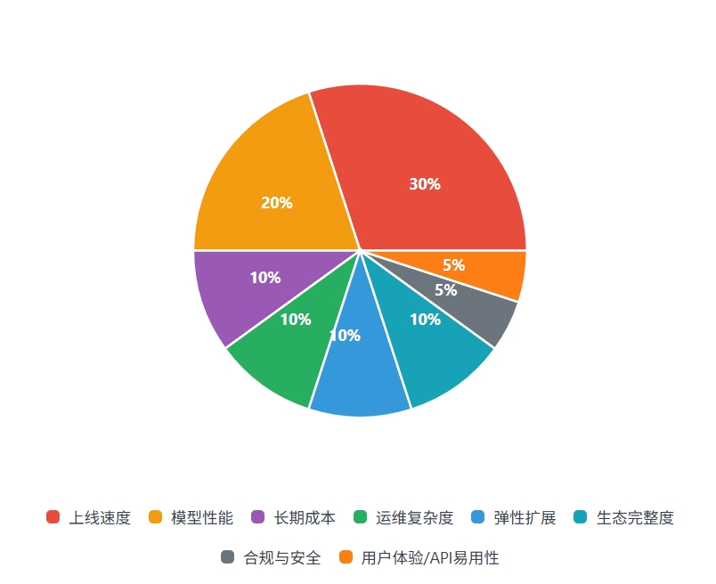

## LLM Deployment Solution Research Report v3.0

## Table of contents

1. Executive Summary
2. Decision Dimensions and Scoring Model
3. Deployment Mode Overview
4. Overview of startup support and free quota
5. Detailed plan comparison

- 5.1 International/Domestic Third-Party API
- 5.2 Cloud vendor managed inference
- 5.3 Low-code/scheduling platform and framework
- 5.4 Self-hosted open source model

6. Three-year TCO simulation
7. Risk and compliance assessment
8. Implementation Roadmap
9. Key conclusions and action plans
10. References

---

## 1. Executive Summary

This report aims to provide a clear, phased strategic roadmap for the team to deploy and select LLM.
Core conclusion: Through the gradual evolution from PoC → Beta → Scale, we can balance the speed of launch, cost efficiency, and compliance and security at different stages, and ultimately achieve the best TCO and data sovereignty protection through a self-hosted + API hybrid architecture at a large scale.

**PoC Phase (Proof of Concept)**

- Recommended solution: third-party API + low-code platform (such as Dify/Coze).
- Reason: With limited time and resources, the plug-and-play capabilities of third-party APIs combined with the visual process of low-code platforms can produce demonstrable prototypes within days to weeks, verifying business models and user needs with minimal investment. Using free quotas or startup plans from manufacturers, early costs can be almost negligible.

**Beta phase (public testing and iteration period)**

- Recommended solution: Migrate to mainstream cloud vendors' managed services (such as Azure OpenAI / AWS Bedrock), and integrate professional vector databases (such as Pinecone, Milvus) to build RAG applications.
- Reason: With the growth of user volume and functional requirements, higher availability, elastic expansion and compliance assurance are required. Cloud hosting services can quickly deploy stable endpoints, seamlessly integrate with cloud monitoring, security, storage and other services, meet SLA and domestic data residency requirements, and verify medium-scale carrying capacity within a controllable cost range.

**Scale Phase (Scaling and Optimization Phase)**

- Recommended solution: Build a self-hosted GPU cluster + API hybrid scheduling architecture.
- Reason: When the call volume reaches millions/month or higher, the cost of third-party API or cloud hosting pay-as-you-go model rises rapidly. Self-hosted GPU clusters can significantly reduce unit costs at high utilization; combined with third-party APIs as an alternative for peak or special high-performance needs, hybrid scheduling is formed to achieve a balance between cost and performance. At this stage, mature MLOps capabilities, improved monitoring and compliance audit systems are required to ensure the stability and security of large-scale services.

---

## 2. Decision Dimensions and Scoring Model

In order to achieve a scientific and transparent selection process, a quantitative evaluation model was established, which includes the following eight key dimensions. Each dimension is assigned a weight that reflects the typical priorities of startups.

| Dimensions                           | Weighting Examples | Explanations and Considerations                                                                                                                                                                                                                                                                                               |
| ------------------------------------ | :----------------: | ----------------------------------------------------------------------------------------------------------------------------------------------------------------------------------------------------------------------------------------------------------------------------------------------------------------------------- |
| Speed ​​of launch                    |        30%         | Core question: How quickly can we get our product to users? Evaluate the integration difficulty and end-to-end delivery cycle of the solution. For startups, launching MVP quickly is the key to seize the market opportunity.                                                                                                |
| Model performance                    |        20%         | Core question: What is the quantitative ability of the model in key tasks (such as coding, RAG, Agent, multi-round dialogue, mathematical reasoning, etc.)? If the project emphasizes intelligent ability, this weight is high; if the PoC first verifies the function, it can be appropriately lowered.                      |
| Long-term costs                      |        10%         | Core question: Will our profits be eaten up by costs after scaling? Focus on 3-year TCO, including API call fees or self-developed/self-hosted hardware depreciation, operation and maintenance manpower, upgrade and migration costs, etc., to measure long-term sustainability.                                             |
| Operation and maintenance complexity |        10%         | Core question: How many people and what skills are needed to maintain the system? Evaluate the workload of daily maintenance, monitoring, troubleshooting and upgrades; low operation and maintenance solutions allow streamlined teams to focus more on business innovation.                                                 |
| Elastic expansion                    |        10%         | Core question: Can the system support a sudden increase in the number of users? Can the cost be reduced during off-peak hours? The flexibility of the automatic expansion capability and automatic reduction cost saving of the solution directly affects the cost efficiency and user experience.                            |
| Ecosystem completeness               |        10%         | Core question: How easy is it to build advanced features such as RAG and Agent? Investigate the maturity of surrounding tool chains, SDKs, development libraries, and community support. A complete ecosystem can greatly reduce the difficulty of building complex AI applications and accelerate development and iteration. |
| Compliance and Security              |         5%         | Core questions: Does the solution meet local regulations? Is user data secure? Evaluating data residency, content review, privacy protection, encryption and audit capabilities, vendor qualifications and SLA commitments is critical for projects in specific industries or regions.                                        |
| User experience/API usability        |         5%         | Core issues: richness of API documentation and examples, friendliness of error prompts, multi-language SDK, debugging tools, local simulation, etc.; easy-to-use APIs can significantly accelerate development iterations and improve team efficiency.                                                                        |

> **Usage suggestions:**

- **Quantitative details** – Set clear indicators for “speed of launch”:
  T₀ → Demo ≤ 14 days: 5 points; ≤ 28 days: 4 points; and so on.

- **Multi-party scoring** – Joint evaluation by product/development/operation/legal/finance to avoid bias from a single perspective.

- **Iterative Update** – After the PoC is completed, the scores of each dimension will be backfilled with real data, and the weights will be recalibrated according to business priorities in preparation for the Beta phase.

### Deployment plan scoring table (PoC stage weight setting)

| Solution                             | Speed ​​ | Performance | Cost | Maintenance | Expansion | Ecosystem | Compliance | Ease of use | **Weighted total score** |
| ------------------------------------ | :------: | :---------: | :--: | :---------: | :-------: | :-------: | :--------: | :---------: | :----------------------: |
| **API Calls + Low Code**             |    5     |      4      |  4   |      5      |     3     |     4     |     3      |      5      |         **4.30**         |
| **Cloud-Hosted Inference**           |    4     |      4      |  3   |      4      |     4     |     5     |     4      |      4      |         **4.00**         |
| **Hybrid deployment (API + local)**  |    3     |      4      |  3   |      3      |     5     |     4     |     4      |      3      |         **3.55**         |
| **Self-developed / self-hosted GPU** |    2     |      5      |  2   |      2      |     3     |     3     |     5      |      2      |         **2.95**         |

> **Description:**
>
> - The weighted total score is calculated as follows: launch speed × 30% + model performance × 20% + long-term cost × 10% + operation and maintenance complexity × 10% + elastic expansion × 10% + ecological integrity × 10% + compliance and security × 5% + user experience/API usability × 5%.

---

## 3. Overview of deployment modes

| Solution               | Typical vendors/tools                      | Cost model                               | Speed ​​of launch    | Operation and maintenance complexity        | Ecosystem integrity                | Compliance                                           | Recommended stage |
| ---------------------- | ------------------------------------------ | ---------------------------------------- | -------------------- | ------------------------------------------- | ---------------------------------- | ---------------------------------------------------- | ----------------- |
| Third-party API        | OpenAI, Anthropic, Ali Qwen, DeepSeek      | On-demand token billing                  | ⭐⭐⭐⭐⭐ (fastest) | ⭐⭐⭐⭐⭐ (zero operation and maintenance) | ⭐⭐⭐⭐⭐ (open ecosystem)        | International version ❌ Domestic version ✅      | PoC               |
| Cloud-hosted reasoning | Azure OpenAI, AWS Bedrock, Alibaba Bailian | On-demand token/reserved instance        | ⭐⭐⭐⭐☆            | ⭐⭐⭐⭐☆                                   | ⭐⭐⭐⭐⭐ (closed-loop ecosystem) | ✅ (domestic nodes optional)                         | Beta              |
| Low code/framework     | Dify, Coze, LangChain, CrewAI              | Subscription + usage (cost penetration)  | ⭐⭐⭐⭐⭐ (fastest) | ⭐⭐⭐⭐☆ (relatively simple)               | ⭐⭐⭐⭐☆ (integrated ecosystem)   | Self-hosted ✅ SaaS version needs to be evaluated | PoC➜Beta          |
| Self-hosted GPU        | RunPod, CoreWeave, BentoML Cloud           | Fixed computing cost (GPU hourly rental) | ⭐⭐☆☆☆              | ⭐☆☆☆☆ (most complex)                       | ⭐⭐⭐☆☆ (self-built)              | ✅ (self-responsibility)                             | Scale             |

**illustrate:**

- Third-party API: Fastest launch, no infrastructure operation and maintenance required; low initial cost, high linear cost in the later stage; international version has data outflow and compliance risks.
- Cloud-hosted inference: easy to deploy, elastically scalable, and deeply integrated with the cloud ecosystem; optional domestic Region to satisfy data residency; suitable for medium-sized and compliance-required scenarios.
- Low-code platform/framework: Visualized processes or modular components, built-in RAG/Agent functions, suitable for rapid verification; SaaS version requires evaluation of data storage; self-hosted version or open source framework can be fully controlled.
- Self-hosted GPU: Lowest long-term cost, highly customizable, highest data sovereignty, but with the highest technical threshold and operation and maintenance complexity, suitable for mature stages and high-concurrency scenarios.

## 4. Overview of Entrepreneurship Support and Free Quotas

| Name/Manufacturer                       | Plan/Project                                           | Amount (RMB ¥ / USD \$ / Free)                                                       | Application points (including application difficulty)                                                      | Support content/usage suggestions                                                                                                                                                                                                                                                       |
| --------------------------------------- | ------------------------------------------------------ | ------------------------------------------------------------------------------------ | ---------------------------------------------------------------------------------------------------------- | --------------------------------------------------------------------------------------------------------------------------------------------------------------------------------------------------------------------------------------------------------------------------------------- |
| AWS Activate                            | Startup Acceleration (including Generative AI Special) | ¥72,500–¥2,175,000 (\~\$1k–\$300k)                                                   | Difficulty: Medium; New startups required; VC/incubator recommendations available                          | - Special quota can be used to test AI hardware such as Trainium/Inferentia - Covers all AWS cloud services and AI/ML services (such as Amazon Bedrock, SageMaker) - Provides technical support, training, and guidance                                                           |
| Azure Founders Hub                      | Entrepreneur Center                                    | ¥36,000–¥1,087,500 (\~\$5k–\$150k)                                                   | Application difficulty: low; no VC recommendation required; renewal based on usage activity                | - Credits can be used for various Azure services (Azure OpenAI, storage, computing, database, etc.) - Includes GitHub Enterprise, Microsoft 365 developer licenses - Provides technical guidance and entrepreneurial ecosystem connections                                        |
| Google for Startups                     | Cloud Program                                          | ¥14,500–¥2,537,500 (\~\$2k–\$350k)                                                   | Application difficulty: high; VC recommendation required; business/technical plan submitted in stages      | - Start Tier (\$2k) is suitable for the idea stage - Scale Tier (\$200k, two years) requires financing and scale conditions - AI First (\$350k) covers \$250k usage in the first year, and discounted renewal in the second year - Covers GCP AI/ML services such as Vertex AI |
| Alibaba Cloud MARS Entrepreneur Program | Cloud Discount Coupons                                 | ¥3.5k–¥1 million                                                                     | Application Difficulty: Low–Medium; Applicants are self-employed or start-ups                              | - AI Resource Subsidy: Trillions of tokens-level call subsidies, thousands of hours of technical support - Expert 1v1 docking service, technical training camp, investment and financing resource docking - Covers AI services such as Tongyi Qianwen Model and DashVector        |
| Tencent Cloud Lite model is free        | Hunyuan Lite / Intelligent Agent Development Platform  | Free tokens, character capacity, knowledge base, etc.                                | Application difficulty: low; just complete real-name authentication and activate                           | - Hunyuan Lite model is permanently free, no quota limit - 500,000 tokens (2 months) will be given for the first opening of the Intelligent Agent Development Platform - Suitable for concept verification and early development testing                                          |
| Baidu Qianfan Entrepreneur Program      | Entrepreneur Program                                   | Free/Enterprise Special 50 million free tokens                                       | Application difficulty: low-medium; after enterprise certification, you can apply for flagship model quota | - ERNIE Speed/Lite is completely free and has no usage restrictions - Enterprise users can apply for ERNIE3.5 flagship model 50 million tokens free call - Support vector library integration, Agent Builder low-code development                                                 |
| Anthropic for Startups                  | Claude API Verification                                | Free API credits, higher rate limits, community support, exclusive event invitations | Difficulty: High; usually requires VC/accelerator endorsement                                              | - Covers Claude 3 series model calls - Suitable for verifying Claude model capabilities and early prototype development                                                                                                                                                              |
| Mistralship (Mistral AI)                | La Plateforme Visit                                    | 6-month startup plan, providing about $30k credits                                   | Application difficulty: medium; in line with the early financing stage                                     | - PoC stage to verify the capabilities of Mistral model; Beta stage evaluation and comparison with other models to decide on long-term cooperation                                                                                                                                      |
| Vercel AI Accelerator                   | Front-end + AI application acceleration                | \~\$4,000,000+ credits                                                               | Application difficulty: high; project matching conditions                                                  | - Suitable for teams that quickly build front-end + AI applications - End-to-end verification with full range of credits                                                                                                                                                             |
| Together AI Studio                      | Comprehensive cloud credits                            | Commitment of \$1,000,000 funding and >\$600,000 cloud credits                       | Application difficulty: high; pay attention to the project application period                              | - Teams with innovative AI application ideas can apply and receive comprehensive support                                                                                                                                                                                                |

### 4.1. Detailed analysis of international cloud platform benefits

#### AWS Activate – Significant Improvement in Generative AI

- **Special Funding**: Up to $300,000 (approximately ¥2.175 million) specifically for testing AI acceleration hardware such as AWS Trainium/Inferentia.
- **Grading application conditions**:
- **Activate Founders**: Base $1,000 (about ¥72,500), suitable for self-funded or early-stage teams.
- **Standard Startup**: Up to $100,000 (approximately ¥725,000), VC/Incubator recommendation or partner institution endorsement required.
- **Generative AI Specialty**: Up to $300,000 (approximately ¥2.175 million), focusing on generative AI-related business or technology verification scenarios.
- **Basic Requirements**:
- New to AWS Activate, typically 10 years old or younger.
- Have financing record or viable business plan in the last 12 months.
- Complete company website, business registration information, team introduction and other materials.
- **Application website:** https://aws.amazon.com/activate/

#### Azure Founders Hub – Lowest threshold, participation score

- **Initial amount**: Starting level $5,000 (approximately ¥36,000).
- **Growth Level**: You can apply for up to $25,000 (approximately ¥180,000), and you need to complete a verification checklist (such as usage, verification cases, etc.).
- **High Level**: Up to $150,000 (approximately ¥1.0875 million), automatically renewed by using an activity scoring system.
- **Features**:
- No VC recommendation required, self-service online application, fast review.
- Engagement score: About 45 days before the credit expires, we will automatically evaluate whether to renew or increase your credit based on your Azure service usage activity.
- Credits can be used for various Azure services, including Azure OpenAI, storage, computing, databases, etc.
- **Application website:** https://www.microsoft.com/en-us/startups

#### Google for Startups – Highest Funding, AI-First Strategy

- **Three-tier support system**:

1. Start Tier: $2,000 (about ¥14,500) initial amount, for teams that have not received any or little funding.
2. **Scale Tier (Standard Startup)**: $200,000 (approximately ¥1.45 million) for two years, subject to meeting financing and company size requirements (such as Pre-seed/Seed/A round, etc.).
3. AI-First Startups: Up to $350,000 (approximately ¥2.5375 million), specifically for core AI technology startups that are required to provide AI-related business or technology plans.

- **AI Priority Program Additional Benefits**:
- Cover up to $250,000 in usage in the first year, and renew at a 20% discount in the second year.
- Additional special support: such as $10,000 for partner LLM model calls, $12,000 Google Cloud enhanced support credit, etc.
- **Application points**:
- You need to submit company information, financing proof (such as VC investment proof), technology/business plan, etc.
- The quotas at different stages are issued in phases, and subsequent support is evaluated based on milestones or usage.
- **Application website:** https://cloud.google.com/startup

---

### 4.2 China Cloud Platform Support Plan

#### Alibaba Cloud MARS Entrepreneur Program – Major Upgrade in 2025

- **Release background**: In April 2025, the "MARS Entrepreneur Program" was newly upgraded, aiming to support at least 1,000 startups within one year and provide millions of AI resource subsidies.
- **Core Support Content**:
- **AI resource subsidies**: Massive call subsidies (trillions of tokens) and thousands of hours of technical support.
- **Basic credit limit**: starting from ¥3,500, up to ¥1 million cloud discount coupons.
- **Expert Service**: Free 1v1 technical expert matching service.
- **Ecological support**: technical training camps, investment and financing resource docking, partner network, etc.
- **Application Requirements**:
- Both enterprises and individual businesses can apply, and they must not have paid for Alibaba Cloud or be applying for a special plan for the first time.
- Submit company/team information, business plan, AI technology roadmap, etc.; the review period is approximately 15-20 working days.
- **Usage suggestions**:
- Priority will be given to applying for and consuming subsidy resources for model calling and integration testing during the PoC/Beta phase.
- Plan the subsequent payment or renewal plan in advance based on usage, and compare and evaluate multi-cloud solutions by combining AWS/Azure/Google.
- Participate in official training camps and ecological activities to obtain more technical and financing support.
- **Application website:** https://help.aliyun.com/document_detail/2698335.html

#### Tencent Cloud Lite Model Free Plan

- **Free form**: The Hunyuan Lite model is permanently free, with no usage limit, and the API input and output length is upgraded from 4k to 256k.
- **Free Quota**:
- The first time you activate the Hunyuan Large Model service, you will be given 1 million tokens (1 year). When you first activate the Intelligent Agent Development Platform, you will receive a free call quota of 500,000 tokens (valid for 2 months), which is applicable to the Hunyuan Large Model series and other fine-tuned knowledge large models.
- The Hunyuan Lite model has no limit on usage and can be used for free forever.
- Free knowledge base capacity of 3 million characters (valid for 6 months) and 5,000 online search calls (valid for 2 months).
- **Application Requirements**:
- Complete corporate or personal real-name authentication.
- After logging into the Tencent Cloud Intelligent Development Platform for the first time, click "Product Experience" to automatically activate and obtain free quota.
- **Usage suggestions**:
- Free quotas are used first, and consumption can be checked on the billing management page of the intelligent agent development platform.
- Suitable for startups or individuals to conduct proof of concept and early development testing.
- Free resources that are not used up after the expiration date will become invalid. It is recommended to use them in time or purchase renewals according to needs.
- **Application website:** https://cloud.tencent.com/document/product/1729/97731

#### Baidu Qianfan Entrepreneur Program

- **Totally Free Strategy**: ERNIE Speed/Lite models are completely free for all users to use, with no usage restrictions.
- **Enterprise Special Quota**: After enterprise certification, you can apply for a free quota of 50 million Tokens of ERNIE3.5 flagship model for use in production or testing environments.
- **How ​​to apply**:
- Register a Baidu Smart Cloud account and complete enterprise real-name authentication.
- Receive basic free quota on the Qianfan platform free activation page; submit enterprise information to apply for special quota.
- **Application website:** https://cloud.baidu.com/doc/WENXINWORKSHOP/s/xlxuhovgi

---

### 4.3 Benefits for AI Specialized Service Providers

#### Anthropic for Startups

- **Support content**: Launch startup programs with VC partners, provide free API credits, higher rate limits, community support, exclusive founder event invitations, etc.
- **Application requirements**: Usually endorsed by a cooperating VC or accelerator, and submission of project plans and team information.
- **Usage suggestion**: Apply for credits when validating the capabilities of the Claude model; compare performance and cost with other models during the Beta phase.
- **Application website:** https://www.anthropic.com/startups

#### Mistralship (Mistral AI)

- **Support Content**: 6-month startup program providing ~$30k credits to several startups for La Plateforme; 1:1 support; early access to new models and products.
- **Application conditions**: The team must meet the early financing stage and submit AI application scenarios and technical solutions.
- **Usage suggestions**: Verify the capabilities of the Mistral model in the PoC phase; evaluate and compare with other models in the Beta phase to decide on long-term cooperation.
- **Application website:** https://share-eu1.hsforms.com/12yGDfL7gQBCs-Jub4AonKw2dffx9

---

### 4.4 Benefits for Professional Accelerator Entrepreneurs

#### Vercel AI Accelerator

- **Project duration**: Approximately 6 weeks, providing over $4,000,000 in credits and resources to ~40 teams.
- **Main Benefits**:
- AWS offers $1,000,000 Activate credits
- Anthropic offers $600,000 credits + 3 months free Claude for Teams
- $430,000 credits from OpenAI
- Credits and support from 20+ other AI platforms
- **Usage suggestions**: Teams that intend to quickly build front-end + AI applications can apply for end-to-end verification with full range of credits.
- **Application website:** https://vercel.com/ai-accelerator

#### Together AI Studio

- **Support**: $1,000,000 in funding and >$600,000 in cloud credits from OpenAI, AWS, Google Cloud, Azure, and more.
- **Usage suggestions**: Teams with innovative AI application ideas can follow this project and apply for comprehensive support.
- **Application website:**: https://together.fund/ai/

## 5. Detailed plan comparison

### 5.1 International/Domestic Third-Party API

### 5.1.1 Pricing at a Glance

| Platform / Model                      | Context Window | **Input ¥ / 1M tokens** | **Output ¥ / 1M tokens**                       | Features and Model Value                                                                                                          |
| ------------------------------------- | -------------- | ----------------------- | ---------------------------------------------- | --------------------------------------------------------------------------------------------------------------------------------- |
| **OpenAI**                            |                |                         |                                                |                                                                                                                                   |
| GPT-4.1 nano                          | 128 K          | **0.73**                | **2.90**                                       | Fastest, lowest cost model, suitable for low-latency tasks such as fast-response agents or edge computing.                        |
| GPT-4.1 mini                          | 128 K          | **2.90**                | **11.60**                                      | A balance of intelligence and speed, suitable for most medium-complexity businesses.                                              |
| GPT-4.1                               | 128 K          | **14.50**               | **58.00**                                      | Most intelligent, suitable for complex tasks such as document understanding, legal analysis, and research reasoning.              |
| o3                                    | 128 K          | **14.50**               | **58.00**                                      | A new generation flagship reasoning model that excels in code, math, science, and multimodal reasoning.                           |
| o4-mini                               | 128 K          | **7.98**                | **31.90**                                      | The best performance-price ratio for inference, suitable for cost-sensitive scenarios that require strong inference capabilities. |
| **Anthropic Claude**                  |                |                         |                                                |                                                                                                                                   |
| Claude Haiku 3.5                      | 200K           | **5.80**                | **29.00**                                      | Extremely cost-effective and responsive, suitable for lightweight dialogue and real-time generation.                              |
| Claude Sonnet 4                       | 200K           | **21.80**               | **108.75**                                     | Optimal balance between intelligence and cost, suitable for enterprise search, RAG, and daily AI assistant.                       |
| Claude Opus 4                         | 200 K          | **108.75**              | **543.75**                                     | The most powerful intelligence, suitable for the highest complexity reasoning and cross-modal high-value tasks.                   |
| **Google Gemini**                     |                |                         |                                                |                                                                                                                                   |
| Gemini 2.5 Flash Preview              | 1 M            | **1.09**                | **4.35** (Non-thinking) / **25.38** (Thinking) | Low-cost, long-context, multi-modal deployment optimization.                                                                      |
| Gemini 2.5 Pro ≤200 K                 | 1 M            | **9.06**                | **72.50**                                      | Deep document understanding and multimodal high-value scenarios.                                                                  |
| Gemini 2.5 Pro >200 K                 | 1 M            | **18.13**               | **108.75**                                     | —                                                                                                                                 |
| **DeepSeek**                          |                |                         |                                                |                                                                                                                                   |
| DeepSeek-V3 (misses)                  | 64K            | **2.00**                | **8.00**                                       | General MoE cost-effective; cache hits as low as 0.51/1.00 (M).                                                                   |
| DeepSeek-R1                           | 64 K           | **4.00**                | **16.00**                                      | Optimized version for complex reasoning, suitable for technical problem solving and deep thinking.                                |
| **Alibaba Cloud Qwen**                |                |                         |                                                |                                                                                                                                   |
| Tongyi Qianwen-Max                    | 131 K          | **2.40**                | **9.60**                                       | Flagship model, with the strongest ability for complex tasks.                                                                     |
| Tongyi Qianwen-Plus                   | 131 K          | **0.80**                | **2.00**                                       | Balance of effect, speed and cost.                                                                                                |
| Tongyi Qianwen-Turbo                  | 1 M            | **0.30**                | **0.60**                                       | Extremely cost-effective, fast speed and low cost.                                                                                |
| Tongyi Qianwen-Long                   | 10 M           | **0.50**                | **2.00**                                       | Supports very long texts and is optimized for large-scale analysis.                                                               |
| **Baidu Qianfan**                     |                |                         |                                                |                                                                                                                                   |
| ERNIE Speed/Lite                      | 8K / 128 K     | **0.00**                | **0.00**                                       | Lightweight and zero-cost, PoC and large-scale trial friendly.                                                                    |
| ERNIE 4.5 Turbo                       | —              | **0.80**                | **3.20**                                       | Cost-effective general model, supporting tool calls.                                                                              |
| ERNIE 4.5                             | —              | **4.00**                | **16.00**                                      | Deep multimodal flagship, leading in Chinese reasoning.                                                                           |
| **Tencent Cloud Hunyuan**             |                |                         |                                                |                                                                                                                                   |
| Hunyuan-lite                          | 250 K          | **0.00**                | **0.00**                                       | Free long context, suitable for basic services and PoC.                                                                           |
| Hunyuan-TurboS                        | 28K            | **0.80**                | **2.00**                                       | 500,000–1,000,000 tokens free quota, flagship performance.                                                                        |
| Hunyuan-T1                            | 28 K           | **1.00**                | **4.00**                                       | General main model, commonly used for complex question answering and document understanding.                                      |
| **Mistral AI**                        |                |                         |                                                |                                                                                                                                   |
| Mistral Small 3.1                     | 128 K          | **0.73**                | **2.18**                                       | Lightweight and efficient, multi-language friendly.                                                                               |
| Mistral Medium 3                      | 128 K          | **2.90**                | **14.50**                                      | Good value for medium to high complexity tasks.                                                                                   |
| Mistral Large                         | 128 K          | **14.50**               | **43.50**                                      | Flagship-level capabilities, the first choice for hardcore scenarios.                                                             |
| **Cohere**                            |                |                         |                                                |                                                                                                                                   |
| Command R7B                           | 128 K          | **0.27**                | **1.09**                                       | Small model RAG / Test preferred, lowest cost.                                                                                    |
| Command R                             | 128 K          | **1.09**                | **4.35**                                       | General RAG model, enterprise lightweight application.                                                                            |
| Command A                             | 256 K          | **18.13**               | **72.50**                                      | Agentic AI optimization, multi-language RAG and complex business.                                                                 |
| **Volcano Ark (Volcengine)**          |                |                         |                                                |                                                                                                                                   |
| Doubao-pro-32k                        | 32 K           | **0.80**                | **2.00**                                       | Main general-purpose large model with stable performance.                                                                         |
| **OpenRouter (Convergence Platform)** |                |                         |                                                |                                                                                                                                   |
| Llama 3.3 70B                         | 131 K          | **0.51**                | **1.81**                                       | Lowest price, OpenAI compatible API, multiple models available.                                                                   |

> **Description**:
>
> - Free model shows **0.00**.

#### 5.1.2 Model Detailed Description

---

#### Overview of key benchmarks

In order to comprehensively evaluate large language models, the industry has established a number of standardized benchmarks to measure the performance of models in different cognitive dimensions and application scenarios. These key benchmarks are crucial for selecting appropriate models. Let’s take a look at the current mainstream benchmarks.

1. Overall Score / Arena Elo

- Obtained through the Elo rating or user preference voting results of platforms such as Chatbot Arena, reflecting the comprehensive user experience of the model in general conversation and task processing. The Elo mechanism calculates the relative ranking by randomly pairing models, collecting human preference votes. A high Elo means that the model is more popular with users in a wide range of scenarios.

2. Mathematical Reasoning (AIME 2024/2025)

- AIME Benchmark evaluates the model's ability to solve medium- and high-difficulty math reasoning problems. It not only measures the correctness of calculations, but also examines multi-step logical deductions. The 2025 version was run multiple times to reduce variance, and the results showed that o3 Mini and Gemini 2.5 Pro Exp led the way in AIME 2024/2025.

3. **Coding ability (SWE-bench, BigCodeBench, LiveCodeBench, etc.)**

- SWE-bench: pass\@k/resolved rate metric for real software engineering tasks (e.g., GitHub issue fixes). Top models in 2025 include Claude Sonnet 4, o3, GPT-4.1 series, Gemini 2.5 Flash, etc.
- BigCodeBench: A complex code generation/repair benchmark for larger models, covering multi-model comparisons.
- LiveCodeBench: Another platform for real-time evaluation of coding capabilities.

4. Scientific knowledge (GPQA Diamond)

- GPQA Benchmark tests the accuracy of models in cross-disciplinary, high-level professional question answering. The latest data shows that Gemini 2.5 Pro Exp leads with about 80.3%, Groκ 3 Mini Fast High Reasoning \~79.0%, Claude 3.7 Sonnet Thinking Mode \~75.3%, o3 Mini \~75.0%, etc.

5. Multimodal Understanding (MMMU)

- MMMU Benchmark evaluates the model's ability to process multimodal information such as graphics, text, and charts. The latest results show that Gemini 2.5 Pro Exp leads by about ≈81.7% on this benchmark, second only to or close to leading models such as o3 and Claude.

6. Agent capabilities (such as BFCL/ArenaHard/MultiChallenge/Multi-turn)

- Measures the performance of the model in scenarios such as multi-step tasks, tool calls, and environment interactions. Typical benchmarks include BFCL, ArenaHard, MultiChallenge, etc. ChatGPT-4o performs ~72.1% on BFCL, Qwen3 (235B) BFCL ~70.8%, Hunyuan Turbos ArenaHard ~91.9%, etc.

---

#### Detailed analysis of model performance

The following table summarizes the latest performance of the main LLM APIs on the above key benchmarks. Due to the large differences in the formats published by different platforms, we have appropriately standardized the indicators:

- **Combined Score**: Reference to Chatbot Arena Elo ranking or approximation.
- **AIME**: pass\@1 or accuracy percentage if the platform only publishes leading models.
- **SWE-bench**：Resolved Rate (%) 或 pass\@5 (%)。
- **GPQA**: Accuracy (%).
- **MMMU**: Accuracy (%).
- **Agent capabilities**: MultiChallenge/BFCL/ArenaHard etc. accuracy (%).

**Latest performance of major LLM APIs on key benchmarks**

| Ranking | Model Name               | Company       | Arena Elo | AIME 2024 | SWE-bench | GPQA  | MMMU  | MultiChallenge |
| :-----: | ------------------------ | ------------- | :-------: | :-------: | :-------: | :---: | :---: | :------------: |
|    1    | Gemini 2.5 Pro           | Google        |   1480    |   92.0%   |   63.8%   | 84.0% | 81.7% |     51.91      |
|    2    | O3                       | OpenAI        |   1427    |   91.6%   |   69.1%   | 83.3% | 82.9% |     56.51      |
|    3    | ChatGPT-4o               | OpenAI        |   1426    |   13.1%   |   29.8%   | 53.6% | 69.1% |     27.81      |
|    4    | GPT-4.5                  | OpenAI        |   1413    |   36.7%   |   38.0%   | 71.4% | 74.4% |     43.77      |
|    5    | Claude Opus 4            | Anthropic     |   1373    |   75.5%   |   72.5%   | 79.6% | 76.5% |     53.90      |
|    6    | Gemini 2.5 Flash         | Google        |   1420    |    72%    |   60.4%   | 82.8% | 79.7% |     47.65      |
|    7    | DeepSeek R1-0528         | DeepSeek AI   |   1421    |   91.4%   |   57.6%   | 81.0% |  N/A  |     44.55      |
|    8    | GPT-4.1                  | OpenAI        |   1385    |   9.8%    |   54.6%   | 50.3% | 80.1% |     38.26      |
|    9    | Grok 3 Preview           | xAI           |   1419    |   52.2%   |   57.0%   | 75.4% | 73.2% |      N/A       |
|   10    | Qwen3-235B-A22B          | Alibaba Cloud |   1363    |   85.7%   |   70.7%   | 71.1% |  N/A  |     40.53      |
|   11    | DeepSeek V3              | DeepSeek AI   |   1334    |   39.2%   |   42.0%   | 59.1% |  N/A  |     32.19      |
|   12    | O4 Mini                  | OpenAI        |   1362    |   92.7%   |   68.9%   | 81.4% | 81.6% |     43.83      |
|   13    | O1                       | OpenAI        |   1365    |   79.2%   |   48.9%   | 78.0% | 77.6% |     44.93      |
|   14    | Claude Sonnet 4          | Anthropic     |   1346    |   70.5%   |   72.7%   | 75.4% | 74.4% |     49.63      |
|   15    | Gemini 2.5 Flash Lite    | Google        |   1377    |   71.4%   |   45.2%   | 76.8% | 78.3% |      N/A       |
|   16    | Claude 3.7 Sonnet        | Anthropic     |   1307    |   80.0%   |   70.3%   | 84.8% | 75.0% |     42.89      |
|   17    | Mistral Medium           | Mistral AI    |   1365    |   42.8%   |   38.4%   | 68.9% | 73.2% |     32.29      |
|   18    | Hunyuan Turbos           | Tencent       |   1373    |   76.4%   |   64.9%   | 69.3% | 74.6% |      N/A       |
|   19    | GPT-4.1 Mini             | OpenAI        |   1338    |   28.5%   |   31.8%   | 65.0% | 72.7% |     35.81      |
|   20    | Qwen2.5 Max              | Alibaba Cloud |   1360    |    N/A    |   38.7%   | 60.1% |  N/A  |      N/A       |
|   21    | O3 Mini High             | OpenAI        |   1340    |   87.3%   |   35.5%   | 79.7% |  N/A  |     39.89      |
|   22    | Claude 3.5 Sonnet        | Anthropic     |   1299    |   16.0%   |   49.0%   | 65.0% | 68.3% |     43.20      |
|   23    | Gemini 2.0 Flash         | Google        |   1363    |   73.3%   |   28.7%   | 74.2% | 75.4% |     36.88      |
|   24    | Gemma 3 27B IT           | Google        |   1356    |   42.8%   |   29.7%   | 42.4% | 64.9% |      N/A       |
|   25    | Grok 3 Mini Beta         | xAI           |   1361    |   39.7%   |   41.5%   | 66.2% | 69.4% |      N/A       |
|   26    | O3 Mini                  | OpenAI        |   1321    |   87.3%   |   35.5%   | 77.0% |  N/A  |     40.09      |
|   27    | Gemini 1.5 Pro           | Google        |   1317    |   36.4%   |   26.6%   | 46.2% | 62.2% |     21.59      |
|   28    | Command A                | Cohere        |   1325    |   28.5%   |   31.4%   | 50.8% | 58.7% |      N/A       |
|   29    | Qwen Plus                | Alibaba Cloud |   1326    |   68.9%   |   45.3%   | 62.4% | 67.8% |      N/A       |
|   30    | Gemma 3 12B IT           | Google        |   1336    |   38.7%   |   24.6%   | 40.9% | 59.6% |      N/A       |
|   31    | Hunyuan Turbo            | Tencent       |   1311    |   58.4%   |   42.8%   | 55.6% | 61.9% |      N/A       |
|   32    | GLM-4 Plus               | Zhipu AI      |   1326    |   52.7%   |   38.9%   | 58.2% | 63.4% |      N/A       |
|   33    | Llama 3.1 Nemotron Ultra | Meta          |   1312    |   45.6%   |   24.6%   | 48.3% | 56.8% |      N/A       |
|   34    | O1 Mini                  | OpenAI        |   1319    |   79.2%   |   27.2%   | 59.4% | 78.2% |     34.49      |
|   35    | Llama 3.1 405B Instruct  | Meta          |   1284    |   41.3%   |   26.4%   | 51.1% | 64.5% |     16.22      |

---

#### Performance evolution and competitive focus

- **Overall ranking is tight**: Models from major manufacturers compete fiercely in the overall ranking, with the Elo score gap between them often within dozens of points, and new versions are released frequently in an effort to surpass their competitors.
- **Breakthroughs in specific areas**:
- **Mathematics and Reasoning**: Grok 3 Mini Beta achieved a high score of about 95.8% in AIME Mathematical Reasoning (experimental mode); DeepSeek R1 showed strong competitiveness in ArenaHard and Mathematical Reasoning; Qwen3 also performed well in LiveCodeBench and AIME tests.
- **Multimodal Understanding**: The Gemini series maintains its leading position in the MMMU benchmark, highlighting its advantages in image and text, chart understanding, and cross-modal reasoning.
- **Multimodal differentiation**: Multimodal capability is an important direction of LLM differentiation at present. In the future, it will be expanded to the integration of more modes such as audio, video, 3D data, etc. to provide more natural interaction and more complex unstructured data processing capabilities.

#### The evolution and challenges of benchmarking

- **From single to comprehensive**: Traditional single-task accuracy benchmarks are no longer sufficient to fully reflect the performance of models in practical applications.
- **Agent capability evaluation**: Emerging benchmarks such as SWE-bench, ArenaHard, and BFCL focus more on evaluating the overall performance of LLM as an intelligent agent, emphasizing the ability of the model to work together with external tool chains.
- **Simulating real-world environments**: Benchmarks such as RE-Bench and Multi-Mission Tool Bench are trying to simulate more dynamic and complex environments that require long-term planning and multi-task collaboration to comprehensively evaluate the reliability of models in complex workflows.
- **Test optimization and actual deployment**: Some high scores may come from test optimization or "thinking mode" (Test-time Compute), which may be difficult to popularize in actual deployment due to high cost or high latency. Developers need to weigh the performance against actual benefits.

---

#### Analysis of popular LLM API models

##### OpenAI Series

OpenAI offers a range of models that meet different needs from ultra-low latency to flagship intelligence, and are optimized for specific tasks.

- **GPT-4.1 nano**:
- **Positioning**: Ultra-low latency, ultra-low cost.
- **Typical scenarios**: edge computing, lightweight agents, webhook callbacks, and other scenarios that require extremely high response speed.
- **Cost-effectiveness**: **¥0.73/1M input, ¥2.90/1M output**, which has irreplaceable cost advantages under millisecond-level interaction requirements.
- **GPT-4.1 mini**:
- **Positioning**: Balance of intelligence and speed.
- **Typical scenarios**: Medium-complexity customer service conversations, FAQ bots, content review pipelines.
- **Price/performance**: **¥2.90/1M input, ¥11.60/1M output**, significantly improved inference quality, and slightly higher cost than nano.
- **GPT-4.1**:
- **Positioning**: flagship smartphone.
- **Typical scenarios**: long text comprehension, legal/financial document analysis, and in-depth research report writing.
- **Value for money**: **¥14.50 / 1M input, ¥58.00 / 1M output**, suitable for core businesses with sufficient budget and priority on quality.
- **o3**:
- **Localization**: Top multimodal reasoning models.
- **Typical scenarios**: code generation, mathematical proof, scientific experiment design, and image understanding.
- **Price/performance**: Same price as GPT-4.1 (**¥14.50 / 1M input, ¥58.00 / 1M output**), but shows clear advantages in professional benchmarks (such as MATH, Codeforces, ImageNet).
- **o4-mini**:
- **Positioning**: Lightweight inference model.
- **Typical scenarios**: Cost-sensitive and complex tasks that require strong math, coding, and visual understanding capabilities.
- **Price/performance**: **¥7.98 / 1M input, ¥31.90 / 1M output**, which is about 45% cheaper than o3, but still retains more than 80% of the performance.

---

##### Anthropic Claude Series

The Claude model is known for its outstanding performance across different performance and cost ranges, especially in handling complex conversations and multimodal content.

- **Claude Haiku 3.5**:
- **Positioning**: Extremely high throughput, low latency conversation model.
- **Typical scenarios**: high-concurrency scenarios such as real-time customer service, content review, and quick summary.
- **Cost-effectiveness**: **¥5.80 / 1M input, ¥29.00 / 1M output**, continuously stable in high-concurrency scenarios.
- **Claude Sonnet 4**:
- **Positioning**: Enterprise-level balanced flagship.
- **Typical scenarios**: RAG (retrieval-augmented generation), search recommendation, and multi-round mixed text and graph analysis.
- **Price/performance**: **¥21.80 / 1M input, ¥108.75 / 1M output**, providing a high-quality experience for multi-modal and complex applications.
- **Close Work 4**:
- **Positioning**: Top thinker.
- **Typical scenarios**: cutting-edge research, strategic planning, cross-disciplinary comprehensive Q&A and creative writing.
- **Price/performance**: **¥108.75 / 1M input, ¥543.75 / 1M output**, reserved for the most demanding inference quality scenarios.

---

##### Google Gemini Series

The Gemini series emphasizes multi-modal processing capabilities and performance balance at different cost-effectiveness.

- **Gemini 2.5 Flash Preview**:
- **Positioning**: Low-cost long context and hybrid reasoning capabilities.
- **Typical scenario**: Large-scale batch multimodal pipeline, supporting text, image, video, and audio input.
- **Price/performance**: **¥1.09 / 1M input, ¥4.35 / 1M non-inference output, ¥25.38 / 1M inference output**, providing the best throughput cost.
- **Gemini 2.5 Pro**:
- **Positioning**: The flagship of multimodal deep reasoning.
- **Typical scenarios**: complex document understanding, code auditing, cross-media search and RAG.
- **Value for money**:
- Input: **¥9.06 / 1M (context length ≤200K)**, **¥18.13 / 1M (context length >200K)**
- Output: **¥72.50 / 1M (context length ≤200K)**, **¥108.75 / 1M (context length >200K)**

---

##### DeepSeek Series

The DeepSeek model has attracted attention for its high cost-effectiveness and enhanced capabilities in complex reasoning.

- **DeepSeek-V3**:
- **Positioning**: Cost-effective Chinese general MoE (Mixed of Experts) model.
- **Typical scenarios**: article generation, summarization, and general knowledge question answering.
- **Cost-effectiveness**: **¥2.00 / 1M input, ¥8.00 / 1M output**; when the cache hits, the price drops to **¥0.51 / 1M**, which greatly saves the cost of repeated queries.
- **DeepSeek-R1**:
- **Positioning**: Complex reasoning enhanced version.
- **Typical scenarios**: technical document analysis, scientific research assistance, and rigorous logical reasoning.
- **Cost-effective**: **¥4.00 / 1M input, ¥16.00 / 1M output**, performance improvement to match professional needs.

---

##### Alibaba Cloud Qwen series

Tongyi Qianwen series provides comprehensive solutions from extremely fast and low-cost to ultra-long text processing, and is particularly competitive in the domestic market.

- **Tongyi Qianwen-Max**:
- **Position**: Flagship complex mission expert.
- **Typical scenarios**: financial auditing, legal compliance, and in-depth analysis of scientific research literature.
- **Price/performance**: **¥2.40 / 1M input, ¥9.60 / 1M output**, achieving top-level model capabilities at a very low cost.
- **Tongyi Qianwen-Plus**:
- **Position**: Balanced all-round model.
- **Typical scenarios**: Most mixed business scenarios, such as conversation, summary, classification, RAG.
- **Cost-effective**: **¥0.80 / 1M input, ¥2.00 / 1M output**, it is considered to be the most widely used "preferred base" in China.
- **Turbo**:
- **Positioning**: An extremely fast and low-cost assembly line player.
- **Typical scenarios**: high-concurrency log decomposition, indicator extraction, and structured field extraction.
- **Cost-effectiveness**: **¥0.30 / 1M input, ¥0.60 / 1M output**, the lowest unit cost option in the commercial model.
- **Tongyi Qianwen-Long**:
- **Position**: Expert in processing extremely long texts.
- **Typical scenarios**: Large-scale document indexing and full-text retrieval, supporting 10M Tokens context.
- **Cost-effective**: **¥0.50 / 1M input, ¥2.00 / 1M output**, solving the needs of large context processing at the lowest cost.

---

##### Baidu Qianfan ERNIE series

Baidu's ERNIE series focuses on Chinese multimodal capabilities and provides a free entry option.

- **ERNIE Speed / Lite**:
- **Positioning**: Zero cost to get started.
- **Typical scenarios**: PoC (proof of concept), developer learning, lightweight batch text processing.
- **Cost-effectiveness**: **Permanently free**, no token restrictions, an ideal choice for trial and error and learning.
- **ERNIE 4.5 Turbo**:
- **Positioning**: Cost-effective enterprise-level general working model.
- **Typical scenarios**: Support tool calls, plug-ins, and RAG processes.
- **Value for money**: **¥0.80 / 1M input, ¥3.20 / 1M output**, providing professional-level features at a price close to free.
- **ERNIE 4.5**:
- **Positioning**: Chinese multimodal flagship.
- **Typical scenarios**: image + text understanding, long document understanding, and cultural context analysis.
- **Cost-effective**: **¥4.00 / 1M input, ¥16.00 / 1M output**, providing leading results for core Chinese scenarios.

---

##### Tencent Cloud Hunyuan Series

Tencent Hunyuan series provides multiple models from free to trillion-parameter flagship, achieving a balance between performance and cost.

- **Hunyuan-lite**:
- **Positioning**: Permanently free long-context model.
- **Typical scenarios**: PoC, education, and large-scale basic services.
- **Cost-effectiveness**: **¥0.00 / 1M**, extremely cost-effective, and the inference depth is slightly lower than the flagship model.
- **Hunyuan-TurboS**:
- **Positioning**: Trillion-parameter flagship.
- **Typical scenarios**: High-concurrency intelligent question-answering and document parsing.
- **Cost-effectiveness**: 1 million tokens are free in the first month, and **¥0.80/1M input, ¥2.00/1M output** thereafter, taking into account both cost and performance.
- **Hunyuan-T1**:
- **Position**: General main model.
- **Typical scenarios**: complex conversations, full document understanding, and intelligent recommendations.
- **Cost-effective**: **¥1.00 / 1M input, ¥4.00 / 1M output**, it is the "economic flagship" of the Hunyuan series.

---

Mistral AI Series

Mistral AI models are recognized for their efficiency and expertise in coding, STEM fields.

- **Mistral Small 3.1**:
- **Positioning**: Lightweight multilingual assistant.
- **Typical scenarios**: basic tasks such as translation, summarization, and classification.
- **Cost-effectiveness**: **¥0.73 / 1M input, ¥2.18 / 1M output**, extremely low startup cost.
- **Mistral Medium 3**:
- **Position**: Coding and STEM field expert.
- **Typical scenario**: Technical document generation and analysis.
- **Value for money**: **¥2.90 / 1M input, ¥14.50 / 1M output**, performance close to the flagship but at a better price.
- **Mistral Large 2**:
- **Positioning**: Open source flagship competitor.
- **Typical scenarios**: the most demanding multimodal and complex reasoning tasks.
- **Value for money**: **¥29.00 / 1M input, ¥87.00 / 1M output**, providing a free alternative for teams that need top-notch capabilities.

---

##### Cohere Series

The Cohere model focuses on RAG and Agentic AI, providing solutions optimized for retrieval and tool invocation.

- **Command R7B**:
- **Position**: Lightweight RAG prototype build.
- **Typical scenario**: Lowest cost RAG test model.
- **Price/performance**: **¥0.27/1M input, ¥1.09/1M output**, ideal for building RAG PoC.
- **Command R**:
- **Positioning**: General-purpose enterprise-level RAG.
- **Typical scenarios**: knowledge base question and answer, intelligent search.
- **Cost-effective**: **¥1.09 / 1M input, ¥4.35 / 1M output**, balancing performance and cost.
- **Command A**:
- **Positioning**: Agentic AI only.
- **Typical scenarios**: Support multi-step tool calls and complex business processes.
- **Cost-effective**: **¥18.13 / 1M input, ¥72.50 / 1M output**, providing exclusive optimization for complex Agent processes.

---

##### Volcengine

- **Doubao-pro-32k**:
- **Positioning**: C-end large-scale content generation engine.
- **Typical scenarios**: social, recommendation, and creation platforms.
- **Cost-effective**: **¥0.80 / 1M input, ¥2.00 / 1M output**, achieving extremely low cost under large traffic.

---

##### OpenRouter third-party aggregation platform

- **Llama 3.3 70B（OpenRouter）**:
- **Positioning**: Open source flagship "one-click trial".
- **Typical scenario**: Quickly conduct PoC and small-scale experiments without self-deployment.
- **Cost-effectiveness**: **¥0.51 / 1M input, ¥1.81 / 1M output**, with convenience as the core value.

---

#### General considerations for API services

Choosing the right LLM API requires not only considering model performance, but also comprehensively considering factors such as cost, deployment, feature support, and compliance.

##### Cost Model

- **Pay by usage**: Billing is mainly based on input/output token usage, without the need for upfront infrastructure investment.
- **Cost curve**: In the early stage, when the call volume is low, the cost is negligible (there is often free quota); as the call volume increases linearly, the cost rises rapidly.
- **Optimization strategy**: Many providers offer significant discounts for cache input and batch processing, which can effectively reduce the cost of repetitive tasks (e.g. batch processing of Alibaba Cloud Qwen series and cache hit price of DeepSeek).
- **Self-hosting inflection point**: When the monthly call volume reaches hundreds of millions, it is necessary to evaluate the critical point between API call cost and self-hosting cost in advance.

##### Speed ​​of launch and deployment complexity

- **Simple deployment**: Just apply for an API Key to make the call, easy integration.
- **Operation and maintenance free**: No need to worry about the deployment, operation and maintenance, and capacity expansion of the underlying model, the service provider is responsible for high availability.
- **Fast iteration**: Suitable for fast verification scenarios and prompt iterations, saving team human resources.

###### Feature Support (RAG/Agent/Embedding)

- **Basic Services**: All mainstream APIs provide basic text/dialogue generation and Embedding interfaces.
- **Tool Calling**: Most mainstream model services support Function Calling, allowing LLM to interact with external systems and data.
- **Built-in tools**: Some service providers provide built-in code interpreters, file searches, web searches and other tools.
- **RAG support**: Developers usually need to integrate a vector database themselves or with the help of a framework to implement RAG, but some platforms have optimized the RAG process.
- **Multimodal capabilities**: Multiple flagship models support image, audio, and video processing capabilities.

##### Free quota

- **International manufacturers**: The free quota is usually limited, mostly depends on startup or project applications, and has rate/usage restrictions.
- **Domestic manufacturers**: often have more generous free or low-price strategies, such as permanent free models and free token quotas.

##### Compliance

- **Cross-border data and supervision**: There are cross-border data and regulatory risks when using international APIs in the production environment of mainland China, and they should not be directly used for formal services for domestic users.
- **Domestic Compliance**: Domestic APIs have completed algorithm filing, built-in review mechanisms, and data is stored domestically, making them more suitable for Chinese market applications. If highly sensitive data is processed, additional assessment is still required as to whether private deployment or higher-level security measures are required.
- **Data Usage Policy**: Most providers state that customer data will not be used to train their underlying models, but you should still carefully review their data policies when choosing.

##### Model Value and Evaluation

- **General Intelligence**: Several flagship models lead in general benchmarks. DeepSeek-V3 performs well in relevant tests.
- **Chinese processing**: Some Chinese models perform well in Chinese understanding and reasoning, especially in multiple benchmarks.
- **Encoding ability**: Many models perform well in encoding benchmarks.
- **Long context understanding**: Many models support context windows of millions or even tens of millions of tokens, which is suitable for processing very long documents.
- **Price/performance**: Some low-priced or free models offer near-flagship performance, making them ideal for cost-sensitive scenarios.

##### Typical scenarios

- **For overseas markets**: International API is suitable for innovative products, internal tools, research projects, or early rapid demonstration and verification for overseas markets.
- **RAG Application**: API can be combined with your own vector library to build RAG scenarios.
- **Scale and compliance considerations**: If the business scale expands or compliance requirements increase in the future, it will be necessary to plan alternative paths in advance, which may include turning to private deployment or replacing domestic compliance service providers.

### 5.2. Analysis of cloud-hosted inference solutions

#### 5.2 Comparison of Hosted Inference Services

##### 5.2.1 Cloud Platform Comparison Overview

| Cloud Platform            | Support Model                                                                                                  | RAG / Agent Ecosystem                                                                                                                                                                   | Billing Model (including other major cost points)                                                                                                                                                                                                                                                                                                                                                                                                     |
| :------------------------ | :------------------------------------------------------------------------------------------------------------- | :-------------------------------------------------------------------------------------------------------------------------------------------------------------------------------------- | :---------------------------------------------------------------------------------------------------------------------------------------------------------------------------------------------------------------------------------------------------------------------------------------------------------------------------------------------------------------------------------------------------------------------------------------------------- |
| **Azure OpenAI**          | GPT-4o, GPT-4.1 series, o series (o3 / o4-mini)                                                                | Supports MCP protocol integration; newly added image generation and Code Interpreter tools; can call Azure AI Search, Functions and other services to build complex Agents              | **Token billing**: o3 input 2 USD / million tokens, output 8 USD / million tokens; cache input 0.5 USD / million tokens   **PTU reservation**: pre-purchase computing resources by instance type   **Other fees**: may involve **Azure AI Search (retrieval enhancement)**, **Azure Functions (Agent tool)**, **storage**, **network outbound traffic**, etc.                                                                                   |
| **AWS Bedrock**           | Claude 3, Llama 3, Titan, Mistral AI, Cohere, Stability AI; Claude Opus 4 / Sonnet 4                           | Bedrock Agents support complex multi-step tasks; Claude 4 series can handle 200K token contexts and support "extended thinking" reasoning mode                                          | **Serverless by token**: Claude Opus 4 input 15 USD / million tokens, output 75 USD / million tokens; Sonnet 4 input 3 USD / million tokens, output 15 USD / million tokens   **Provisioned throughput**: pre-order discount packages based on API call volume   **Other fees**: may involve **Bedrock Agents (coordinator)**, **Amazon OpenSearch (retrieval)**, **Lambda (Agent tool)**, **S3 (storage)**, **network outbound traffic**, etc. |
| **GCP Vertex AI**         | Gemini 1.5 Pro (1 million token context, expanded to 2 million tokens later in 2025), Mistral, Llama 3.1 / 3.2 | Added multi-agent development kit (agent development kit, market, engine) and compatible with MCP protocol; Vertex AI RAG Engine supports long text analysis and multimodal interaction | **Token / GPU hourly hybrid**: Gemini 1.5 Pro input 1.25–2.5 USD / million tokens, output 10–15 USD / million tokens; GPU instances are billed by the hour (A100 is about 0.6 USD / h)   **Other fees**: may involve **Vertex AI RAG Engine (retrieval)**, **Cloud Functions (Agent tool)**, **Cloud Storage (storage)**, **network outbound traffic**, etc.                                                                                       |
| **Alibaba Cloud Bailian** | Tongyi Series (Qwen-Long / Max / Plus / Turbo / VL), Llama 3                                                   | Full life cycle MCP service: quickly build Agent in 5 minutes; integrate DashVector vector library, PAI-Lingjun development tools and visual workflow                                   | **Token billing**: Qwen-Long input 0.0005 yuan / thousand tokens, output 0.002 yuan / thousand tokens; Qwen-Max input 0.04 yuan / thousand tokens   **GPU instance hour**: V100 about 1.5 yuan / h   **Other fees**: may involve **DashVector (vector library)**, **Function Compute (Agent tool)**, **OSS (storage)**, **network outbound traffic**, etc.                                                                                      |
| **Baidu Qianfan**         | Wenxin series (ERNIE 4.5 / X1 / Speed ​​/ Lite), third-party models (such as DeepSeek)                         | AppBuilder low-code development Agent; vector library integrated hybrid retrieval strategy; AI Studio provides full-process tools for model training and deployment                     | **Token billing**: ERNIE X1 input 0.002 yuan/thousand tokens, output 0.008 yuan/thousand tokens; ERNIE 4.5 input 0.004 yuan/thousand tokens, output 0.016 yuan/thousand tokens   **GPU instance hour**: A10 about 0.8 yuan/h   **Other fees**: may involve **vector database**, **function computing**, **object storage**, **network outbound traffic**, etc.                                                                                  |
| **HUAWEI CLOUD**          | Pangu Series (3.0, industrial fault prediction accuracy > 95%)                                                 | HUAWEI CLOUD CBS supports the construction of industry knowledge graphs; AIUI general semantic model provides basic reasoning; advanced RAG tools are not yet open                      | **Token billing** (reference): Pangu 3.0 input 0.01 yuan/thousand tokens, output 0.04 yuan/thousand tokens   **Other fees**: may involve **knowledge graph services**, **cloud functions**, **object storage**, **network outbound traffic**, etc.                                                                                                                                                                                                 |

---

### 5.2.2 Detailed Analysis

#### Price Trends and Core Cost Structure

- **Significant price reduction**: Azure o3, Alibaba Cloud Qwen-Long, AWS Sonnet 4, etc. all hit record low Token prices, reflecting the general downward trend in AI reasoning costs.
- **Diversity of billing models**: Common ones include **Billing by Token** (charged by the actual number of input/output words), **Billing by Instance Hour** (for GPU, self-deployment or training), and **Pre-provisioned throughput/reserved mode** (pre-purchased capacity enjoys discounts), which can meet the needs of different scales and business scenarios.
- **TCO consideration**: The total cost of ownership is not limited to the model call fee. After integrating operation and maintenance, monitoring, network and security services, the one-stop service of the cloud platform can often reduce manpower and complexity, making the overall TCO lower than self-built or self-managed clusters.

#### Ecological and functional evolution

- **RAG / Agent ecosystem mature**: Major cloud platforms have improved the RAG (search enhancement generation) and Agent (agent) ecosystems. For example, Azure MCP, GCP Multi-Agent Development Kit, Alibaba Cloud Bailian MCP, etc., have simplified search enhancement, tool calling, and workflow orchestration.
- **Multimodality and long context**: High-end models (such as Gemini 1.5 Pro supporting millions of tokens, Amazon Nova Premier) seize the "long context + multimodality" market, and can handle more complex inputs and generate richer responses.

#### Industry customization capabilities

- Cloud service providers provide models and solutions optimized for the industry. For example, Huawei Cloud Pangu 3.0 focuses on fault prediction in the manufacturing industry, and Baidu ERNIE X1 emphasizes logical reasoning and multi-step automation. Enterprises can choose AI services with higher matching degree according to industry needs to improve application effects.

#### Speed ​​of launch and complexity of operation and maintenance

- **Quick launch**: The cloud platform console, sample images, and templates enable the creation of AI endpoints in minutes, accelerating development and verification.
- **Cloud-native MLOps**: Monitoring, grayscale release, A/B testing, version management and other functions are commonly built-in, significantly reducing DevOps complexity and costs.

#### Other cost estimates and analysis

In addition to the basic model inference and dedicated resource costs, the total cost of cloud deployment also needs to consider the costs of the following key components. These "hidden costs" may accumulate to exceed the inference costs themselves in complex scenarios or high concurrency, and should be fully incorporated into the budget and architecture design.

1. Data storage fees

- **Purpose**: Storage of documents/data for RAG, model files, application logs, user data, etc.
- **Main services**: object storage (such as S3, OSS, Blob Storage), vector database, relational/NoSQL database.
- **Billing model**: Billing is based on storage capacity (GB/month), data transfer volume, and number of requests.
- **Estimate**:

- **Object storage**: For GB-level RAG data, the monthly cost is usually several US dollars to tens of US dollars (tens to hundreds of RMB); if massive multimedia is stored, the cost will rise sharply.
- **Vector database**: Depending on the vector dimension, index scale and QPS, it may cost tens to hundreds of US dollars (hundreds to thousands of RMB) per month; large-scale enterprise-level deployments can cost thousands of dollars or more.
- **Database instance**: Based on instance specifications, storage, and read/write load, ranging from tens to thousands of dollars per month.

2. **Network transmission fees**

- **Purpose**: Requests flow into the cloud platform, responses flow out, and data is transmitted between services (such as Agent calling external APIs and RAG retrieving vector libraries).
- **Billed by egress**: Ingress is usually free or very low, and cross-region transfers are more expensive.
- **Estimate**:

- The amount of response data for text AI applications is generally not large, with tens to hundreds of GB of outbound traffic per month, and the cost is between a few US dollars and tens of US dollars (tens to hundreds of RMB).
- If it involves multimedia and a large number of users, the size of the data may reach TB level, costing hundreds to thousands of US dollars (several thousand to tens of thousands of RMB).

3. **Calculate service fees (Agent tool calls, custom logic)**

- **Purpose**: Implement custom logic such as Agent tool calls, API integration, data pre-processing/post-processing, user authentication, etc.
- **Main services**: Serverless Functions (Lambda, Azure Functions, Cloud Functions), Lightweight Container Service, VM/Kubernetes.
- **Billing model**: Billing is based on the number of calls, execution time (GB-seconds), and memory configuration; containers/VMs are billed based on instance specifications.
- **Estimate**:

- The cost of simple Agent calls is extremely low (e.g. 0.00000x USD/time). Small and medium-sized applications may generate tens to hundreds of USD (hundreds to thousands of RMB) per month. Large-scale high-concurrency scenarios may generate higher costs; if complex business logic needs to reside on VM/K8s, the cost may range from tens to thousands of USD per month.

4. **Monitoring and logging fees**

- **Purpose**: Collect, store, and analyze AI application performance indicators, error logs, access logs, etc.
- **Main services**: cloud monitoring, log services.
- **Billing model**: Billing is based on log ingestion volume (GB), storage duration (GB/month), and query volume.
- **Estimate**: Generally relatively low, with most apps costing a few dollars to tens of dollars per month (tens to hundreds of RMB).

5. Security and compliance costs

- **Purpose**: Enhance security and meet compliance.
- **Main services**: WAF, KMS, content security review, audit services, etc.
- **Billing model**: Billing is based on a fixed monthly fee, number of requests, and amount of data processed.
- **Estimate**: Basic security services cost tens of dollars per month; if advanced protection or in-depth compliance support is required, it may cost hundreds to thousands of dollars per month.

> **Tip**: Different project stages, data scale, and business complexity determine the proportion of each part of the cost. In the PoC/Beta stage, these "hidden costs" are relatively low and can be verified with free quotas or small-scale deployments; in large-scale production or high-performance scenarios, it is necessary to focus on optimization and monitoring to avoid out-of-control expenses.

#### Free quota and business plan

- **Wide support**: Azure Founders Hub, AWS Activate, Google Startups, Alibaba Cloud Entrepreneur Program, Baidu Qianfan Entrepreneur Program, etc., providing free quotas or discounts.
- **Utilization suggestions**: Use the free quota in the PoC and Beta stages to reduce initial costs; apply for VC/accelerator endorsement to obtain higher quotas; do not rely directly on free quotas in production environments, and leave sufficient budget.

#### Compliance and Security

- **Region and data control**: Choose hosting in the right region to meet data residency and privacy regulations; enable features such as encrypted transmission and zero-trust network.
- **Certification and assurance**: Most mainstream cloud vendors have passed ISO 27001, SOC 2 and other certifications, and can sign additional terms to ensure that data is not used for model training.
- **Custom model considerations**: Deploying your own models requires additional configuration of content security testing and manual review processes; regular audits are required to ensure compliance.

#### Typical application scenarios

- **Beta-level workloads**: Customer service robots, knowledge centers, marketing automation, etc. require rapid deployment and iteration, and can prioritize the cloud hosting model and RAG/Agent integration.
- **High privacy and regulatory requirements**: In scenarios such as finance and healthcare, you can choose domestic regional hosting or privatized endpoints to ensure data isolation and compliance.
- **SaaS multi-tenancy**: SaaS vendors can use the cloud platform to quickly deliver "per-customer, one-tenant" private inference services, improving security and differentiation through isolation and customization.

#### Risks and Response Strategies

- **Vendor lock-in**: Design abstraction layers and unified vector interfaces to facilitate migration between different cloud platforms; avoid deep binding to a proprietary API.
- **Cost out of control**: Enable budget alerts and automatic scaling; introduce quantization, mixed precision, KV cache and other technologies at the inference level to optimize performance and reduce the cost of a single inference; review usage regularly.
- **Compliance Update**: Continue to track changes in AI regulatory policies in various countries, and promptly update sensitive data governance and audit processes; combine the opinions of the legal team to ensure that the application always complies with regulatory requirements.

---

## 5.3 Evaluation of low-code and framework tools

## 5.3.1 Platform and Framework Comparison

| Platform/Framework | Type                                        | Main Features                                                                                   | Typical Users                               | Pricing Model and Latest Price (June 2025)                                                                                                                                                                                                                                                                                                                                                                                                                                                                                                                                                                       | Pros and Cons Summary                                                                                                                              |
| ------------------ | ------------------------------------------- | ----------------------------------------------------------------------------------------------- | ------------------------------------------- | ---------------------------------------------------------------------------------------------------------------------------------------------------------------------------------------------------------------------------------------------------------------------------------------------------------------------------------------------------------------------------------------------------------------------------------------------------------------------------------------------------------------------------------------------------------------------------------------------------------------- | -------------------------------------------------------------------------------------------------------------------------------------------------- |
| Dify               | Application Platform (SaaS/Self-hosted)     | Visual application orchestration, built-in RAG, Agent, monitoring, multi-model scheduling       | Product Manager, Developer                  | Self-hosted version: core functions are free and open source.  Dify Cloud:  - Starter: about ￥ 428/month (\$59), including 3 million tokens  - Pro: about ￥ 1153/month (\$159), 10 million tokens  - Exceeding $0.25/million tokens                                                                                                                                                                                                                                                                                                                                                                | ✅ Strong Chinese support, active ecology, flexible deployment; ❌ Slightly less flexible, complex processes require secondary development         |
| Coze               | Application Platform (SaaS)                 | Multi-model intelligent agent construction, multi-channel publishing, plug-in extension support | Operation, Developer                        | - Free: ￥ 0, 10 credits/day, 5 people collaborating, 3 Bots/workflows, support Skylark-lite, GPT-3.5, Claude 3 Haiku, GPT-4o mini, etc. - Premium Lite: about ￥ 66/month (\$9), 100 credits/day, 10 people collaborating, 10 Bots, support for mainstream models increased - Premium: about ￥ 140/month (\$19), 400 credits/day, 50 people collaborating, 50 Bots, support for more advanced models (GPT-4o 8k/32k, DeepSeek, Gemini Pro, etc.) - Premium Plus: about ￥ 285/month (\$39), 1000 credits/day, 100 people collaborating, Bot Unlimited, first choice for high-frequency call scenarios | ✅ Free entry threshold is low, supports multiple models and plug-in ecosystems; ❌ Advanced model calls consume quickly, free quota is limited |
| FastGPT            | RAG Platform (open source self-hosted)      | Knowledge base optimized RAG process, Agent workflow, support API access                        | RAG Developer                               | - Free: ￥ 0, 3 people/30 applications/10 knowledge bases, 30 days retention, 600 indexes, 100 AI points - Experience: ￥ 59/month, 10 people/80 applications/30 knowledge bases, 180 days retention, 5000 indexes, 3000 AI points - Team: ￥ 399/month, 50 people/200 applications/100 knowledge bases, 360 days retention, 40,000 indexes, 20,000 AI points - Enterprise: ￥ 999/month, 500 people/1000 applications/500 knowledge bases, 720 days retention, 150,000 indexes, 60,000 AI points Points                                                                                                | ✅ Free and self-hosted, active ecosystem, supports quick launch; ❌ Free version has limited functions, advanced functions require payment     |
| Ragflow            | RAG Platform (open source self-hosted)      | Deep document understanding, long text optimization, complex format support                     | Advanced RAG Developer                      | Completely free open source, no cloud service plan                                                                                                                                                                                                                                                                                                                                                                                                                                                                                                                                                               | ✅ Deep document parsing, unlimited token processing; ❌ High technical threshold, slightly high deployment cost                                   |
| LangChain          | Development framework (open source library) | Modular construction of complex LLM applications such as RAG, Agent, tool calls, etc.           | Senior developers                           | Free open source, the cost comes from LLM API calls and server resources                                                                                                                                                                                                                                                                                                                                                                                                                                                                                                                                         | ✅ Active community, rich ecology; ❌ Steep learning curve, complex state management                                                               |
| LlamaIndex         | Development framework (open source library) | LLM connects to external data, RAG, Agentic RAG                                                 | Developers, researchers                     | Free open source, cost is similar to LangChain                                                                                                                                                                                                                                                                                                                                                                                                                                                                                                                                                                   | ✅ Wide data access and good retrieval performance; ❌ Complex concepts, need to master the framework design concept                               |
| CrewAI             | Agent Framework (Open Source Library)       | Multi-agent collaboration framework, supports RAG and Agent division of labor                   | Senior developers, researchers              | Free open source, running costs are the same as LangChain                                                                                                                                                                                                                                                                                                                                                                                                                                                                                                                                                        | ✅ Clear abstraction, suitable for team-based agents; ❌ Limited customization, scarce documentation                                               |
| AutoGen            | Agent Framework (open source library)       | Microsoft product, supports multi-agent dialogue, code execution                                | Researchers, scientific research developers | Free open source, running costs are the same                                                                                                                                                                                                                                                                                                                                                                                                                                                                                                                                                                     | ✅ Powerful communication model, suitable for scientific research exploration; ❌ Limited tools, cumbersome deployment                             |
| Flowise            | Workflow platform (open source self-hosted) | Visual drag-and-drop process orchestration, support for Agentic RAG, multi-tool integration     | Automation developers                       | Completely free and open source, a commercial version may be launched in the future                                                                                                                                                                                                                                                                                                                                                                                                                                                                                                                              | ✅ User-friendly and rich in components; ❌ Slightly less flexible, complex scenarios still require code support                                   |

#### 5.3.2 Detailed description

#### Dify detailed function breakdown

- **Visual Application Orchestration**

- Drag-and-drop or low-code UI: Configure RAG pipelines (document upload → Embedding generation → Vector retrieval → Prompt combination → Model call → Result output) and multi-step Agent workflows through a graphical interface.
- Support conditional branching and looping: You can add conditional judgments in process nodes to implement complex logic (such as routing different sub-processes based on search results).
- Debug panel: You can view the intermediate data of each step (such as Embedding vector dimensions, search result summary, Prompt content) in real time to facilitate problem location.

- **Built-in RAG support**

- Access to multiple vector databases: such as Elasticsearch, Weaviate, Pinecone, Milvus, and FAISS (optional for self-hosting). The cloud version can be directly hosted or connected to existing services.
- Document preprocessing and segmentation: automatic splitting of long texts, support for PDF/Office documents, uploading and parsing of multiple formats (Markdown, TXT, HTML), automatic deduplication and cleaning.
- Embedding generation and tuning: You can configure different Embedding models (OpenAI, open source models, user-owned models), support batch/incremental updates; you can set similarity thresholds, Top-K, filtering strategies, etc.
- Dynamic prompt splicing: supports templated prompts, short-term memory, and historical dialogue injection, making it easier to do conversational question-and-answer or multi-round search enhancement.
- Write-back and result fusion: Supports multi-document retrieval result fusion strategies (based on score weighting, re-ranking, summary merging, etc.), and can backfill the fusion results to Prompt to improve accuracy.

- **Agent Workflow**

- Multi-tool calling: supports calling external APIs (such as database queries, business system interfaces), internal functions (scripts), and even self-hosted microservices; integrates existing systems through HTTP, Webhook, RPC, etc.
- Parallel/serial tasks: Multiple model calls or retrievals can be initiated in parallel in the same process, and the results can be aggregated later; they can also be called serially to form a chain decision.
- Error handling and retry: Exception capture nodes and timeout retry strategies can be defined in the process to ensure system reliability.
- Timing/Trigger: Supports triggering Agent based on time or external events, such as re-indexing after regular data updates and automatically triggering the retrieval process when new documents arrive.

- **Multi-model scheduling and management**

- Model Registry: Supports connecting to multiple cloud vendors or self-hosted model services (OpenAI, Azure OpenAI, Anthropic, locally deployed LLaMA series, etc.), and managing them in the same interface or code.
- Scheduling strategy: Dynamically route requests to different models based on request type or cost budget (e.g., use a small model for quick pre-screening and then use a large model for in-depth answers).
- Load control: high concurrent requests can be limited and queued; the cloud version of the platform will perform elastic scaling in the background according to the subscription level.
- Monitoring and indicators: Provides the time, number of calls, and token consumption of each model call, and supports data export or integration with third-party monitoring systems (such as Prometheus and Datadog).

- **Deployment Flexibility**

- Self-hosted version is free: the source code is open source and can be deployed in a private cloud or local cluster, managing computing resources and security by yourself; it is suitable for scenarios with sensitive data and high compliance requirements.
- Cloud hosting (Dify Cloud): Used on a subscription basis, no hardware maintenance is required, but you need to be concerned about the storage and privacy of data on third-party platforms. The cloud version provides one-click deployment environment, automatic upgrade and backup functions.
- Hybrid mode: You can call cloud services (such as Embedding API or large model inference) in a self-hosted environment, or mount private databases or local APIs in the cloud version.

- **Monitoring and Logging**

- Detailed logs: Request and response logs, error logs, and business logs can all be viewed; log filtering and searching are supported.
- Usage statistics: statistics on call volume, cost consumption, and major bottlenecks by team/project dimensions; support setting alarm thresholds.
- Performance Analysis: Automatically generate performance reports (such as average response time, peak concurrency period) to help optimize architecture and subscription level.

- **Multi-language and localization**

- Excellent Chinese support: built-in Chinese word segmentation, Chinese document parsing and retrieval optimization; multi-language compatibility in Prompt template examples.
- Internationalization: The interface supports multiple languages, which can adapt to the multi-language usage scenarios of the team.

- **Typical application scenarios**

- Product prototype verification: Business teams or product managers can quickly build prototypes such as knowledge quizzes, intelligent customer service, and automatic report generation.
- Internal tools: HR, legal affairs, and R&D team internal knowledge base retrieval and automation processes (such as automatic generation of meeting minutes and document proofreading).
- Small and medium-sized online services: External services can be integrated into the official website or App and called through the SDK/HTTP interface.
- Scenarios with high compliance requirements: The self-hosted version meets strict requirements for data privacy or legal compliance (such as the medical and financial industries).

- **Threshold and cost**

- Self-hosting requires strong operation and maintenance capabilities: you need to prepare servers, container orchestration (such as Kubernetes), databases (vector storage), monitoring systems, etc.
- Cloud version subscription cost: Starter (￥ 428/month) is suitable for light testing; Pro (￥ 1153/month) is suitable for small and medium-sized teams; advanced usage requires evaluation of the excess call costs.
- Team size and usage frequency: If the daily call volume or Embedding updates are frequent, you need to make cost forecasts in advance or choose a flexible solution (self-hosted + on-demand cloud API).

---

#### Coze detailed function breakdown

- **SaaS model and point-based billing**

- Basic free quota: 10 credits per day, which can be used to try out mainstream small/medium models (Skylark-lite, GPT-3.5, Claude 3 Haiku, GPT-4o mini, etc.), suitable for lightweight testing by individuals or small teams.
- Credits consumption logic: Different models and plug-ins (such as WebPilot, Stable Diffusion, DALL·E3, etc.) consume different credits. The document lists the consumption of each model per call and the estimated daily call limit to facilitate budget planning.

- **Bot/Workflow Build**

- Visual or code-based orchestration: Provides a graphical process editor, allows the introduction of custom scripts or function nodes, and integrates with external systems through Webhook/API.
- Multi-channel publishing: supports publishing Bot to multiple terminals such as WeChat, Slack, Telegram, web page embedding, etc.; built-in OAuth, Webhook and other docking methods make access more convenient.
- Collaboration mechanism: Team members can jointly edit and manage Bots, and permission management is relatively basic (collaboration quota depends on subscription level).

- **Multiple model support and scheduling**

- Built-in multiple models: from lightweight Skylark-lite to GPT-4o with different context windows, different consumption and capabilities; multiple models can be combined in the same workflow (such as using a small model for preprocessing first, and then using a large model for deep answering).
- External model access: Supports binding of users' own model API keys (such as OpenAI, Anthropic, Azure OpenAI, etc.). Calls are still charged by Coze credits, or direct connection can be considered in premium subscriptions (platform policy needs to be confirmed).
- Plugin ecosystem: supports common plugins (search, image generation, data crawling, etc.). Calling plugins also consumes credits. Customizable plugin access is available.

- **Monitoring and Analysis**

- Usage statistics: Display daily/monthly call volume, credits consumption details, and each Bot performance indicator (response time, error rate); support exporting reports for cost analysis.
- Log query: You can view detailed logs of a single conversation or Workflow execution, including request parameters, model response, and exception information; this helps troubleshoot logic or prompt issues.
- Alarms and current limiting: You can set a call limit or alarm threshold for key bots to avoid excessive consumption caused by misuse; the higher the subscription level, the richer the configuration options.

- **Team and authority management**

- Number of collaborators: The number of collaborators is limited according to the subscription level; basic role divisions (administrators, editors, etc.) are supported, but the permission granularity is relatively simple.
- Organization/project isolation: multiple projects or workspaces can be managed to avoid interference between different business lines; cost centers can be isolated to facilitate financial accounting.

- **Integration and Extension**

- External system connection: Support integration with internal enterprise systems (CRM, ERP, database) through Webhook, API Key, etc. to realize automated business processes.
- Custom scripts: Custom JavaScript or other scripts (depending on platform support) can be embedded in the Workflow to handle complex business logic.
- Plug-in market: Some common functions (such as search engines, image generation, and file parsing) already have built-in plug-ins, which reduces the cost of secondary development; when custom plug-ins are needed for advanced scenarios, certain development investment is required.

- **Deployment and Maintenance**

- SaaS is ready to use: there is no need to operate and maintain the environment by yourself, the platform is responsible for availability, scaling, and security updates; it is suitable for rapid online launch, pilot projects, or teams with limited operation and maintenance resources.
- Data privacy: All conversations and documents are stored in the Coze cloud, and privacy and compliance risks need to be assessed; if sensitive data is involved, you should communicate with the platform or choose a self-hosted/private deployment solution (if any).
- Backup and recovery: The platform provides basic backup mechanisms, but they may not meet strict legal compliance (SLA details need to be confirmed).

- **Multi-language and localization**

- Interface/document multi-language support: The interface is usually available in Chinese/English, with a low operating threshold; prompt templates or examples contain Chinese and English versions, which is convenient for domestic teams to use.
- Model effect: Good support for Chinese text. Free or low-level models are sufficient for simple question-answering. High-level models are recommended for complex business scenarios, but credits consumption and costs need to be evaluated.

- **Typical application scenarios**

- Lightweight prototype: quickly verify Bot ideas, internal Q&A, or customer service demo.
- Automation for small and medium-sized teams: internal knowledge base Q&A, process automation (such as automatic replies, simple data queries).
- Educational or personal projects: Learn and try out multi-model capabilities without heavy asset investments.
- Be cautious in highly sensitive scenarios: For scenarios with high requirements for data privacy, such as finance and medical care, additional risk assessment is required if there is no private deployment option.

- **Decision-making recommendations**

- If your team has limited operation and maintenance resources, needs to go online quickly, and the data sensitivity is not high, you can choose Coze SaaS.
- If the call volume is high and the cost is sensitive, you should calculate the credits consumption and compare it with self-hosting or other subscription models.
- If you need more flexible customization or have high compliance requirements, you can consider evaluating open source self-hosting solutions (such as Dify self-hosting or LangChain frameworks).

---

#### FastGPT detailed function analysis

- **Core Positioning**

- Open source self-hosted RAG platform, emphasizing knowledge base optimization and agent workflow; while providing cloud hosting subscriptions to lower the deployment threshold.

- **RAG pipeline**

- Document processing: supports parsing and preprocessing of multiple formats (PDF, Office, Markdown, HTML, etc.); automatic segmentation, deduplication, and cleaning functions.
- Embedding management: multiple embedding models can be configured (self-hosted or cloud API), support incremental updates and batch indexing; provide an index management interface.
- Vector search optimization: supports multiple index types (HNSW, IVF+PQ, etc.); adjustable recall parameters to meet the needs of long text and high concurrency scenarios.
- Prompt splicing and multi-round dialogue: Supports conversational RAG with context memory; configurable historical dialogue injection strategy to prevent context expansion.

- **Agent and plugins**

- Process orchestration: Define multi-step processes through YAML/JSON or Web UI, support calling external APIs, executing custom scripts, or triggering internal functions.
- Extension interface: SDK (Python/Node.js, etc.) is provided to facilitate embedding RAG services in existing systems; it can also be directly called through RESTful API.
- Plug-in mechanism: You can write custom plug-ins to extend functions, such as customized data source access and business system docking; the community-contributed plug-in ecosystem is gradually enriched.

- **Deployment and Operation**

- Self-hosted and free: can be deployed in Kubernetes or Docker Compose environment, supports elastic scaling; the team is required to have operation and maintenance capabilities (network, storage, security configuration, etc.).
- Cloud version subscription: From Free to Enterprise, you can quickly obtain a hosting environment without having to worry about the underlying operation and maintenance; however, you need to evaluate data privacy.
- Monitoring integration: When self-hosted, it can be integrated with monitoring systems such as Prometheus and Grafana; the cloud version has built-in basic monitoring and alarm configuration.
- Automated operation and maintenance: supports CI/CD pipeline access (such as GitOps) to facilitate continuous iteration and grayscale release; high subscription levels may provide platform-level backup and SLA support.

- **Multiple Model Management**

- Model registration: supports connecting to external large model APIs (OpenAI, Azure, Anthropic, locally deployed LLM); flexible request routing.
- Intelligent Scheduling: Dynamically select models based on request characteristics or cost budget; support downgrade strategy (use small models when large models are unavailable or exceed budget).
- Version management: multiple versions of prompt templates or processes can be managed and rollback is supported.

- **SECURITY AND COMPLIANCE**

- Self-hosted environment: Users have full control over data storage, transmission encryption, etc., which can meet high compliance scenarios; users need to configure TLS, access control, identity authentication, etc. by themselves.
- Cloud version security: The platform provides basic encryption and access mechanisms, but compliance requirements such as data retention period and physical location need to be confirmed; it supports enterprise version SLA and dedicated network isolation (if any).
- Audit log: records call logs and user operation logs to facilitate post-audit and problem troubleshooting.

- **Multi-language support**

- Interface and documentation: multi-language (at least Chinese and English) support; community or commercial versions provide more localized examples.
- Multilingual search: built-in Chinese search optimization, word segmentation and similarity tuning; also supports English or multilingual documents.

- **Scalability and performance**

- Horizontal expansion: It can be expanded horizontally through container or service cluster deployment; the index layer supports sharding or distributed configuration to cope with large-scale knowledge bases.
- Concurrency: Self-hosting requires you to tune your own resources (CPU/GPU/memory); the cloud version will automatically adjust or prompt for upgrades based on your subscription.
- Performance indicators: provide query response time, throughput, and background task (such as Embedding update) monitoring; help optimize hardware configuration and subscription selection.

- **Typical scenario**

- Internal knowledge platform for medium and large enterprises: self-hosting meets compliance requirements, and cloud hosting ensures rapid launch.
- R&D tool chain integration: Embed IDE and DevOps platforms through SDK/API to achieve intelligent document retrieval and code assistance.
- Support for multiple business lines: You can create independent databases for different teams (HR, legal affairs, R&D, customer service) and configure different permissions.

- **Decision-making recommendations**

- If you need high customization, deep integration, and compliance control, and your team has operation and maintenance capabilities, self-hosted FastGPT is a good choice.
- If you want to go online quickly and iterate gradually, you can start with a low-level subscription of the cloud version, and then evaluate self-hosted or higher subscriptions.
- Pay attention to costs: For large-scale indexing or high-concurrency retrieval scenarios, you need to plan resources or subscribe to slots in advance to avoid sudden cost increases later.

---

#### Ragflow detailed function breakdown

- **Core Positioning**

- Focuses on deep document understanding and long text optimization, supports the processing of extremely large amounts of tokens, is not limited by traditional short text segmentation, and is suitable for processing extremely large documents or multi-document fusion scenarios.

- **Document parsing and understanding**

- Intelligent segmentation strategy: not only simply split by fixed length, but also split based on semantic structure (chapter, paragraph, sentence); support custom segmentation rules.
- Long text aggregation: Segmented aggregation retrieval can be performed on very long texts, using hierarchical retrieval (rough search first, then fine search) or layered summarization to reduce the amount of calculation while ensuring semantic integrity.
- Complex format support: Better parsing capabilities for complex document formats with tables, formulas, diagrams, etc.; structured information can be extracted for subsequent logic or data processing.

- **Vector storage and retrieval**

- Unlimited Token Processing: No need to manually split small fragments, very large contexts can be processed at one time, and repeated calculations can be reduced through unique indexing and retrieval algorithms.
- Vectorization strategy: supports access to multiple Embedding models, customized similarity calculation, and weighted retrieval; in a self-hosted environment, the underlying index parameters can be tuned to adapt to large-scale corpora.
- Retrieval tuning: Provides refined recall control, such as multi-stage retrieval, result fusion, and dynamic thresholds; suitable for professional scenarios with extremely high precision requirements (legal texts, scientific research documents, and large white papers).

- **Deployment complexity**

- Mainly self-hosted: Currently, open source versions are mainly used, with no cloud hosting services (or not yet publicly available); deployment requires deep infrastructure configuration (high-performance computing nodes, distributed storage, memory and disk optimization).
- High resource requirements: Large-scale document processing and deep semantic understanding have high requirements for CPU/GPU, memory, and disk IO, and require the team to have mature operation, maintenance, and optimization capabilities.
- Clusterable: Supports distributed deployment, distributing indexing and retrieval loads to multiple nodes; cluster communication, load balancing, and fault recovery need to be configured by yourself.

- **Integration capabilities**

- API/SDK: Provides a calling interface for easy integration into existing systems; however, there may be relatively few examples and documents, requiring developers to read the source code or community examples in depth.
- Compatible with common vector libraries: can be connected to mainstream vector databases or come with optimized indexes; needs to be built and maintained by yourself.
- Compatible with other frameworks: It can be used as a backend retrieval component in frameworks such as LangChain and LlamaIndex, but the integration work requires users to adapt it themselves.

- **Monitoring and Tuning**

- Self-hosted monitoring: You need to build your own monitoring solution (such as Prometheus + Grafana) to monitor resource usage, response time, index update progress, etc. in real time.
- Tuning tools: provide some command lines or management interfaces to adjust search parameters and index refresh strategies; specific optimization requires continuous experimentation based on business scenarios.

- **SECURITY AND COMPLIANCE**

- Full data control: Under self-hosting, data is fully under control, but encryption, access control, audit logs, etc. need to be implemented by the team; the team needs to have relevant security capabilities.
- Compliance and applicability: Suitable for internal deployment of ultra-large-scale professional documents (such as legal and regulatory libraries, scientific research literature libraries); if public cloud hosting is available, the security qualifications of the cloud provider can be evaluated.

- **Typical scenario**

- Scenarios such as law, finance, and government that require deep retrieval and reasoning of large-scale documents.
- Research institutions need to perform aggregate analysis or automatic writing assistance across massive amounts of literature.
- Scenarios that require "processing a large document at once" rather than "segmented and spliced ​​multiple times" to avoid misunderstandings caused by context fragmentation.

- **Decision-making recommendations**

- If the team has sufficient operation and maintenance and hardware resources, and has extremely high requirements for in-depth understanding of long texts, Ragflow self-hosting can be given priority.
- Not suitable for lightweight scenarios or teams with limited operation and maintenance capabilities; it can be combined with other lightweight RAG platforms for verification in the small-scale or prototype stage, and then Ragflow can be evaluated for in-depth requirements.
- Can be used in conjunction with FastGPT/other frameworks: Use a lightweight platform for regular document scenarios, and use Ragflow for in-depth processing in critical ultra-large document scenarios, and then summarize the results.

---

#### LangChain detailed function analysis

- **Positioning and Features**

- An open source framework library that provides modular components to quickly build complex LLM applications such as RAG, Agent, and multi-tool calls; highly flexible and with a rich community ecosystem.

- **Core Components**

- LLM interface abstraction: Unify the connection to different large model APIs (OpenAI, Azure, Anthropic, self-hosted LLM, etc.), encapsulate the calling method, and facilitate switching.
- Prompt templates and filling: support Jinja, templated prompt management, easy reuse and version control; support dynamic interpolation and conditional logic embedding.
- Chain construction: Chain is formed by connecting multiple steps (LLM call, data processing, condition judgment, etc.); parallel execution and asynchronous call are also supported.
- Memory management: Provides short-term/long-term memory interfaces that can be used for conversation history preservation and state management; can be combined with external storage such as Redis.
- Agent mode: supports zero-sample, few-sample, and tool-based agents, automatically selects tools or prompts users; built-in tool manager, customizable tools.
- Document retrieval integration: compatible with various vector databases such as LlamaIndex, Chroma, Pinecone, FAISS, Weaviate, etc.; supports Embedding generation, segmentation strategy, and custom retrieval logic.
- Callback mechanism: You can insert hooks to monitor each step of the call, log, debug or make dynamic adjustments; it is convenient to observe intermediate output and statistical indicators during development.

- **Expanding the Ecosystem**

- Third-party integration: The community contributes a large number of examples and extension modules, such as seamless integration with databases (SQL, NoSQL), search engines, crawlers, message queues, cloud services, etc.
- Custom components: You can customize Chain, Agent, Tools, Memory, and Callback to meet special business needs.
- Templates and Examples: The official and community documents provide a wealth of examples, but they require reading and understanding, and the learning curve is relatively steep.

- **Deployment and Operation**

- There is no official hosting, and users need to deploy it on their own infrastructure or cloud; there is a high degree of freedom in deployment methods, and it can be combined with containers, Serverless, cloud functions, etc.
- Dependencies and versions need to be managed: The LangChain version and related dependencies need to be locked in the project, and forward compatibility needs to be paid attention to during regular upgrades.
- Monitoring and logging: You need to integrate monitoring (such as Prometheus) and logging systems (such as ELK) to collect runtime metrics and link tracking.
- Extended concurrency: Multiple instances or stateless services can be horizontally extended and automatically scaled according to load; concurrency control and rate limiting need to be considered.

- **SECURITY AND COMPLIANCE**

- Data storage and privacy: It is completely under the control of the user, and a private environment can be used for sensitive data; the proxy mode can perform encryption and desensitization before and after calling external APIs.
- Access control: Implement authentication and authorization mechanisms on your own, such as adding a gateway or API Token access to internal services; additional development work is required.
- Audit: Detailed call logs can be recorded in Callback for auditing and tracing.

- **Difficulty and team requirements**

- Suitable for experienced developers or R&D teams who are familiar with Python ecosystem, asynchronous programming, microservice architecture, etc.
- Steep learning curve: You need to understand concepts such as Chain, Agent, Callback, etc.; it may take time to build the basic framework in the early stages of the project.
- High flexibility: It can provide sufficient capabilities when the business complexity is high, but it is relatively cumbersome and the input-output ratio needs to be evaluated.

- **Typical scenario**

- Automation of complex business processes: multiple system calls, multi-step reasoning, and a large number of conditional judgment scenarios.
- Custom requirements: Connecting to special internal systems may require strict control of call logic and require high degree of customization.
- R&D or experimentation: New ideas and new agent strategies need to be quickly iterated, debugged and verified in a controllable environment.

- **Decision-making recommendations**

- If the team has strong development capabilities and requires high customization, LangChain is the preferred open source framework; however, sufficient development and maintenance costs must be reserved.
- If you want to quickly verify simple scenarios, you can use higher-level platform integration (such as Dify, Coze), and then introduce LangChain to deepen customization after the demand matures.
- For sensitive data, LangChain self-custody can combine desensitization and encryption methods to meet compliance requirements.

---

#### LlamaIndex detailed function breakdown

- **Positioning and Features**

- Focus on data access and RAG: quickly connect external data sources (files, databases, web crawlers, etc.) to LLM for retrieval enhancement tasks; can be used in conjunction with frameworks such as LangChain.

- **Core Components**

- Data Loader: Built-in multiple file format loaders (PDF, Word, Markdown, JSON, CSV, etc.) and database connectors (SQL, NoSQL), and you can customize Loader to implement special data sources.
- Document sharding and index building: Provides flexible sharding strategies (fixed length, semantic paragraph, title segmentation, etc.), and supports multiple index types (tree index, list index, vector index, etc.).
- Embedding management: Multiple embedding models can be configured and batch or incremental indexing is supported; there are optimization mechanisms for large-scale data sets, such as batch building, concurrent indexing, caching, etc.
- Query interface: Provides high-level API for query, automatically splices prompts, and injects search results into LLM calls; supports retaining context during multiple rounds of conversations.
- Pluggable backends: supports vector backends such as Pinecone, Chroma, FAISS, Weaviate, Milvus, etc.; also supports simple memory indexing for fast prototyping.

- **Integration and Extension**

- Combined with LangChain: The query results of LlamaIndex can be used as a part of LangChain Chain to achieve more complex processes.
- Custom indexing and search strategies: Custom sorting, filtering or multi-stage retrieval (rough search first, then fine search) can be implemented; results can be fused or weighted.
- You can insert custom prompt construction logic, such as dynamically generating different prompts based on search results, and you can also debug in Callback.

- **Deployment and Maintenance**

- Fully open source and self-hosted: relies only on user-provided model services and computing resources; no cloud-hosted version (or community-provided hosting services).
- Performance and resources: Memory and disk must be allocated properly for large-scale indexing and retrieval, and external storage and cluster support may be required; it is very friendly to small and medium-sized knowledge bases.
- Monitoring: You need to build your own monitoring and logging system to track index building progress, query response time, resource usage, etc.

- **SECURITY AND COMPLIANCE**

- Full data control: Users manage their own data sources to meet compliance requirements; desensitization and encryption can be performed during data loading.
- Access control: Permission control can be implemented in upper-level applications. LlamaIndex itself does not contain a user management module and requires additional development.

- **Difficulty of use**

- Suitable for developers or researchers: You need to be familiar with Python and understand the basic principles of RAG; it is easier to get started than LangChain, but deep customization still requires some experience.
- Rapid prototyping: For common document retrieval scenarios, it can be implemented quickly; for complex business logic, it needs to be combined with other frameworks or custom codes.

- **Typical scenario**

- Knowledge base Q&A, document summarization, report generation: quickly connect existing documents to LLM.
- Research prototype: You need to try different indexing strategies and backend storage, compare the effects and optimize.
- Small team or POC: Can run lightly self-hosted or in conjunction with a small cloud instance.

- **Decision-making recommendations**

- If you are mainly concerned with data access and RAG basic functions and want to complete the prototype quickly, LlamaIndex is the first choice.
- If the business has more complex processes, it is recommended to combine LangChain or other frameworks and use LlamaIndex as a retrieval component.
- For ultra-large-scale scenarios or scenarios with extremely high performance requirements, it is necessary to combine distributed storage or professional vector databases and make good resource planning.

---

#### CrewAI detailed function breakdown

- **Positioning and Features**

- Multi-agent collaboration framework, focusing on the division of labor and collaboration among multiple agents; suitable for scenarios where multiple roles or modules need to collaborate to complete a task.

- **Core Components**

- Agent definition and management: You can define different types of agents (such as retrieval agents, decision agents, execution agents, etc.), and configure their capabilities, permissions, and communication interfaces.
- Collaboration Protocol: Built-in or customizable inter-agent communication protocol that supports message passing, event subscription, and asynchronous task scheduling.
- RAG and tool calls: A single Agent can be embedded in a RAG chat or call external tools, and multiple Agents can be combined to complete more complex tasks (e.g. one Agent is responsible for retrieval, one for analysis, and one for execution).
- State management: The framework manages the state of each agent and can persistently store conversation context and temporary data; it supports backtracking and fault recovery.
- Extensible plug-ins: Supports adding plug-ins or extension modules to Agent, such as domain-specific knowledge modules, external system interface modules, etc.

- **Deployment and Operation**

- Self-hosted: Completely open source, users need to deploy it on the server or container by themselves, manage Agent instances, message buses or queues (such as RabbitMQ, Kafka).
- Resource management: It can be horizontally expanded or distributed according to the number of agents and task complexity; communication middleware, resource isolation and monitoring need to be configured.
- Monitoring and logging: You need to integrate your own monitoring system to track the performance of each agent, message queue status, error log, etc. The framework may provide a basic logging interface.

- **SECURITY AND COMPLIANCE**

- Permission control: Different permissions can be assigned to different Agents (such as accessing specific data sources or performing specific operations), but developers are required to implement fine-grained security policies.
- Data isolation: Multiple agents may share or isolate data. Data flow and storage strategies need to be designed according to the scenario. The framework itself needs to cooperate with the platform security mechanism.

- **Difficulty of use**

- Suitable for senior developers or research teams: Experience in distributed systems, asynchronous programming, message queues, etc. is required.
- Learning cost: It is necessary to understand the multi-agent architecture design and concurrent collaboration mode. The initial construction cost is high, but it can bring clearer division of labor in complex scenarios.

- **Typical scenario**

- Complex business automation: requires multiple modules or roles to be divided according to the process, such as financial transaction approval, complex event response, and multi-source data fusion and analysis.
- Enterprise-level system: Different departments or microservices collaborate in the form of agents to form cross-team process automation.
- Research and Experimentation: Explore multi-agent collaboration strategies, social intelligence, or simulation scenarios.

- **Decision-making recommendations**

- If the business scenario itself is clearly modular, requires multiple roles, and the team has the corresponding technical capabilities, CrewAI can significantly clarify responsibilities and processes.
- For simple or small to medium-sized scenarios, it may be more efficient to use a single agent or a lightweight framework. You can first use LangChain, etc., and then evaluate whether multi-agent collaboration is needed.
- The operation and maintenance costs are high, and the benefits and development investment need to be evaluated.

---

#### AutoGen detailed function breakdown

- **Positioning and Features**

- A multi-agent dialogue and collaboration framework launched by Microsoft, emphasizing dialogue between models, code execution, and tool calling; it is aimed at scientific research or internal large-scale project exploration.

- **Core Components**

- Agent communication mechanism: supports the definition of multiple agents, allowing agents to collaborate with each other to complete tasks through preset or dynamic dialogues; roles, goals, and memory mechanisms can be specified.
- Tool and environment integration: Agent can directly execute code (such as Python snippets), call external APIs, access the file system, etc.; suitable for prototype verification or automated script tasks.
- Task splitting and aggregation: supports splitting large tasks to different agents and then aggregating the results; built-in partial task management logic.
- Dialogue management: supports multi-round dialogue control and context management, can persist or store dialogue history in the short term, and supports backtracking and restarting.

- **Deployment and Operation**

- Self-hosted: The framework is open source and requires you to deploy the Python environment and necessary dependencies yourself; resource consumption depends on the model calling method used (cloud API or local model).
- Operating environment: It can be run locally or on a cloud server. It requires configuration of dependent libraries, containers, or virtual environments. The GPU requirement depends on the specific model call.
- Monitoring logs: You need to integrate the log and monitoring systems yourself to track interactions between agents, tool calls, errors, and performance.

- **SECURITY AND COMPLIANCE**

- Code execution risk: Agent executable scripts need to be run in a controlled environment to prevent malicious or accidental code execution; security can be enhanced through sandbox technology or permission isolation.
- Data access: You need to design your own data access strategy to ensure that sensitive data is only used by authorized agents; encryption and audit mechanisms need to be implemented by yourself.

- **Difficulty of use**

- Suitable for scientific research developers or teams with experimental needs: It can quickly verify multi-agent collaboration ideas, especially in the decomposition and automated execution of complex tasks.
- The learning cost is medium to high: You need to be familiar with the framework API, asynchronous or concurrent management, and tool calling interface; you need to have a deep understanding of code execution security.

- **Typical scenario**

- Automated script generation and execution: such as automated testing, data processing pipelines, and batch task decomposition and execution.
- Multi-agent collaboration research: exploring the performance of different models or strategies in collaborative tasks.
- Internal tools or R&D assistance: such as automated document generation, code review assistants, etc., which require partial automation or complex collaboration.

- **Decision-making recommendations**

- If the R&D team needs to quickly experiment with multi-agent collaboration and have the ability to safely manage code execution, AutoGen can be used.
- If the business scenario does not involve code execution or multi-agent collaboration is weak, consider a lighter framework (such as LangChain + simple Agent).
- The security of the execution environment and the cost of resource usage need to be strictly evaluated.

---

#### Flowise detailed function breakdown

- **Positioning and Features**

- A visual drag-and-drop process platform that focuses on process orchestration and multi-tool integration, targeting no-code/low-code users; supports RAG and Agentic RAG, but is not as flexible as a pure code framework.

- **Core Functions**

- Drag nodes: Drag LLM call nodes, retrieval nodes, logic judgment nodes, HTTP request nodes, etc. into the canvas through the graphical interface to form an execution process.
- Real-time debugging: You can view input and output between nodes in real time and quickly adjust prompts or parameters; it is friendly to novices and reduces the threshold for getting started.
- Connectors: Built-in connectors for multiple services (vector database, model API, Webhook, database, message queue, etc.); users can customize connector plug-ins.
- Version management: You can take version snapshots of the process and roll back to the historical state; support team collaboration to edit the process.
- Deployment export: Export the process as a deployable Docker image or Serverless function to facilitate running in a production environment; some platforms may provide one-click deployment to cloud services (requires combination with self-hosting or third-party services).
- Monitoring dashboard: displays process running status, error logs, call counts and time statistics; supports alarm configuration.

- **Deployment and Operation**

- Self-hosted open source: The source code is free and users can deploy it on private servers or clouds. Users need to manage dependencies, container orchestration and monitoring by themselves; suitable for internal platform construction.
- Hosted service (if available): Some services provide hosted versions, which can be quickly experienced and deployed, but privacy and cost must be taken into consideration.
- Scalability: It is very efficient for simple processes; for complex businesses, it may be necessary to embed scripts or custom components in the nodes, increasing maintenance costs.

- **SECURITY AND COMPLIANCE**

- Node security: When connecting to external systems, ensure credential management and network isolation; code nodes must have execution permission control.
- Data privacy: The self-hosted version provides full control over the data; the hosted version requires evaluation of the platform’s encryption and isolation strategies for data storage and transmission.

- **Difficulty of use**

- Low threshold: Non-technical personnel can also quickly build prototypes; technical personnel can expand functions by customizing nodes.
- Low learning cost: intuitive interface, less need to write code; suitable for early verification or business teams to independently build lightweight applications.

- **Typical scenario**

- Business team prototype: quickly build knowledge questions and answers, automated processes or simple agents.
- Cross-team collaboration: Product and operations can configure processes without deep coding, and development can then maintain complex nodes.
- Edge scenarios: Export processes to edge devices or lightweight cloud services for distributed small-scale deployment.

- **Functional Requirements Comparison**

- **Deep document understanding**: Ragflow is better than most low-code platforms; but if you only need general RAG, Dify/FastGPT is enough.
- **Multi-agent collaboration**: CrewAI/AutoGen is focused and suitable for complex division of labor scenarios; ordinary processes can use LangChain Agent or the simple Agent function of the low-code platform.
- **Multi-model routing and optimization**: Most platforms support basic routing; if you need refined strategies (dynamic budget control, online learning routing), you need to implement the strategy logic yourself in frameworks such as LangChain.
- **Monitoring and visualization**: SaaS platforms usually have built-in visualization panels; self-hosted frameworks need to integrate their own monitoring systems.
- **Scalability**: All open source solutions are scalable, but require operation and maintenance; SaaS platform expansion is limited by subscription tiers, and the cost increase after growth needs to be evaluated.

---

### 5.4. Self-hosted and open source model solutions

#### 5.4.1 GPU self-hosting price reference

##### GPU cloud platform rental price comparison table (unit: ¥/hour, USD in brackets)

| Platform        | NVIDIA A100 80GB ¥/h (USD) | NVIDIA T4 16GB ¥/h (USD)  | Notes                                                                                                                                                                                                                                                                                                                                                               |
| --------------- | -------------------------- | ------------------------- | ------------------------------------------------------------------------------------------------------------------------------------------------------------------------------------------------------------------------------------------------------------------------------------------------------------------------------------------------------------------- |
| Thunder Compute | 5.66 (0.78)                | 1.96 (0.27)               | Emerging platform, supported by Y Combinator; highly competitive on-demand pricing, suitable for short-term experiments and elastic expansion; quotas must be applied for in advance and availability zone coverage must be verified; enterprise-level SLA, network bandwidth, and support capabilities require additional evaluation.                              |
| TensorDock      | 6.89 (0.95)                | —                         | Provides A100 instances and has H100 options (about $2.25/h); supports Spot instances to further reduce costs; suitable for scenarios with multiple model requirements; needs to pay attention to preemption interruption risks, instance availability, and network/storage performance.                                                                            |
| Alibaba Cloud   | —                          | Starting from 2.00 (0.28) | Suitable for lightweight reasoning and testing; A100 80GB requires special quota and is often out of stock                                                                                                                                                                                                                                                          |
| Tencent Cloud   | —                          | 13.89 (1.92)              | T4 is moderately priced and easy to integrate with the domestic ecosystem;                                                                                                                                                                                                                                                                                          |
| RunPod          | 8.63 (1.19)                | —                         | Community GPU cloud, A100 80GB, low to medium pricing; provides "secure cloud" option (need to confirm the specific GPU model); suitable for personal development and small team testing; production environment needs to evaluate stability, technical support and data security strategy.                                                                         |
| Vast.ai         | 5.87 (0.81)                | —                         | Market-based bidding platform, A100 price fluctuates in real time and is usually low; suitable for batch asynchronous tasks or elastic expansion; attention should be paid to instance interruption risks, performance fluctuations caused by node heterogeneity, and the impact of data privacy and network latency on jobs.                                       |
| Azure           | 26.6 (3.67)                | 3.84 (0.53)               | The ecosystem of large manufacturers is complete, providing rich hosting services, monitoring and MLOps support; the on-demand price is relatively high, and it is recommended to optimize costs through reservations, Savings Plans, Spot/low-priority instances, etc.; suitable for medium- and long-term production-level deployments and high SLA requirements. |
| Google Cloud    | 45.29 (6.25)               | 2.54 (0.35)               | Ecosystem and global coverage are obvious advantages; T4 has better price-performance ratio and can take advantage of committed use and reserved discounts; A100 is expensive on-demand                                                                                                                                                                             |
| AWS             | 44.15 (6.09)               | 3.84 (0.53)               | Mature enterprise-level services and ecosystem, high on-demand prices but support for Savings Plan, Reserved, and Spot instances to significantly reduce costs; suitable for production environments with high requirements for SLA, network, and security compliance; requires long-term usage planning and contract discounts.                                    |

-Currently, the prices of high-end graphics cards from Chinese service providers are relatively high (the picture below is from the Internet)

#### 5.4.2 Detailed description

- **Cost Model**

- Total Cost of Ownership (TCO): In addition to GPU rental (hourly or with reservation discounts), this also includes server build, power consumption, network bandwidth, storage, software licensing, and operations staff costs.
- Fixed cost and marginal cost: GPU rental is a fixed cost. When the utilization rate is high, the unit token cost is extremely low. If the load is insufficient or idle, the cost efficiency decreases.
- Cost examples: Examples of annual costs of running some models on cloud instances, with unit costs dropping significantly at high utilization.
- Optimize costs: Using quantized models, choosing the right inference framework, and optimizing the inference environment can significantly reduce VRAM requirements and inference costs.

- **Online speed and deployment complexity**

- Highest technical threshold: A professional MLOps team is required to manage hardware, operating systems, drivers, deep learning frameworks, and inference engines.
- Complexity management: involves model deployment, inference optimization, model management, computing power management, load balancing and fault recovery, etc.
- Ongoing maintenance: LLM requires ongoing maintenance, including regular updates and retraining to avoid model drift.
- Open source toolchain: Open source projects can be used to accelerate deployment and optimization.

- **Function Support**

- Fully autonomous: You can deploy any open source model and fine-tune it according to your needs.
- Self-built RAG: deploy vector database, customize index and retrieval strategies, and combine with private knowledge base without relying on external services.
- Agent Workflow: Deeply customize the calling logic, connect to internal systems, enterprise databases, and third-party APIs, and fully control the process.
- Stay flexible: New open source models and optimization tools can be introduced at any time.

- **Free Quota**

- No direct free service from manufacturers; you can apply for cloud vendor computing power coupons or use support to get discounts.
- During the experimental phase, you can use the free inference API to verify functions, or obtain temporary computing power with the help of partners.

- **Compliance**

- Maximum data control: Enterprises have full control over their data, ensuring that data resides in designated regions and enforcing internal privacy and security policies.
- Full responsibility: All responsibilities related to data privacy, security, and compliance are borne by the enterprise, and an internal AI governance framework needs to be established, including data usage policies, access controls, audit logs, and data breach response mechanisms.
- Security risks: Open source frameworks and self-hosted deployments may have insecure default settings and configuration flaws, requiring enhanced security management.

- **Typical scenario**

- Question and answer of internal knowledge base, confidential data reasoning, and legal/medical high compliance scenarios.
- High-concurrency long-term service. When the call volume reaches more than one million times per day, self-hosting has obvious advantages in unit cost; highly customized differentiated products are possible.
- During the product maturity stage, we hope to get rid of external dependence, optimize long-term TCO and enhance technological moat.

- **Challenges and Countermeasures**

- High O&M investment: Establish or train an MLOps team to improve monitoring, scaling, and fault recovery processes; start with small-scale pilots to accumulate experience in stages.
- High technical threshold: Use community best practices, open source tool chains and cloud market images to reduce initial costs; conduct internal training and external consulting.
- Resource management: Improve resource utilization and avoid idle waste through automatic elastic scaling, request caching, and hybrid scheduling (API fallback).

---

## 6. Three-year TCO simulation

**Assumptions:**

- PoC/Beta initial stage (Year 1): 1 million requests per month, 1,000 tokens per request (500 input + 500 output). Total token volume 1 billion tokens/month.
- Initial Scaling (Year 2): 10 million requests per month, 1,000 tokens per request. Total token volume 10 billion tokens per month.
- Scale (Year 3): 30 million requests per month, 1,000 tokens per request. Total token volume 30 billion tokens per month.
- API cost: Average cost calculation based on the sample model.
- GPU Cost: Estimate processing power and cost using sample cloud rental GPU prices.
- Operation and maintenance manpower cost: estimated based on annual cost, with different manpower inputs at different stages.
- Other costs: including storage, network, software licenses, etc., estimated at 10% of the total cost.

| Scheme                               | Year 1 (¥) | Year 2 (¥) | Year 3 (¥) | Total for 3 years (¥) | Remarks                                                                                                                                                                                 |
| ------------------------------------ | ---------- | ---------- | ---------- | --------------------- | --------------------------------------------------------------------------------------------------------------------------------------------------------------------------------------- |
| Pure API                             | 130,500    | 1,305,000  | 3,915,000  | 5,350,500             | Cost increases linearly with usage, no upfront investment, and low operation and maintenance costs.                                                                                     |
| Cloud hosting (Azure/AWS)            | 435,000    | 2,175,000  | 4,350,000  | 6,960,000             | Including hosting service fees, model call fees, and some operation and maintenance labor. Year 2/3 Assuming that the unit cost is reduced through reserved instances and optimization. |
| Hybrid strategy (API + self-hosting) | 580,000    | 1,812,500  | 3,262,500  | 5,655,000             | API is the main focus in the PoC/Beta phase, and gradually migrates to self-hosting in the Scale phase. Includes API costs, GPU rental, and operation and maintenance manpower.         |
| Pure self-hosting (H100 cluster)     | 1,087,500  | 2,900,000  | 5,075,000  | 9,062,500             | Including GPU rental, operation and maintenance personnel, electricity, network, etc. Year 1 The investment is large, but the unit cost is the lowest under high utilization.           |

**illustrate:**

- Year 1 (PoC/Beta): Pure API has the lowest cost, mainly using free quotas; cloud hosting requires reserved infrastructure and monitoring; self-hosting requires purchasing/renting GPUs and investing in operation and maintenance, which has the highest cost.
- Year 2 (Beta→ Initial Scale): Pure API costs increased significantly; cloud hosting can control costs through discounts and elastic expansion; self-hosting expands clusters and recruits MLOps personnel, costs increase but unit costs decrease.
- Year 3 (Scale): Pure API costs range from hundreds of thousands to millions; cloud hosting is still expensive at high scale; hybrid strategies show advantages with self-hosting, and the total TCO is more controllable; pure self-hosting has the lowest cost after large-scale, but the initial investment and risk are greater.
- Inflection point analysis: When the monthly call volume exceeds hundreds of millions of tokens, the unit cost of self-custody begins to be lower than that of API, and advance planning is required. The hybrid solution can smoothly transition and switch in stages to alleviate cash flow pressure.
- Sensitivity considerations: If you need the latest large model features or fast iteration capabilities, API has obvious advantages; if you pay more attention to cost and data sovereignty, self-hosting is preferred. A comprehensive assessment based on team capabilities and business needs is required.

---

## 7. Risk and Compliance Assessment

| Risk                | Severity | Mitigation                                                                                                                                                                                                                                                                                                                                                                            |
| ------------------- | -------- | ------------------------------------------------------------------------------------------------------------------------------------------------------------------------------------------------------------------------------------------------------------------------------------------------------------------------------------------------------------------------------------- |
| Vendor lock-in      | High     | Strategy: Introduce an abstract routing layer (API Gateway) in the architecture design. The upper layer calls a unified interface, and the bottom layer can flexibly switch model vendors. And gradually introduce self-hosting as a "ballast stone" to reduce dependence on a single external vendor.                                                                                |
| Data Outbound       | High     | Strategy: If the target user is in mainland China, you must choose a domestic data center or domestic API. It is prohibited to send data containing personal information of Chinese users overseas.                                                                                                                                                                                   |
| Cost out of control | Medium   | Strategy: Establish a refined cost monitoring and budget warning system; set a spending cap for the development/test environment; accurately measure the token consumption of each function point; reduce repeated calls through a layered model and cache common requests; dynamically adjust traffic distribution to avoid bill explosion.                                          |
| Operational Gap     | Medium   | Strategy: Use gradual introduction: Use zero/low operation APIs and hosting solutions in the early stage; recruit or develop MLOps capabilities 3-6 months in advance before deciding to self-host; external consulting and training can be used to accelerate team growth.                                                                                                           |
| Content supervision | Medium   | Strategy: Incomplete trust model with built-in security; add input/output bidirectional content filtering at the business layer and maintain a dynamic sensitive word library; design manual sampling or appeal process for high-risk scenarios (UGC, etc.); improve user agreements and disclaimers; and complete algorithm filing and security audits for domestic public services. |
| Data Privacy        | High     | Policy: Desensitize/anonymize sensitive data; implement role-based access control (RBAC); enable comprehensive audit logs; ensure data residency meets regulatory requirements; prepare for “right to be forgotten” requests.                                                                                                                                                         |
| Model Drift         | Medium   | Strategy: Establish a continuous model performance monitoring mechanism; regularly update and retrain the model to adapt to changes in data and user behavior.                                                                                                                                                                                                                        |

**illustrate:**

- **Vendor lock-in**: Keep the architecture flexible and avoid deep coupling to specific services; plan the self-hosting path in advance.
- **Data outbound transfer**: A compliance red line. You must comply with domestic laws and regulations and use domestic Regions or domestic APIs.
- **Cost out of control**: strict monitoring, budget alerts, and cost optimization through technical strategies (tiered model, caching).
- **Operation gap**: Use low-operation solutions in the early stage to gradually build team capabilities and ensure sufficient support when self-hosting.
- **Content supervision**: Establish a multi-level filtering and manual review mechanism to ensure compliance and security of output.
- **Data Privacy**: Built-in privacy protection mechanisms in the LLM architecture, such as data masking, access control, and auditing.
- **Model drift**: Maintain model performance and relevance through continuous monitoring and regular updates/retraining.

---

## 8. Implementation Roadmap (18 months)

### PoC Phase (0–2 months)

**Goal**: Quickly verify core business value and obtain initial user feedback and cost-performance data.

**Main tasks**:

- Select a third-party API + low-code platform (such as Dify Cloud/Coze in China) and build an MVP (such as smart FAQ, copywriting generation examples).
- Conduct stress tests in parallel (using tools such as k6/JMeter), measure average token consumption and latency, and collect key metrics.
- Apply for and use domestic and foreign entrepreneurial support quotas to cover API call costs; record application progress and quota expiration arrangements.

**Team Responsibilities**:

- Product/Business: Define core scenarios and acceptance criteria.
- R&D: Integrate API and low-code platform; build monitoring and cost tracking.
- Operations/DevOps: Configure basic monitoring alerts.
- Legal/Security: Assess initial compliance requirements; prepare data sovereignty or privacy statement.

**Trigger conditions**:

- Prototype business logic passes preliminary user testing.
- The monthly call volume or cost measurement reaches the predetermined threshold.
- Get the next round of funding or the team confirms moving to Beta.

---

Beta Phase (2–8 months)

**Goal**: Deploy a stable version of the service in a compliant region with moderate concurrency, continue to iterate on features and monitor cost/performance.

**Main tasks**:

- Migrate to cloud-hosted inference endpoints (selected regions in China); integrate vector databases and build RAG processes; improve Agent workflows.
- Establish a monitoring and alarm system: call cost, response time, error rate, resource utilization, etc.; implement budget alarm.
- Small-scale self-hosted or open source model pilot: Select lightweight models or cloud-rented GPU environments for comparative testing to evaluate performance and cost inflection points.
- Strengthen compliance processes: input/output review mechanism, log audit, preparation of algorithm filing materials; regular communication and updates with legal affairs.

**Team Responsibilities**:

- Product/Business: Design test cases and A/B experiments.
- R&D: Implement cloud hosting integration, vector search, agent logic; develop self-hosted test environment.
- MLOps: monitoring alarms, and automatic scaling scripts.
- Security/Legal Affairs: Implement audit and compliance processes.
- Finance: Track the use of support quotas and subsequent budget arrangements.

**Trigger conditions**:

- The monthly call volume or cost reaches the preset threshold.
- Self-hosting testing shows cost advantages at future scale.
- Compliance or performance requirements exceed what is acceptable for cloud hosting.
- The team is ready to commit MLOps manpower and obtain budget approval.

---

Scale Phase (8–18 months)

**Goal**: Launch on a large scale, ensure cost control, stable availability, compliance and security, and build continuous iteration capabilities.

**Main tasks**:

- Launch self-hosted GPU Pilot and deploy some inference services in cloud rental or self-built environments; optimize the inference framework (quantization, mixed precision, batch processing).
- Build an intelligent traffic dispatching gateway: route traffic to self-hosted or third-party APIs based on request type, cost budget, and real-time load.
- Improve the MLOps process: automatic expansion and contraction, rolling release, rollback strategy, monitoring alarm, and fault recovery.
- Deep optimization: model distillation/pruning, small model collaboration, caching strategy, long-term reservation discount negotiation.
- Team expansion: Establish an AI platform team and clarify the division of roles (MLOps, data engineering, model development, security compliance, and operation and maintenance support).
- Continuous compliance operations: real-time auditing, manual sampling mechanism, emergency offline process, regular compliance reporting; pay attention to changes in regulatory policies and make timely adjustments.

**Team Responsibilities**:

- R&D/MLOps: Build and maintain self-hosted clusters and scheduling gateways to optimize inference performance and costs.
- Operations/Infrastructure: Supports large-scale cluster management, network and storage architecture.
- Security/Legal: Continuous compliance auditing and emergency response.
- Data Engineering/Model Team: Model optimization and monitoring; data pipeline and feature management.
- Product/Business: measure business indicators and guide optimization directions.
- Finance: cost analysis and budget control; negotiation of long-term discounts.

**Trigger conditions**:

- Evaluate progress against milestones and adjust strategy if cost or performance deviates from targets.
- The results of the self-hosted Pilot are in line with expectations; the scheduling gateway operates stably and achieves the initial traffic distribution goals.
- Team and budget expansion is ready.

**Milestone Example**:

| Milestone                                                       | Description                                                                                                                                      | Timeline    |
| --------------------------------------------------------------- | ------------------------------------------------------------------------------------------------------------------------------------------------ | ----------- |
| Pilot environment launched                                      | Self-hosted GPU Pilot environment deployed and tested against cloud hosting/API                                                                  | Month 9–10  |
| Scheduling Gateway MVP completed                                | The first version of the intelligent traffic scheduling gateway is launched, and some traffic is routed through self-hosting or third-party APIs | Month 11    |
| MLOps automation capabilities cover major scenarios             | Automatic scaling, rolling release, monitoring and alarm, fault recovery and other processes run in major scenarios                              | Month 12–13 |
| The proportion of self-hosted traffic reaches the target        | The proportion of self-hosted traffic gradually increases (e.g. 50% → 70%)                                                                       | Month 14–15 |
| Cost optimization goal achieved                                 | Long-term TCO reduced by expected percentage compared to pure API solution (e.g., 50–60% reduction)                                              | Month 16    |
| Team and governance system established                          | AI platform team established, with clear division of responsibilities and governance process                                                     | Month 16–17 |
| Continuous iteration and normalization of compliance operations | Real-time audit and manual sampling mechanism take effect, compliance reports are issued regularly, and monitoring is continuously optimized     | Month 17–18 |

## 9. Key conclusions and action plans

**ACT NOW**

- Register and obtain an API account such as Alitong Yiqianwen, use Dify Cloud free version or Coze to quickly build a PoC (such as an intelligent FAQ robot or copy generation), and complete the first demonstrable version within 3 weeks.
- Carry out stress tests (such as k6) in parallel to accurately measure the average token consumption and latency of a single request, providing data support for subsequent architectural decisions.

**Short-term planning (Next 2 Weeks)**

- Prepare and submit free quota applications for Azure Founders Hub, AWS Activate, Alibaba Cloud Entrepreneur Program, etc. based on stress test data.
- Started to build a preliminary monitoring and cost tracking system to monitor and alert on API call costs in real time.

**Medium-term goal (Next 3-6 Months)**

- After obtaining cloud vendor credits, migrate to cloud-hosted inference services and deploy them in compliant areas; integrate vector databases to build enterprise-level RAGs to handle medium concurrency and real business scenarios.
- Conduct A/B testing: Use self-hosting or lightweight open source models for some requests to evaluate output quality and cost and accumulate self-hosting experience.
- Improve compliance and security: build input and output two-way filtering, log audit and manual review processes, and prepare algorithm filing materials.

**Long-term strategy (Next 6-12 Months)**

- Launched the self-hosted GPU Pilot project to conduct small-scale experiments in a cloud computing environment to verify the performance and cost of open source models.
- Establish MLOps processes: automatic expansion and contraction, rolling upgrades, monitoring and alarming, fault recovery, etc., to lay the foundation for large-scale deployment.
- Design and implement an intelligent traffic scheduling gateway to dynamically route between self-hosted clusters and third-party APIs based on request type, cost budget, and system load.

**Final Vision (18 Months)**

- Migrate regular traffic (estimated to be ~70%) to self-hosted clusters to handle it at the lowest unit cost; use third-party APIs as an alternative for peak traffic or as an elastic resource for calling high-performance models.
- Through continuous optimization (model distillation, small model collaboration, caching strategy, long-term reservation discount negotiation, etc.), the long-term TCO is reduced by more than 60% compared to the pure API solution.
- Build a complete compliance and safety operation system: real-time audit, manual sampling, emergency offline mechanism, and regular compliance reporting.
- Team organization: There is no need for full-time MLOps in the PoC phase; a small number of ML/DevOps engineers are introduced in the Beta phase; in the Scale phase, the AI ​​platform team is expanded to form a unified calling platform to provide shared AI services for multiple business scenarios.
- Technology accumulation: Establish documents and best practices, continue to pay attention to open source and industry trends, continuously improve capabilities, and maintain competitive advantage.

---

## 10. References

1. OpenAI. (2025, June 13). API Pricing. Retrieved from [https://openai.com/api/pricing/](https://openai.com/api/pricing/)
2. Baidu. (2025, April 25). Baidu founder Robin Li officially launched the third "Wenxin Cup" Entrepreneurship Competition. Retrieved from [https://www.cls.cn/detail/2015053](https://www.cls.cn/detail/2015053)
3. Tencent Cloud. (2025, May 22). Tencent announced a comprehensive price reduction for Hunyuan large models. Hunyuan-lite is now free. Retrieved from [https://www.stcn.com/article/detail/1212140.html](https://www.stcn.com/article/detail/1212140.html)
4. Anthropic. (2025, June 13). Pricing. Retrieved from [https://www.anthropic.com/pricing](https://www.anthropic.com/pricing)
5. Google AI. (2025, June 13). Gemini API Pricing. Retrieved from [https://ai.google.dev/gemini-api/docs/pricing](https://ai.google.dev/gemini-api/docs/pricing)
6. Baidu. (2025, March 16). Baidu Unveils ERNIE 4.5 and Reasoning Model ERNIE X1. Retrieved from [https://www.prnewswire.com/news-releases/baidu-unveils-ernie-4-5-and-reasoning-model-ernie-x1--makes-ernie-bot-free-ahead-of-schedule-302402490.html](https://www.prnewswire.com/news-releases/baidu-unveils-ernie-4-5-and-reasoning-model-ernie-x1--makes-ernie-bot-free-ahead-of-schedule-302402490.html)
7. Analytics Vidhya. (2025, March). Baidu ERNIE 4.5 & X1: Multimodal AI meets logical thinking. Retrieved from [https://www.analyticsvidhya.com/blog/2025/03/ernie-4-5-x1/](https://www.analyticsvidhya.com/blog/2025/03/ernie-4-5-x1/)
8. DeepSeek. (2025, June 13). Models & Pricing. Retrieved from [https://api-docs.deepseek.com/quick_start/pricing](https://api-docs.deepseek.com/quick_start/pricing)
9. Alibaba Cloud. (2025, June 13). DashScope Models. Retrieved from [https://www.alibabacloud.com/help/en/model-studio/models](https://www.alibabacloud.com/help/en/model-studio/models)
10. Mistral AI. (2025, June 13). Pricing. Retrieved from [https://mistral.ai/pricing](https://mistral.ai/pricing)
11. Together.ai. (2025, June 13). Pricing. Retrieved from [https://www.together.ai/pricing](https://www.together.ai/pricing)
12. AI/ML APIs. (2025, June 12). Qwen3-235B-A22B API Pricing. Retrieved from [https://aimlapi.com/models/qwen-3-235b-a22b-api](https://aimlapi.com/models/qwen-3-235b-a22b-api)
13. Securities Times. (2025, May 22). “You lower the price, I’ll give it away for free”, large model manufacturers are “killing like crazy”. Retrieved from [https://www.stcn.com/article/detail/1212172.html](https://www.stcn.com/article/detail/1212172.html)
14. EmpathyFirst Media. (2025, June). 10 Game-Changing AI Agent Platforms Transforming Business. Retrieved from [https://empathyfirstmedia.com/ai-agent-sdks/](https://empathyfirstmedia.com/ai-agent-sdks/)
15. RunPod. (2025, June 13). GPU Cloud Pricing. Retrieved from [https://www.runpod.io/pricing](https://www.runpod.io/pricing)
16. AWS. (2025, June 13). Amazon Bedrock Security and Privacy. Retrieved from [https://aws.amazon.com/bedrock/security-compliance/](https://aws.amazon.com/bedrock/security-compliance/)
17. Azure China. (2025, June 13). Azure China region service description. Retrieved from [https://azure.microsoft.com/zh-cn/global-infrastructure/regions/](https://azure.microsoft.com/zh-cn/global-infrastructure/regions/)
18. Huawei Cloud. (2025, June 13). PanGu-alpha Pricing. Retrieved from [https://support.huaweicloud.com/price-pangulm/pangulm_02_0001.html](https://support.huaweicloud.com/price-pangulm/pangulm_02_0001.html)
19. AWS Activate. (2025). AWS Activate Startup Credits. Retrieved from [https://aws.amazon.com/activate/](https://aws.amazon.com/activate/)
20. Google for Startups. (2025). Google Cloud Startup Program. Retrieved from [https://cloud.google.com/startup](https://cloud.google.com/startup)
